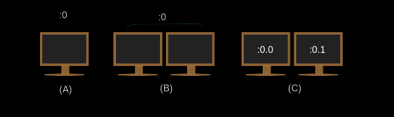

# Linux 102

## Personalizar y usar el entorno de shell
El shell es posiblemente la herramienta más poderosa en un sistema operativo Linux y puede
definirse como una interfaz entre el usuario y el kernel. Tiene la función de interpretar los
comandos introducidos por el usuario, por lo tanto, los administradore de sistemas debe ser
hábiles en su uso. Como probablemente sabemos, el Bourne Again Shell (*Bash*) es el shell de
facto en la gran mayoría de las distribuciones de Linux.

ol momento que el sistema operativo inicia, lo primero que el Bash (o cualquier otro shell)
realiza, es ejecutar una serie de scripts de inicio. Estos scripts personalizan el entorno de
sesión. Existen varios scripts para todo el sistema operativo, así también para usuarios
específicos. En estos scripts podemos elegir las preferencias o configuraciones que mejor se
adapten a las necesidades de nuestros usuarios en forma de variables, alias y funciones.

La serie exacta de archivos de inicio depende de un parámetro muy importante: el tipo de shell.

#### Tipos de shell: interactivo vs. no interactivo y inicio de sesión vs. sin inicio de sesión

**Shell interactivos / no interactivo**: este tipo de shells se refiere a la intercomunicación
entre el usuario y el shell: mediante el teclado el usuario proporciona la entrada digitando
comandos en la terminal y a su vez el shell proporciona la salida imprimiendo mensajes en
la pantalla.

**Shells de inicio de sesión / sin inicio de sesión**: este tipo de shell se refiere al evento
de un suario cuando accede a un sistema informático por medio de sus credenciales, como el
nombre de usuario y la contraseña.

Tanto los shells interactivos como los no interactivos pueden ser de inicio de sesión o sin
inicio de sesión y cualquier combinación posible de estos tipos tiene sus usos específicos.

*Shells Interactivo de inicio de sesión* se ejecutan cuando los usuarios se conectan al sistema
y se utilizan para personalizar las configuraciones de los usuarios según sus necesidades. Un
buen ejemplo de este tipo de shell, sería el de un grupo de usuarios que pertenecen al mismp
departamento y necesitan un conjunto de variable determinadas en sus sesiones.

Para *shells Interactivos sin inicio de sesión* nos referimos a cualquier otro shell abierto por
el usuario después de entrar en el sistema. Los usuarios utilizan estos shell durante las sesiones
para llevar a cabo tareas administrativas y de mantenimiento, como la configuración de variables,
el tiempo, la copia de archivos, crear scripts, etc.

Por otro lado, los shells no interactivo no requieren ninǵun tipo de interacción humana. Por lo
tanto, estos shells no solicitan al usuario una entrada y su salida (si la hubiera) será
escrita en un registro (en la mayoría de los casos).

Los *shells de inicio de sesión no interactivos* son bastante raros y poco prácticos. Sus usos son
virtualmente inexistentes. Algunos ejemplos extraños incluyen forzar un script a ser ejecutado
después de un shell de inicio de sesión con `/bin/bash --login script` o canalizar la salida
estándar (stdout) de un comando a la entrada estándar (stdin) de una conexión ssh:

    <some_commnad> | ssh user@ip

en cuanto el shell *interactivo sin inicio de sesión* no hay interacción ni login en nombre del
usuario, por lo que aquí nos referimos al uso de scripts automatizados. Estos scrits se utilizan
principalmente para llevar a cabo tareas administrativas y de mantenimiento respectivamente
como las incluidas en los cronjobs. En algunos casos, `bash` no lee ningún archivo de inicio.

#### Ejecutando shells con Bash
Después de iniciar sesión, escribe `bash` en una terminal para abrir un nuevo shell.
Técnicamente, este shell es un proceso hijo del shell actual.

Al iniciar le proceso hijo de `bash`, podemos especificar varias opciones para definir qué tipo
de shell queremos iniciar. Aquí hay algunas importantes a la hora de invocarlo:

- **`bash -l o bash --login`**: invocará un shell de inicio de sesión
- **`bash -i`**: invocará un shel interactivo
- **`bash --noprofile`**: con shell de inicio de sesión ignorará tanto el archivo de inicio de todo el sisteama `/etc/profile` como los archivos de inicio a nivel de usuario `~/.bash_profile`, `~/.bash_login` y `~/.profile`.
- **`bash --norc`**: con shell interactivo ingorará tanto el archivo de inicio del sistema `/etc/bash.bashrc` como el archivo de inicio a nivel de usuario `~/.bashrc`.
- **`bash --rcfile file`**: con shell interactivo tomará `file` como el archivo de inicio ignorando a nivel de sistema `/etc/bash.bashrc` y a nivel de usuario `~/.bashrc`.

#### Ejecutando shell con `su` y `sudo`
A través del uso de estos dos programs (similares) podemos obtener tipos específicos de shells:

**`su`**: cambia el Id de usuaro o lo convierte en superusuario (`root`). Con este comando podemos
invocar ambos shells, el de inicio de sesión y sin inicio de sesión:

- `su - user2, su -l user2 o su --login user2` iniciará un shell de inicio de sesión interactivo como `user2`.
- `su user2` iniciará un shell interactivo y sin inicio de sesión como `user2`.
- `su - root o su -` iniciará un shell de inicio de inicio de sesión interactivo como `root`.
- `su root o su` iniciará un shell interactivo y sin inicio de sesión como `root`.

**`sudo`**: ejecutando comandos como otro usuario (incluyendo el superusuario). Debido a que este
comando se usa principalmente para obtener privilegios temporales de `root`, el usuario que lo
use debe estar en el archivo `sudoers`. Para añadir usuarios a `sudoers` necesitamos convertirnos en
`root` y luego ejecutar:

    usermod -aG sudo user2

Así como `su`, `sudo` nos permite invocar tanto los shell de inicio de sesión como los de sin inicio
de sesión:

- `sudo su - user2, sudo su -l user2 o sudo su --login user2` iniciará un shell de inicio de sesión interactivo como `user2`.
- `sudo su user2` iniciará un shell interactivo sin inicio de sesión como user `user2`.
- `sudo -u user2 -s` iniciará un shell interactivo sin inicio de sesión como `user2`.
- `sudo su - root o sudo su -` iniciará un shell de inicio de sesión interactivo como `root`.
- `sudo -i` iniciará un shell de inicio de sesión interactivo como `root`.
- `sudo -i soma_command` iniciará un shell de inicio de sesión interactivo como `root`, ejecutara el comando y volverá al usuario original.
- `sudo su root o sudo su` iniciará un shell interactivo sin inicio de sesión como `root`.
- `sudo -s o sudo -u root -s` iniciará un shell sin inicio de sesión como `root`.

Cuando se usa `su` o `sudo`, es importante considerar el inicio de un nuevo shell y preguntarnos:
¿necesitamos el entorno del usuario o no? Si es así, usaríamos las opciones que invocan las
shell de inicio de sesión; si no, las que invocan sin inicio de sesión.

#### ¿Qué tipo de shell tenemos?
Para saber en qué tipo de shell estamos trabajando, podemos escribir `echo $0` en la terminal y
obtener la siguiente salida:

- **Inicio de sesión interactivo**: `-bash or -su`
- **Sin inicio de sesión interactivo**: `bash or /bin/bash`
- **Sin inicio de sesión no interactivo (scripts)**: `{name_of_script}`

#### ¿Cuántas shell tenemos?
Para observar cuántos `bash` tenemos ejecutando en el sistema, poder usar el comando:

    ps aux | grep bash

El `user2` en Dbebian ha entrado en una sesión GUI y ha abierto gnome-terminal, luego ha pulsado
`Ctrl + Alt + F1` para entrar en una sesión terminal `tty1`. Finalmente, ha vuelto a la sesión
del GUI presionando `Ctrl + Alt F7` y ha escrito el comando `ps aux | grep bash`. De esta manera,
la salida muestra un shell interactivo sin inicio de sesión a través del emulador de terminal
(`pts/0`) y un shel de inicio de sesión interactivo a través de la propia terminal basada en
texto (`tty1`). Note también como el último campo de cada linea es `bash` para el primero y
`-bash` para el segundo.

#### ¿De dónde shell obtiene la configuración: archivo de inicio?
Note que los scripts de todo el sistema o globales se colocan en el directorio `/etc/`, mientras
que los locales o de nivel de usuario se encuentran en el directorio `home` del usuario (`~`).
Además, cuando hay más de un archivo que buscar, y una vez que ellos es encontrado y
ejecutado, los otros serán ingnorados.

#### Shell interactivo de inicio de sesión

**Nivel global**:
- **`/etc/profile`**: este es el archivo `.profile` de todo el sistema para el shell Bourne y los shells compatibles con Bourne (incluido `bash`). A través de una serie de declaraciones `if` este archivo establece un número de variables como `PATH` y `PS1`, así como origen (si existen) tanto para el archivo `/etc/bash.bashrc` como los del directorio `/etc/prfile.d`.
- **`/etc/profile.d/*`**: este directorio puede contener scripts que son ejecutados por `/etc/profile`.

**Nivel local**:
- **`~/.bash_profile`**: este archivo específico de Bash se utiliza para configurar el entorno del usuario. También puede ser usado para crear el `~/.bash_login` y `~/.profile`.
- **`~/.bash_login`**: este archivo, solo se ejecutará si no hay un archivo `~/.bash_profile`. Su nombre sigiere que debería ser usando para ejecutar los comandos necesarios para el inicio de sesión.
- **`·/.profile`**: este archivo no es específico de Bash y se obtiene solo si no existe `~/.bash_profile` ni `~/.bash_login`, que es lo que normalmente ocurre. Por lo tanto, el propósito principal de `~/.profile` es el de revisar si está ejecutando un shell de Bash, y si fuera afirmativo, obtener `~/.bashrc` (si existe). Normalmente establece la variable `PATH` para que incluya el directorio privado del usuario `~/bin` (si existe).
- **`~/.bash_logout`**: si existe, este archivo específico de Bash hace algunas operaciones de limpieza al salir del shell. Esto puede ser conveniente en casos como los de las sesiones remotas.

#### Exploración de los archivo de configuración de Bash de inicio de sesión interactivo
Mostremos algunos de estos archivos en acción modificando `/etc/profile` y `/home/user2/.profile`.
Añadiremos a cada uno una lína que nos recuerde el archivo que se está ejecutnado:
```sh
echo 'echo Hello from /etc/profile' >> /etc/profile
echo 'echo Hello from ~/.profile' >> ~/.profile
```

#### Shell interactivo sin inicio de sesión

**Nivel global**:
- **`/etc/bash.barcr`**: este es el archivo `.bashrc` de todo el sistema para los shells interactivos `bash`. A través de su ejecución. `bash` se asegura que se está ejecutando interactivamente, comprueba el tamaño de la ventana después de cada comando y establece algunas variables.

**Nivel local**:
- **`~/.bashrc`**: además de llevar a cabo tareas similiares a las descritas para `/etc/bash.bashrc` a nivel de ususario, este archivo específico de Bash suele establecer algunas variables de historial y origen `~/.bash_aliases`. Aparte de eso, este archivo se utiliza normalmente para almacenar alias y funciones específicas de los usuarios.

Asimismo, también vale la pena selañar que `~/.bashrc` se lee si `bash` detecta que su `stdin` es una
conexión de red, por ejemplo, SSH.

#### Exploración de los archivos de configuración de shell no interactivo y de inicio de sesión
Modifiquemos ahora `/etc/bash.bashrc` y `~/.bashrc`:
```sh
echo 'echo Hello from /etc/bash.bashrc' >> /etc/bash.bashrc
echo 'echo Hello from ~/.bashrc' >> ~/.bashrc
```

#### Shell no interactivo de inicio de sesión
Un shell no interactivo con las opciones `-l o --login` es forzado a comportarse como un shell de
inicio de sesión y así los archivos de inicio a ser ejecutados serán los mismo que los de los
shell de inicio de sesión interactivos.

Para probarlo, escribamos un simple script y hagámoslo ejecutable. No incluiremos ningún shebang
porque invocaremos el ejecutable `bash` (`/bin/bash`) desde la línea de comandos.
```sh
echo 'echo "Hello from a script"' > test.sh
chmod +x test.sh
bash -l test.sh
```
¡Funciona! Antes de ejecutar el script, el login tuvo lugar y tanto el archivo `/et/profile` como
el `~/.profile` fueron ejecutados.

Tengamos ahora la salida estándar (stdout) del comando `echo` en la entrada estándar (stdin) de
una conexión `ssh` por medio de un pip (`|`):

    ssh "hello from a noninteractive login shell" | ssh user@ip

Una vez más, `/etc/profile` y `~/.profile` se ejecutan. Aparte de eso, la primera y la última
línea de la salida son bastante reveladoras en lo que respecta al comportamiento de shell. Shelll
no interactivo sin inicio de sesión los scripts no leeen ninguno de los archivos listados arriba,
pero busca en la variable de entorno `BASH_ENV` que expande su valor si es necesario y la usan
como el nombre de un archivo de inicio para lerr y ejecutar comandos.

Típicamente `/etc/profile` y `~/.profile` se aseguran de que tanto `/etc/bash.bashrc` como
`~/.bashrc` se ejecutan después de un inicio de sesión existoso.
```sh
root@debian:~# su - user2
Hello from /etc/bash.bashrc
Hello from /etc/profile
Hello from /home/user2/.bashrc
Hello from /home/user2/.profile
```
Teniendo en cuenta las líneas que se han agregado a los scripts de inicio e invocado un shell
de inicio de sesión interactivo a nivel de usuario con `su - user2` las cuatro líneas de
salida pueden explicarse de la siguiente manera:

1. `Hello from /etc/bash.bashrc` significa que `/etc/profile` se ha obtenido `/etc/bash.bashrc`.

2. `Hello from /etc/profile` significa `/etc/profile` ha sido completamente leído y ejecutado.

3. `Hello from /home/user2.bashrc` significa `~/.profile` se ha obtenido `~/.bashrc`.

4. `Hello from /home/user2/.profile` significa `~/.profile` ha sido completamente leído y ejecutado.

#### Archivos fuente
Algunos script de inicio incluyen o ejecutan otros scripts. Este mecanismo se llama "sourcing".

#### Ejecutando archivos con `.`
En el archivo `/etc/profile` podemos encontrar un ejemplo en el siguiente bloque:
```sh
# include .bashrc if exists
if [ -f "$HOME/.bashrc" ]; then
    . "$HOME/.bashrc"
fi
```
Hemos observado cómo la ejecución de un script puede llevar a la de otro. Así la declaración
`if` garantiza que el archivo `$HOME/.bashrc` (si existe `-f`) se obtendrá.

Además, podemos usar el `.` siempre que hayamos modificado un archivo de inicio y queramos hacer
efectivos los cambios sin necesidad de reiniciar. Por ejemplo:
- Agregar un alias a `~/.bashrc`:

    echo "alias hi='test alias'" >> ~/.bashrc

- Imprime la última línea de `~/.bashrc`:

    tail -n 1 !$

> `!$` se expande hasta el último argumento del comando anterior.

- Ejecutar el archivo manualmente:

    . ~/.bashrc

- Invoar el alias para probar que funciona:

    hi

#### Ejecutar comandos con `source`
El comando `source` es un sinónimp de `.`. Así que para ejecutar `~/.bashrc` tambien se puede
hacer de esta manera:

    source ~/.bashrc

#### El origen de los archivos de incio de Shell: SKEL
`SKEL` es una variable cuyo valor es la ruta absoluta al directorio `skel`. Este directorio sirve
como plantilla para estructura del sistema de archivos de los principales directorio de los
usuarios. Incluye los archivos que serán heredados por cualquier nueva cuenta de usuario que
se cree (incluyendo los archivos de configuración de los shells). El `SKEL` y otras variables
relacionadas se almacenan en `/etc/adduser.conf`, que es el archivo de configuración  para
`adduser`:

    grep -i "skel" /etc/adduser.conf

`SKEL` está configurado como `/etc/skel`; por lo tanto, los scripts de inicio que configurarn
nuestros shell están ahí:

    ls -a /etc/skel

Vamos a crear un directorio en `/etc/skel` para que todos los nuevos usuarios almacenen sus
scripts personales:

1. Como `root` nos movemos a `/etc/skel`:

    cd /etc/skel

2. Listamos su contenido:

    ls -a

3. Creamos un directorio y comprobamos que todo ha ido como se esperaba:
```sh
mkdir personal_scripts
ls -a
```

4. Añadimos un nuevo usuarios y validamos su directorio:
```sh
adduser user2
su - user2
ls -a
```

#### Variables: asignación y referencia
Una variable puede definirse como un nombre que contiene un valor.

En Bash, dar un valor a un nombre se llama *asignación* y es la forma en que creamos o establecemos
las variables. Por otro lado, el proceso de acceder al valor contenido en el nombre se llama
*variable referenciada*.

La sintaxis para la asignación de variables es:

    <variable_name>=<varaible_value>

Por ejemplo:

    distro=zorinos

La variables `distro` es igual a `zorinos`, es decir, hay una porción de memoria que contiene el
valor `zorinos` con `distro` siendo el puntero hacia este.

Tenga en cuenta, que no puede haber ningún espacio a ambos lados del signo de igual cuando se
asigna una variable:
```sh
distro =zorinos # error
distro= zorinos # error
```
A causa del error, Bash leyó `distro` y `zorinos` como órdenes.

Para referencias a una variable (es decir, para comprobar su valor) utilizamos el comando `echo`
que precede al nombre de la variable con un signo `$`:

    echo $distro

#### Nombres de variables
Al elegir un nombre de las variables, hay ciertas reglas que se deben tener en cuenta.

El nombre de una variable puede contener letras (a-z, A-Z), números (0-9) y giones bajos (_):
```sh
distro=zorinos
DISTRO=zorinos
distro_1=zorinos
_distro=zorinos
```
No puede empezar con un número o Bash se confundira:

    1distro=zorinos

No puede contener espacios (ni siquiera usando comillas); por convención, se usan los giones
bajos en su lugar:
```sh
"my distro"=zorinos # error
my_distro=zorinos
echo $my_distro
```

#### Valores de las variables
En lo que respecta a la referencia o valor de las variables, también es importante considerar
una serie de reglas.

las variables pueden contener cualquier carácter alfanumérico (a-z, A-Z, 0-9) así como la
mayoría de los caracteres (?, !, *, ., /, etc.):
```sh
distro=zorin12.4?
echo $distro
```
Los valores de las variables deben ser encerrados entre comillas si contienen espacios simples:
```sh
distro=zorin 12.4 # error
distro="zorin 12.4"
distro='zorsin 12.4'
```
Los valores de las variables también deben ser encerrados entre comillas si contienen
caracteres como los utilizados para la redirección (`<`, `>`) o el símbolo de pipe (`|`). Lo único que
hace el siguiente comando es crear un archivo vacío llamado `zorin`:
```sh
distro=>zorin
ls zorin
```
Esto funciona, siempre y cuando usemos comillas:

    distro=">zorin"

Sin embargo, las comillas simples y dobles no siempre son intercambiables. Según lo que
hagamos con una variable (asignación o referencia), el uso de una u otra tiene implicaciones y
dará resultado diferentes. En el contexto de la asignación de variables, las comillas simples
toman todos los caracteres del valor de la variable *literalmente*, mientras que las comillas
dobles permiten la sustitución de la variable:
```sh
lizard=uromastyx
animal='My $lizard'
echo $animal # My $lizard
animal="My $lizard"
echo $animal # My uromastyx
```
Por otra parte, cuando se hace referencia a una variable cuyo valor incluye algunos espacios
iniciales (o adicionales, a veces combinados con asteriscos) es ibligatorio utilizar comillas
dobles después del comando `echo` para evitar la división de los campos y la expasión de
nombres:
```sh
lizard="    genus   |   uromastyx"
echo $lizard # genus | uromastyx
echo "$lizard" #    genus   | uromastyx
```
Si la referencia de la variable contiene un signo de exclamación de cierre, este debe ser
el último carácter de la cadena (de lo contrario Bash pensará que nos refererimos a un evento
histórico):
```sh
distro=zorin.?/!os # error
distro=zorin.?/!
```
Cualquier "backslash" debe escapar por otro. Además, si una barra invertida es el útlimo
carácter de la cadena y no escapa, Bash interpretará que quremos un salto de línea y nos dará
una nueva línea:
```sh
distro=zorinsos\ # interpreta como nueva línea
distro=zorinos\\
echo $distro
```

#### Variables locales o de shell
Las variables locales o de shell existen solo en el shel en el que se crean. Por convención,
las variables locales se escriben en minúsculas.

Con el fin de realizar algunas pruebas, vamos a crear una variable local. Como se ha explicado
anteriormente. elegimos un nombre apropiado para la variable y la equiparemos a un valor
apropiado. Por ejemplo:
```sh
reptile=tortoise
echo $reptile
```
En ciertos escenarios, cuando se escriben los scripts, la inmutabilidad puede ser una
característica interesante de las variables. Si queremos que nuestras variables sean inmutables,
podemos crearlas en modo de solo lectura (`readonly`):

    readonly reptile=tortoise

Otra opción es convertirlas después de haberlas creado:
```sh
reptile=tortoise
readonly reptile
```
Ahora, si intentamos cambiar el valor de `reptile`, Bash lo negará:

    reptile=lizard # readonly variable

> Para listar todas las variables de solo lectura en nuestra sesióna actual, escriba `readonly -p`.

Un comando útil cuando se trata de variable locales es `set`.

`set` da salida a todas las variables y funciones de shell que se encuentran actualmente
asignadas. Dado que pueden ser muchas líneas, se recomienda usarlo en combinación con un
buscador como `less`:

    set | less

¿Se encuentra nuestra variable `tortoise`?

    set | grep reptile

Sin embargo, `reptile` siendo una variable local, no será heredado por ningún proceso hijo
generado desde el shell actual.

Para remover cualquier variable (local o global), usamos el comando `unset`:

    unset reptile

> `unset` debe ser seguido por el nombre de la variable, no por el simbolo `$`.

#### Variables globales o de entorno
Existen variable globales o de entorno para el shell actual, así como para todos los
procesos subsecuentes que se derivan de este. Por convención, las variables de entorno se
escriben en mayúsculas.

Podemos pasar recursivamente el valor de estas variables a otras variables y el valor de estas
últmias se expandirá finalmente a las primeras:
```sh
my_shell=$SHELL
echo $my_shell
/bin/bash
your_shell=$my_shell
echo $your_shell
/bin/bash
our_shell=$your_shell
echo $our_shell
/bin/bash
```
Para que una variable de shell se convierta en una variable de entorno, se debe utilizar el
comando `export`:

    export reptile

Con `export reptile` hemos convertido nuestra variable local en una variable de entorno para que
los shells hijos puedan reconocerla y usarla.

De la misma manera, `export` puede ser usado para asignar y exportar una variable, todo a la vez:

    export amphibian=frog

> Con `export -n <variable_name>` la variable se convertira de nuevo en una variable local.

El comando `export` también nos dará una lista de todas las variables de entorno existentes o
cuando se digita con la opción `-p`:

    export -p

> El comando `declare -x` es equivalente a `export`.

Dos comandos más que puede ser usados para imprimir una lista de todas las variable de entorno
son `env` y `printenv`:

    env | grep -i "pwd"

Además de ser un sinónimo de `env`, a veces podemos usar `printenv` de forma similar a como
usamos el comando `echo` para comprobar el valor de una variable

    printenv PWD

Sin embargo, con `printenv` el nombre de la variable no está precedido por `$`.

#### Ejecución de un programa en un entorno modificado
El comando `env` puede ser usado para modifcar el entorno de shell en el momento de la ejecución
de un programa.

Para iniciar una nueva sesión de Bash con un entorno tan vacío como sea posible, despejando
la mayoría de las variables (así como las funciones y alias), usaremos `env` con la opción `-i`:

    env -i bash

Ahora la mayoría de las variables de nuestro entorno han desaparecido. Y solo quenda unas pocas:

    env

También podemos usar `env` para establecer una variable particular para un programa particular.

Cuando hablamos de los shell no interactivos sin inicio de sesión, observamos como los scripts
no leen ningún archivo de inicio estándar, sino que buscan el valor de la variable
`BASH_ENV` y lo usan como un archivo de inicio si existe.

Demostrémos este proceso:

1. Creamos nuestro propio archivo de inicio llamado `.startup_script` con el siguiente contenido:

    CROCODILIAN=caiman

2. Escribimos un script Bashh llamado `test_env` con el siguiente contenido:
```sh
#!/bin/bash

echo $CROCODILIAN
```

3. Establecemos el bit ejecutable para nuestro script `test_env.sh`:
```sh
chmod +x test_env.sh
```

4. Por último, usamos `env` para establecer `BASH_ENV` en `startup_script` para `test_env.sh`:


#### Variables comunes de entorno
Es hora de revisar algunas de las variables de entorno más relevantes que se establecen en los
archivos de configuración de Bash.

**`DISPLAY`**: en relación con el servidor X, el valor de esta variable se compone normalmente de
tres elementos:
- El hostname (la ausencia de este significa `localhost`) donde se ejecuta el servidor X.
- Dos puntos como delimitdor.
- Un números (normalmente es `0` y se refiere a la pantalla de la computadora).
```sh
printenv | grep -i "display"
```

**`HISTCONTROL`**: esta variable controla qué comandos se guardan en `HISTFILE`. Hay tres valores
posibles:
- **`ignorespace`**: los comandos que empiecen con un espacio no se guardarán.
- **`ignoredups`**: un comando que es el mismo que el anterior no se guardará.
- **`ignoreboth`**: los comandos que caen en cualquiera de las dos categorías no se guardarán.
```sh
echo $HISTCONTROL
```

**`HISTSIZE`**: esto establece el número de comandos que se almacenarán en la memoria mientras dure la
sesión de shell.
```sh
echo $HISTSIZE
```

**`HISTFILESIZE`**: esto establece el número de comandos que se guardarán en `HISTFILE` tanto al
principio como al final de la sesión:
```sh
echo $HISTFILEZIE
```

**`HISTFILE`**: el nombre del archivo que almacena todos los comandos a medida que se escriben. Por
defecto este se encuentra en `~/.bash_history`:
```sh
echo $HISTFILE
```

**`HOME`**: esta variable almacena la ruta absoluta del directorio principal del usuario y se establece
cuando el usuario se conecta. `~` es equivalente a `$HOME`.

**`HOSTNAME`**: variable que almacena el nombre de la máquina en la red:
```sh
echo $HOSTNAME
```

**`HOSTYPE`**: esto almacena la arquitectura de la unidad central de procesamiento (CPU) del equipo:
```sh
echo $HOSTTYPE
```

**`LANG`**: esta variable guarda la información de localización que se utiliza para el sistema:
```sh
echo $LANG
```

**`LD_LIBRARY_PATH`**: esta variable consiste en un conjunto de directorios separados por dos puntos
donde las bibliotecas compartidas son compartidas por los programas.

**`MAIL`**: esta variable almacena el archivo en el que Bash revisa el correo electrónico.

**`MAILCHECK`**: esta variable almacena un valor numérico que indica en segundos la frecuencia con la
que Bash comprueba si hay correo nuevo.

**`PATH`**: esta variable de entorno almacena la lista de directorios donde Bash busca los archivos
ejecutables cuando se le indica que ejecute cualquier programa.

Dos cosas con respecto al valor de `PATH`:
- Los nombre de los directorios se escriben usando rutas absolutas.
- Los dos puntos se usan como delimitadores.

**`PS1`**: esta variable almacena el valor del indicador Bash.

**`PS2`**: normalmente se establece en `>` y se usa como un mensaje de continuidad para comandos largo
de varias líneas.

**`PS3`**: usando como el indicador para el comando `select`.

**`PS4`**: normalmente se establece en `+` y se usa para la depuración.

**`SHELL`**: esta variable almacena la ruta absoluta del shell actual:

**`USER`**: esto almacena el nombre del usuario actual.

#### Creando Alias
Un alias es un nombre sustituto de otro(s) comando(s). Puede ejecutarse como un comando normal,
pero en su lugar ejecuta otro comando según la definición de alias.

La sintaxis para declarar alias es muy sencillas. Estos se declaran escribiendo la palabra clave
`alias` seguida de su asignación. A su vez, dicha asignación consiste en el nombre del alias, un
signo igual y uno o más comandos:

    alias alias_name=command

Por ejemplo:

    alias oldshell=sh

El poder de los alias radica en que nos permiten escribir versiones cortas de comandos largos:

    alias ls="ls --color=auto"

De la misma manera, podemos crear alias para una serie de comandos concatenados, usando el
punto y coma (`;`) como delimitador. Por ejemplo, podemos tener un alias que nos de información
sobre la ubicación de l ejecutable `git` y su versión:

    alias git_info="which git ; git --version"

El comando `alias` producirá un listado de todos los alias disponibles en el sistema.

El comando `unalias` eliminas los alias:

    unalias git_info

Debemos encerrar los comandos entre comillas (simples o dobles) cuando los argumentos o
parámetros tengan espacios.

La variable también puede ser asignada dentro del alias.

Escapara de un alias es útil cuando un alias tiene el mismo nombre que un comando normal. En
este caso, el alias tiene prioridad sobre el comando original, sin embargo, este sigue siendo
accesible al espacar del alias.

#### Expansión y evaluación de las comillas en los alias
Cuando se usan comillas con variable de entorno, las comillas simples hacen que la expresión
sea dinámica:
```sh
alias where?='echo $PWD'
where?
/home/user2
cd Music
where?
/home/user2/Music
```
Sin embargo, con las comillas dobles la expansión se hace de forma estática:
```sh
$ alias where?="echo $PWD"
$ where?
/home/user2
$ cd Music
$ where?
/home/user2
```

#### Persistencia de Alias: scripts de inicio
Al igual que con las variables, para que nuestroas alias ganen persistencia, debemos escribirlo
en scripts de Inicialización que se ejecuten al inicio. Como ya sabemos, un buen archivo para
que los usuarios agreguen sus alias personales es `~/.bashrc`.

#### Creando funciones
En comparación con los alias, las funciones son más programables y flexibles, especialmente
cuando se trata de explotar todo el potencial de las variables incorporadas y parámetros
posicionales de Bash. También son muy buenas para trabajar con estructuras de control de flujo,
como bucles o conficionales. Podemos pensaer en una función como un comando que incluye la
lógica a través de bloques o colecciones de otros comandos.

#### Dos sintaxis para crear funciones
**Usando la palabra clave `function`**: podemos usar la palabra clave `function`, seguida del nombre
de la función y los comandos entre corchetes:
```sh
function function_name {
    commands
}
```

**Usar `()`**: por otro lado, podemos omitir la palabra `function` y usar dos paréntesis justo
después del nombre de la función:
```sh
function_name() {
    commands
}
```
Es común agregar funciones en archivos o scripts. Sin embargo, también se puede escribir con
cada comando en el shell prompt, en una línea diferente que indica una nueva línea después de
un salto de línea.

En cualquier caso, e independientemente de la sintaxis que elijamos, si decidimos saltarnos los
saltos de línea y escribir una funcioón en una sola línea, los comandos deben estar separados
por punto y coma:

    greet() { greeting="Hello world!"; echo $greeting; }

Al igual que con las variables y los alias, si queremos que las funciones sean persistentes a
través de los reinicios del sistema tenemos que agregarlas en los scripts de inicialización
de shell como `~/etc/bash.bashrc` o `~/.bashrc`.

#### Variables especiales incorporadas en Bash
Bourne Again Shell llega con un conjunto de variables especiales que son particularmen útiles
para funciones y scripts. Estas son especiales porque solo pueden ser referenciadas,
no asignadas. Aquí hay una lista de las már relevantes:

**`$?`**: la referencia de esta variable se expande hasta el resultado de la última ejecución
del comando. Un valor de `0` significa éxito y un valor distinto de `0` es error.

**`$$`**: se expande hasta el PID del shell (process ID).

**`$!`**: se expabde hasta el PID del último trabajo en segund plano.

#### Parámetros de posición de `0` a `9`
Se expande a los prámetros o argumentos que se pasan a la función, `$0` expandiéndose al
nombre del script o shell.

Otras variables especiales incorporadas en Bash incluyen:

**`$#`**: se expande al número de argumentos que se le pasan al comando.

**`$@, $*`**: se extiende a los argumentos pasados al comando.

**`$_`**: se expande hasta el último parámetro o el nombre de script.

#### Parámetros de posición en las funciones
Podemos pasarlos a las funciones desde adentro del archivo o el script:
```sh
editors() {
    edit=emcas

    echo "The text editor of $USER is: $editor"
    echo "Bash is not a $1 shell"
}
editors tortoise
```

## Instalar y configurar X11
El sistema X Window es una pila de software que se utiliza para mostrar texto y gráficos en una
pantalla. El aspecto y diseño de un cleinte X no está dictado por el sistema X Window, sino
que es manejado por cada cliente X individual, un administrador de ventanas, o un entorno
de escritorio completo como KDE, GNOME o Xfce.

El sistema X Window es multiplataforma y funciona en varios sistemas operativos como Linux,
BSD, Solaris y otros sistemas de tipo Unix. También hay implementaciones disponibles para
MacOS de Apple y Window de Microsoft.

#### Arquitectura de sistema X Window
El sistema X Window proporciona los mecanismos para dibujar formas bidimensionales básicas
en una pantalla. Se divide en un cliente y un servidor; en la mayoría de las intalaciones en
las que se requeire un escritorio gráfico, estos componentes estáran presentes en el mismo
equipo. El componente cliente toma la forma de una aplicación, como un emulador de terminal,
un juego o un navegador web. Cada aplicación cliente informa al servidor X sobre la ubicación
y el tamaño de su ventana en la pantalla de la computadora. El cliente también maneja lo
que entra en esa ventana, y el servidor X coloca el dibujo solicitado en la pantalla. El
sistema X Window también maneja la entrada de dispositivos como mouse, teclados,
trackpads y más.

El sistema X Window es capaz de funcionar en red donde múltiples clientes X de diferentes
computadoras de una red pueden hacer solicitudes a un solo servidor X remoto. El razonamiento
que subyace a esto es que un adminstrador o usuario pueda tener acceso a una aplicación gráfica
en un sistema remoto que puede no estar disponible en sus sistema local X Window es un sistema
modular, y esto es una característica clave. A lo largo de la existencia de este sistema se han
desarrollado nuevas características que se han añadido a su marco (Framework). Estos nuevos
componentes solo fueron añadidos como extensiones al servidor X, dejando al núcleo del
protocolo X11 intacto. Estas extensiones están contenidas dentro de los archivos de la
biblioteca Xorg. Algunos ejemplos de bibliotecas Xorg incluyen: `libxrandr`, `libXcursor`,
`libX11`, `libxkbfile` así como otras, cada una de ellas proporciona una funcionalidad extendida
al servidor X.

Un administrador de pantalla proporciona un acceso gráfico a un sistema. Este sistema puede
ser un ordenador local o un ordenador a través de una red. El administrador de pantalla se lanza
después de que la máquina se inicia y así comenzará una sesión de servidor X para el usuario
autenticado. El administrador de pantalla también es responsable de mantener el servidor X en
funcionamiento. Algunos ejemplos de gestores de pantalla son: GDM, SDDM y LightDM. Cada
instancia de un servidor X en funcionamiento tiene un nombre de pantalla para indentificarlo.
El nombre de la pantalla contiene lo siguiente:

    hostname:displaynumber.screennumber

El nombre de la pantalla también indica una aplicación gráfica donde debe ser renderizada y
sobre cuál host (si se utiliza una conexión X remotea).

El `hostname` se refiere al nombre del sistema que monstrará la aplicación. Si falta un nombre
de host en el nombre de pantalla, entonces se asume que es el host local.

El `displaynumber` hace referencia a la colección de "pantallas" que están en uso, ya sea una
sola o varias pantallas en una estación de trabajo. A cada sesión de servidor X en ejecución se
le da un número de pantalla que comienza `0`.

Por defecto el `screennumber` es `0`. Esto puede ser el caso si solo una pantalla o varias pantallas
físicas están configuradas para trabajar como una sola pantalla. Cuando todas la pantallas en
una configuración de múltiples monitores se combinan en una lógica, las ventanas de la
aplicación pueden moverse libremente entre las pantallas. En situaciones en las que cada
pantalla está configurada para funcionar de manera independiente, cada una albergará las
ventanas de aplicación que se abran dentro de ella y las ventanas no podrán moverse de una
patalla a otra. Cada pantalla independiente tendrá un propio número asignado. Si solo hay
una lógica en uso, entonces se omite el punto y el número de pantalla.

El nombre de una sesión X en curso se almacena en la variable de entorno `DISPLAY`:

    echo $DISPLAY # :0

La salida detalla lo siguiente:

1. El servidor X en uso está en el sistema local, por lo tanto no hay nada impreso a la izquierda de los dos puntos.

2. La sesión actual del servidor X es la primera como indica el `0` que sigue a los dos puntos.

3. Solo hay una pantalla lógica en uso, por lo que un número de pantalla no es visible.

Ejemplo de configuración en pantalla:



**(A)**: un solo monitor, con una sola configuración de visualización y una sola pantalla.

**(B)**: configurado como una sola pantalla, con dos monitores físicos como una sola. Las ventanas
de aplicación pueden moverse libremente entre los dos monitores.

**(C)**: una configuración de pantalla única, sin embargo, cada monitor es una pantalla
independietne. Ambas pantallas seguirán compartiendo los mismos dispositivos de entrada como
el teclado y el mouse, pero una aplicación abierta en la plantalla `:0.0` no puede ser movida
a la pantalla `:0.1` o viceversa.

Para iniciar una aplicación en una pantalla específica, asigne el número de pantalla a la
variable de entorno `DISPLAY` antes de lanzar la aplicación:

    DISPLAY=:0.1 firefox &

Este comando iniciaría el navegador web Firefoz en la pantalla de la derecha. Algunos conjuntos
de herramientas también proporcionan opciones de línea de comandos para ordenar a una
aplicación que se ejecute en una pantalla especifica. Por ejemplo, `--screen` y `--display`
de `gtk-options`.

#### Configuración de un servidor X
Tradicionalmente, el principal archivo de configuración que se utiliza para configurar un
servidor X es el archivo `/etc/X11/xorg.conf`. En las distribuciones modernas de Linux, el
servidor X se configurará así mismo en timpo de ejecución cuando este es iniciado, y por lo
tanto no puede existir ningún archivo `xorg.conf`.

El archivo `xorg.conf` está dividido en estrofas llamadas `secciones`. Cada sección comienza con
el término `Section` y después de este término se encuentra el nombre de la sección que se
refiere a la configuración de un componente. Cada `Section` está correspondientemente terminada
por una `EndSection`. El típico archivo `xorg.conf` contiene las siguientes secciones:

**`InputDevice`**: se utiliza para configurar un modelo específico de taclado o mouse.

**`InputClass`**: en las distribuciones modernas de Linux esta sección se encuetra típicamente en
un archivo de configuración separado y localizado en `/etc/X11/xorg.conf.d/`. El `InputClass`
se usa para configurar una clase de dispositivos de hardware como teclados y mouses en
lugar de un componente específico de hardware. Ejemplo del archivo
`/etc/X11/xorg.conf.d/00-keyboard.conf`:
```conf
Section "InputClass"
    Identifier "system-keyboard"
    MatchIsKeyboard "on"
    Option "XkbLayout" "us"
    Option "XkbModel" "pc105"
EndSection
```
La opción para `XkbLayout` determina la disposición de las teclas de un teclado, como Dvorak para
diestros y zurdos, QWERTY e idioma. La opción para `XkbModel` se usa para definir el tipo de
teclado en uso. Una tabla de modelos, diseños y sus descripciones se pueden encontrar en
`xkeybpoard-config`. Los archivos asociados a las distribuciones de teclado se pueden encontrar
en `/usr/share/X11/xkb`. Un ejemplo de siseño de teclado griego plotónico en una computadora de
Chromebook se vería como el siguiente:
```conf
Section "InputClass"
    Identifier "system-keyboard"
    MatchIsKeyboard "on"
    Option "XkbLayout" "gr(polytonic)"
    Option "XkbModel" "chromebook"
EndSection
```
Alternativamente, la disposición del teclado puede ser modificada durante una sesión X en curso
con el comando `setxkbmap`. Aqupi hay un ejemplo de este comando que configura la disposición del
Politónico Griego en una computadora Chromebook:

    setxkbmap -model chromebook -layout "gr(polytonic)"

Este ajuste solo durará mientras la sesión X esté en uso. Para que estos cambios sean
permanentes, modifique el archivo `/etc/X11/xorg.conf.d/00-keyboard.conf` para incluir los ajustes
necesarios.

Las distribuciones modernas de Linux proporciona el comando `localectl` a través de `systemd`
que tamién puede ser usado para modificar una disposición del teclado y creará automáticamente
el archivo de configuración `/etc/X11/xorg.conf.d/00-keyboard.conf`. Aquí hay un ejemplo de
configuración de un teclado Politónico Griego en una Chromebook, esta vez usando el comando
`localectl`:

    localectl --no-convert set-x11-keymap "gr(polytonic)" chromebook

La opción `--no-convert` se usa aquí para evitar que `localectl` modifique el mapa de teclas de la
consola de host.

**`Monitor`**: la sección `Monitor` describe el monitor físico que se utiliza y dónde está conetado.
El siguiente es un ejemplo de configuración que muestra un monitor físico conetado al segundo
puerto de la pantalla y que se utiliza como monitor primario:
```sh
Section "Monitor"
    Identifier"DP2"
    Option "Primary" "true"
EndSection
```
**`Device`**: la sección `Device` describe la tarjeta de video física que se utiliza. tambińe
contendrá el módulo del núcleo utilizado como controlador de la tarjeta de video, junto con su
ubicación física en la placa base:
```sh
Section "Device"
    Identifier "Device0"
    Driver "i915"
    BusID "PCI:0:2:0"
EndSection
```
**`Screen`**: la sección `Screen` una las secciones `Monitor` y `Device`. Un ejemplo de la sección
`Screen` podría ser la siguiente:
```sh
Section "Screen"
    Identifier "Screen0"
    Device "Device0"
    Monitor "DP2"
EndSection
```
**`ServerLayout`**: la sección `ServerLayout` agrupa todas las secciones como el mouse, teclado y
las pantallas en una interfaz del sistema X Window:
```sh
Section "ServerLayout"
    Identifier "Layout-1"
    Screen "Screen0" 0 0
    InputDevice "mouse1"
    InputDevice "system-keyboard" "CorePointer" "CoreKeyboard"
EndSection
```
Los archivos de configuración especificados por el usuario también residen en
`/etc/X11/xorg.conf.d/`. Los archivos de configuración proporcionados por la distribución se
localizan en `/usr/share/X11/xorg.conf.d/`. Los archivos de configuración ubicados dentro de
`/etc/X11/xorg.conf.d/` son analizados antes del archivo `/etc/X11/xorg.conf` si existen en el
sistema.

El comando `xdpinfo` se una en una computadora para mostrar información sobre una instancia de
servidor X en ejecución:

    xdpinfo

#### Creando un archivo de configuración básica de Xorg
Aunque X creará su configuración después del inicio del sistema en instalaciones modernas de
Linux, un archivo `xorg.conf` todavía puede ser usado. Para generar un archivo
`/etc/X11/xorg.conf` permanente, ejecute el siguiente comando:

    sudo Xorg -configure

> Si ya existe una sesión X en ejecución. tendra que especificar un `DISPLAY` diferente en el comando, por ejemplo: `sido Xorg :1 -configure`.

En alguas distribuciones de Linux, el comando `X` puede ser usado en lugar de `Xorg`, ya que `X`
es un enlace simbólico a `Xorg`.

Se creará un archivo `xorg.conf.new` en su actual directorio de trabajo. El contenido de este
archivo se derova de lo que el servidor X ha encontrado disponible en el hardware y los
controladores del sistema local. Para user este archivo, tendrá que ser movido al directorio
`/etc/X11/` y renombrado a `xorg.conf`:

    sudo mv xorg.conf.new /etc/X11/xorg.conf

#### Wayland
Wayland es el nuevo protocolo de visualización diseñado para reemplazar el sistems W Window.
Muchas distribuciones modernas de Linux lo usarn como un servidor de visualización por defecto.
Se supone que es más ligero en cuanto a recursos del sistema y su instalación ocupa menos
espacio en disco que X. El proecto comeznzó en 2010 y todavía esta en desarrollo activo,
incluyendo el trabajo de los desarrolladores activos y anteriores de X.org.

A diferencia del sistema X Window, no hay niniguna instancia de servidor que se ejecute entre el
cliente y el kernel. En su lugar, una ventana cliente trabaja con su propio código o el de un
kit de herramientas (como Gtk+ o Qt) para proporcionar el renderizado. Para hacer el
renderizado, se hace una petición al kernel de Linux a través del protocolo Wayland. El
kernel reenvía la solicitud a través de este protocolo al Wayland compositor que se encarga
de la entrada de dispositivos, la gestión de ventanas y la composición. El compositor es
parte del sistema que combina los elementros renderizados en una salida visual en la
pantalla.

La mayoría de las herramientas modernas como Gtk+ 3 y Qt 5 han sido actualizada para
permitir la renderización a un sistema X Window o a una computadora con Wayland. No todas las
aplicaciones autónomas han sido escritas para soportar el renderizado en Wayland hasta ahora.
Para las aplicaciones y frameworks que todavía toene como objetivo que se ejecute el
sistema X Window, la aplicación puede ejecutarse dentro de XWayland. El sistems XWayland
es un servidor X separado que se ejecuta dentro de un cliente de Wayland y por lo tanto,
renderiza el contenido de una ventana de cliente dentro de una isntancia de servidor X
independiente.

Así como el sistema X Windows utiliza una vaiable de entorno `DISPLAY` para controlar las
pantallas en uso, el protocolo Wayland utiliza una variable de entorno `WAYLAND_DISPLAY`. A
continuación se muestra la salida de un sistema que ejecuta una pantalla Wayland:
```sh
echo $WAYLAND_DISPLAY
wayland-0
```
Esta variable de entorno no está disponible en los sistemas que ejecutan X.

## Escritorios gricos
#### Sistema X Window
En Linux y otros sistemas operativos similares a Unix en los que se emplea, el sistema X
Window (conocido como X11 o simplemente X) proporciona los recuros de bajo nivel relacionados
con la reepresentación de la interfaz gráfica y la interacción del usuario con ella.
Por ejemplo:

- El manejo de los eventos de entrada, como los movimiento del mouse o las pulsaciones de teclas.
- La capacidad de cortar, copiar y pegas el contenido del texto entre aplicaciones separadas.
- La interfaz de programación que otros programas utilizan para dibujar elementos gráficos.

Aunque el sistema X Window se encarga de controlar la pantalla gráfica, no pretende dibujar
elementos visuales complejos. Las formas, los colores, los matices y cualquier otro efecto
visual son generados por la aplicación que se ejecuta sobre X. Este enfoque da a las
aplicaciones mucho espacio para crear interfaces personalizadas, pero también pueden dar
lugar a sobreusos de desarrollo que están fuera del alcande de la aplicación y a incoherencias
en el aspecto y comportamiento cuando se comparan con las interfaces de otros programas.

Desde el punto de vista del desarrollador, la introducción del ambiente de escritorio facilita
la programación de la interfaz gráfica de usuario vinculada al desarrollo de la aplicación
subyacente, mientras que desde el punto de vista del usuario proporciona una experiencia
coherente entre las distintas aplicaciones. Los entornos de escritorio reunen interfaces de
programación, bibliotecas y programas de apoyo que cooperan para ofrecer conceptos de diseño
tradicionales pero aún en evolución.

#### Ambientes de escritorio
La tradicional interfaz gráfica de la computadora de escritorio consiste en varias ventanas
asociada con procesos en ejecución. Como el sistema X Window por sí solo ofrece solo
características interactivas básicas, la experiencia completa del usuario depende de los
componentes proporcionados por el entorno de escritorio. Probablemente el componente más
importante de un entorno de escritorio, es el administrador de ventanas (windows manager)
que controla la colocación y decoración de las ventanas. Es el gesto de ventanas que añade
la barra de título a la ventan, los botones de control y gestiona el cambio entre las
ventanas abiertas.

Todos los entornos de escritorio proporcionan un gestor de ventnas que se ajusta al aspecto
y a la sensación de un kit de herramientas de widgets. Los widgets son elementos visuales
informativos o interactivos, como botnoes o campos de entrada de texto, distribuidos dentro
dentro de la ventana de la aplicación. Los componentes estándares del escritorio y el
propio gesto de ventanas dependen de tales kits de herramientas de widgets para ensamblar
sus interfaces.

Las bibliotecas de software, como Gtk+ y Qt, proporcionan widgets que los programadores
pueden usar para construir elaboradas interfaces gráficas para sus aplicaciones.
Históricamente, las aplicaciones desarrolladas con GTK+ no se parecían a las aplicaciones
hechas con Qt y viceversa, pero el mejor soporte de temas de los entornos de escritorio de
hoy en día hacen que la distinción sea menos obvia.

En general, Gtk+ y Qt ofrecen las mismas características en cuanto a los widgets. Los
elementos interactivos simples pueden ser indistinguibles, mientas que los widgets compuestos,
como la ventan de diálogo que utilizan las aplicaciones para abrir y gurardar archivos,
sin embargo, pueden tener un aspecto bastante diferente. No obstante, las aplicaciones
construidas con conjuntos de herramientas distintos pueden ejecutarse simultáneamente,
independientemente del conjunto de herramientas de widgets utilizado por los demas componentes
del escritorio.

Además de los componentes básicos del escritorio, que podrían considerarse programas
individuales por sí mismos, los entornos de escritorio persiguen la metáfora del escritorio
proporcionando un conjunto mínimo de accesorios desarrollados bajo las mismas pautas de
diseño. Las variaciones de las siguientes aplicaciones son comúnmente proporcionadas por
todos los principales entornos de escritorio:

**Aplicaciones relacionadas con el sistema**: emuladores de terminal, gestor de archivos, gestor de
instalación de paquetes, herramientas de configuración del sistema.

**Comunicación e Internet**: Administrador de contactos, cliente de correo electrónico, navegador web.

**Aplicaciones de oficina**: calendario, calculadora, editor de texto.

Los entornos de escritorio pueden incluir muchos otros servicios y aplicaciones: el salduo de
la pantalla de inicio de sesión, el gestero de sesiones, la comunicación entre procesos,
el agente de credenciales, etc. También incorporan características proporcionadas por
servicioss de sistemas de terceros, como PulseAudio para el sonido y CUPS para la impresión.
Estas características no necesitan el entorno gráfico para funcionar, pero el entorno de
escritorio proporciona gráficas frontend para facilitar la configuración y el funcionamiento
de esos recursos.

#### Entornos de escritorio populares
Muchos sistemas operativos patentados solo admiten un único entorno oficial de escritorio
que está vinculador a su lanzamiento particular y que se supone no debe ser modifiado. A
diferencia de ellos, los sistemas operativos basados en Linux soportan diferentes opciones de
entornos de escritorio que pueden utilizarse en conjunto con X. Cada entorno de escritorio
tiene sus propias características, pero normalmente comparten algunos conceptos de diseño
comunes:
- Un lanzador de aplicaciones que lista las aplicaciones integradas y de terceros disponibles en el sistema.
- Reglas que definen las aplicaciones predeterminadas asociadas a los tipos de archivos y protocolos.
- Herramientas de configuración para personalizar la apariencia y el comportamiento del entorno de escritorio.

Gnome es uno de los entorno de escritorio más populares, siendo la primera opción en
distribuciones como Fedora, Debian, Ubuntu, SUSE Linux Enterprise, Red Hat Enterprise Linux,
CentOS, etc. En su versión 3, Gnome trajo grande cambios en su aspecto y estructura, alejándose
de la metáfora del escritorio e introduciendo el Gnome SHell como su nueva interfaz.

El lanzador de pantalla completa Gnome Shell Activities reemplazó al tradicional lanzador
de aplicaciones y a la barra de tareas. Sin embargo, todavía es posible usar Gnome 3 con
el aspecto antiguo eligiendo la opción de Gnome Classic en la pantalla de inicio de sesión.

KDE es un gran ecosistema de aplicaciones y plataforma de desarrollo. Su últoma versión de
entorno de escritorio, KDE Plasma, se utiliza por defecto en openSUSE, Mageia, Kubuntu, etc.
El emploe de la biblioteca Qt es la característica más destacada de KDE, que le da su aspecto
inconfunfible y una plétora de aplicaciones originales. KDE incluso proporciona una herramienta
de configuración para asegurar la cohesión visual con las aplicaciones Gtk+.

Xfce es un entorno de escritorio que pretende ser eséticamente agradable sin consumir muchos
recuros de la máquina. Su estructura está alamente modularizada, permitiendo al usuario activar
y descativar componentes según sus necesidades y preferencias.

Hay muchos otros entornos de escritorio para Linux, normalmente proporcionados por
bifuraciones de distribuciones alternativas. La distribución Linux Mint, por ejemplo, proporciona
dos entornos de escritorio originales: Cinnamon Y MATE. LXDE es un entorno de escritorio
adaptado al bajo consumo de recursos, lo que lo convierte en una buena opción para su
instalación en equipos antiguos o en ordenadores monoplaca. Aunque no ofrece todas las
características de los entornos de escritorio más pesados, LXDE ofrece todas las
características básicas que se esperan de una moderna interfaz gráfica de usuario.

#### Interoperabilidad de escritorio
La diversidad de entornos de escritorio en los sistemas operativos basados en Linux impone
un reto: ¿cómo hacer que funcionen correctamente con aplicaciones gráficas o servicios de
sistema de teceros sin tener que implementar un soporte específico para cada uno de ellos?
los métodos y especificaciones compartidas entre entornos de escritorio mejoran en gran
medida la experiencia del usuario y resuelven muchos problemas de desarrollo, ya que las
aplicaciones gráficas deben interactuar con el entorno de escritorio actual, independientemente
del entorno de escritorio para el que fueron diseñadas originalmente. Además, es importante
mantener la configuración general del escritorio si el usuario acaba cambiando su elección
de entorno de escritorio.

La organización freedesktop.org mantinene un gran cuerpo de especificaciones para la
interoperabilidad de los ordenadores de sobremesa. La adopción de la especificación completa
no es obligatoria, pero muchas de ellas se utilizan ampliamente:

**Ubicaciones de directorios**: donde se encuentran los ajustes personales y otros archivos
específicos del usuario.

**Entradas en el escritorio**: las aplicaciones de línea de comandos pueden ejecutarse en el
entorno de escritorio a través de cualquier emulador de terminal, pero sería demasiado
confuso hacer que todas ellas estuvieran disponibles en el lanzado de aplicaciones. Las
entradas de escritorio son archivos de tesxto que terminan en `.desktop` que son utilizados
por el entorno de escritorio para recopilar información sobre las aplicaciones de escritorio
disponibles y cómo utilizarlas.

**Aplicación de arranque automático**: entradas de escritorio que indican la aplicación que
debe iniciarse automáticamente después de que el usuario haya iniciado la sesión.

**Arrastrar y soltar**: cómo las aplicaciones deben manejar los eventos de arrastart y soltar.

**Papalera (trash can)**: la ubicación común de los archivos eliminados por el administrador de
archivos, así como los métodos para almacenar y eliminar archivos de allí.

**Temas de iconos**: el formato común de las bibliotecas de iconos intercambiables.

La facilidad de uso que ofrecen los entornos de escritorio tienen un inconveniente en comparación
con las interfaces de texto como shell: la capacidad de proporcionar acceso remoto. Mientras
que un entorno de shell de línea de comandos de un equipo remoto puede ser fácilmente accesible
con herramientas como `ssh`, el acceso remoto a entorno gráficos requiere métodos diferentes
y pueden no lograr un rendimiento satisfactorio en conexiones más lentas.

#### Acceso no local
El sistema X Window adopta un diseño basado en pantallas autónomas, donde el mismio
administrador de pantalla puede controlar máas de una sesión de escritorio gráfico al mismo
tiempo. En esencia, una pantalla es análoga para un terminal de texto: ambas se refieren a una
máquina o aplicación de software utilizada como punto de entrada para establecer una sesión
de sistema operativo independiente. Aunque la configuración más común implica una sesión gráfica
singular que se ejecuta en la máquina local, también son posibles otras configuraciones
menos convencionales:
- Cambiar entre sesiones de escritorio gráfico activas en la misma máquina.
- Más de un conjunto de dispositivos de visualización (por ejemplo, pantalla, telcado, mouse) conectados a la misma máquina, cada una controlando su propia sesión de escritorio gráfica.
- Sesiones remotas de escritorio gráfico, donde la interfaz gráfica se envía a través de la red a una pantalla remota.

Las sesiones de escritorio remotos son soportadas por X, que emplea el X Display Manager
Control Protocol (XDMCP) para comunicarse con las pantallas remotas. Debido a su alto uso de
ancho de badan, el XDMCP se utiliza raramente a través de Internet o en redes LAN de baja
velocidad. Los problemas de seguridad también son una preocupación con XDMCP: la pantalla
local se comunica con un administrador de pantalla X remoto con privilegios para ejecutar
procedimientos remotos, por lo que una eventual vulnerabilidad podría favorcer la ejecución de
comandos arbitrarios ocon privilegios en el equipo remoto.

Además, el XDMCP requiere que se ejecute X instancias en ambos extremos de la conexión, lo
que puede hacerla inviable si el sistema X Window no está disponible para todas las máquinas
involucradas. En la práctica, se utilizan otros métodos más eficientes y menos invasivos para
establecer sesiones de escritorio gráfico a distancia.

Virtual Network Computing (VNC) es una herramienta de plataforma independiente para ver y
controlar entorno de escritorios remotos usando el protocolo Remote Frame Buffer (RFB). A
través de este, los eventos producidos por el teclado y el mouse, se transmiten al escritorio
remotor, que a su vex devuelven cualquier actualización de la pantalla para ser mostrados
localmente. Es posible ejecutar muchos servidors VNC en la misma máquina, pero cada servidor
VNC necesita un puerto TCP exclusivo en la interfaz de red que acepte las solicitudes de sesión
entrantes. Por convención, el primer servidor VNC debe user el puerto TCP 5900, el segundo
debe usar el 5901, y así sucesivamente.

El servior VNC no necessita privilegios especiales para funcioanr. Por ejemplo, un usuario
ordinario puede iniciar sesión en su cuenta remota e iniciar su propio servidor VNC dese allí.
Luego, en la máquina local puede utilizar cualquier aplicación cliente de VNC para acceder
al escritorio remoto. El archivo `~/.vnc/xstartup` es un script de shell eejecutado por el
servidor VNC cuando se inicia y puede ser utilizado para definir qué entorno de escritorio,
el servidor VNC podrá a disposición del cliente VNC. Es importante señalar que VNC no
proporciona métodos modernos de cifrado y autenticación de forma nativa, por lo que debe
utilizarse junto con una aplicación de terceros que proporcione esas características. Los
métodos que implicant túneles de VPN y SSH se utilizan a menudo para asegurar las conexiones
de VNC.

Remote Desktop Protocol (RDP) se utiliza principalmente para acceder de forma remota al
escritorio de un sistema operativo Microsoft Windows a través del puerto de red TCP 3389.
Aunque utiliza el protocolo RDP de Microsoft, la implementación cliente en los sistemas
Linux son programas de código abierto licenciado bajo GNU General Public License (GLP) y no
tienen restricciones legales de uso.

Simple Protocol for Independiente Computing Envirionments (Spice) comprenden un conjunto de
herramientas destinadas para acceder al entorno de escritorio de los sistema virtualizados,
ya sea en la máquina local o en una ubicación remoto. Además, el protocolo Spice ofrce
características nativas para integrar los sistemas locales y remotos como la posibilidad de
acceder a los pospositivos locales (por ejemplo, los altavoces de sonido y los dispositivos
USB conectados) desde la máquina remota y el intercambio de archivos entre los dos sistemas.

Hay comandos específicos del cliente para conectarse a cada uno de estos protocolos de
escritorio remoto, pero el cliente de escritorio remoto Remmina proporciona una interfaz
gráfica integrada que facilita el proceso de conexión, almacenando opcionalmente la
configuración de la conexión para su uso posterior. Remmina tiene plugins para cada protocolo
individual y hay un plugin para XDMCP, VNC, DRP y Spice. La elección de la herramienta
adecuada depdende de los sistemas operativos implicados, la calidad de la conexión de red
y las características del entorno de escritorio remoto que debe estar disponibles.

## Administrar cuentas de usuario y de grupo y los archivos de sistema relacionados con ellas
#### Agregando cuentas de usuario
En linux, puedeañadir una nueva cuenta de usuario con el comando `useradd`. Por ejemplo,
con privilegios de root, puede crear una nueva cuenta de usuario llamada `Michael` con una
configuración por defecto, usando lo siguiente:

    useradd michael

Cuando se ejecuta el comando `useradd`, la información de usuario y grupo almacenada en la
base de datos de contraseñas y grupos se actualiza para la cuenta de usuario recién creada,
y si especifica, también se crea el directorio principal del nuevo usuario. Adicionalmente
se crea un grupo con el mismo nombre de la cuenta de usuario.

Una vez que haya creado el nuevo usuario, puede establecer su contraseña usando el comando
`passwd`. Puede reviar su ID de usuario, ID de grupo y los grupos a los que pertenece a través
de los comandos `id` y `groups`.
```sh
passwd michael
id michael
groups michael
```
Las opciones más importantes que se aplican al comando `useradd` son:

- **`-c`**: crear una nueva cuenta de usuario con comentarios personalizados.
- **`-d`**: crear una nueva cuenta de usuario con un directorio de inicio específico.
- **`-e`**: crear una nueva cuenta de usuario estableciendo una fecha específica en la que se desactivará.
- **`-f`**: crear una nueva cuenta estableciendo el número de días después de que expire una contraseña, durante los cuales el usuario debe actualizar (de lo contrario, la cuenta se desactivará).
- **`-g`**: crear una nueva cuenta de usuario con un GID específico.
- **`-G`**: crear una nueva cuenta de usuario añadiéndola a múltiples grupos secundarios.
- **`-k`**: crear una nueva cuenta de usuario copiando los archivos del "kel" de un directorio personzalizado específico (opción válida con `-m`).
- **`-m`**: crear una nueva cuenta de usuario con su directorio principal.
- **`-M`**: crear una nueva cuenta de usuario sin su directorio principal
- **`-s`**: crear una nueva cuenta de usuario con un shell de acceso específico.
- **`-u`**: crear una nueva cuenta de usuario con un UID específico.

#### Modificación de las cuentas de usuario
En ocasiones es necesario cambiar un atributo de una cuenta de usuario existente, como
también el nombre de usuario, el shell, la fecha de caducidad de la contraseña, etc. En tales
casos, necesitas usar el comando `usermod`:
```sh
usermod -s /bin/tcsh michael
usermod -c "Micheal User Account" michael
```
Al igual que el comando `useradd` el comando `usermod` requiere privilegios de root.

Las opciones más importantes que se aplican al comando `usermod` son:
- **`-c`**: agrega un breve comentario a la cuente de usuario.
- **`-d`**: cambiar el directorio princial de la cuenta de usuario. Cuando se usa con la opción `-m`, los contenidos del directorio principal actual se mueven al nuevo directorio principal, que a su vez se crea de no existir.
- **`-e`**: establece la fecha de expiración de la cuenta de usuario.
- **`-f`**: establece el número de días después de que una contraseña expira, durante los cuales el usuario debe actualizar la contraseña (de lo contrario la cuenta de desactivará).
- **`-g`**: cambia el grupo primario de la cuenta de usuario (el grupo debe existir).
- **`-G`**: añade grupos secundarios a la cuenta de usuario especificada. Cada grupo debe existir y debe estar separado por coma, sin espacios en blanco. Si se usa sola, esta opción elimina todos los grupos existente a los que pertenece, mientras que cuando se usa con la opción `-a`, simplemente añade nuevos grupos secuandarios a los ya existentes.
- **`-l`**: cambia el nombre de usuario de la cuenta de usuario especificada.
- **`-L`**: bloquea la cuenta de usuario especificada. Esto pone un signo de exclamación delante de la contraseña ecriptada dentro del archivo `/etc/shadow`, deshabilitando así el acceso con una contraseña para ese usuario.
- **`-s`**: cambia el shell de acceso de la cuenta de usuario especificado.
- **`-u`**: cambia el UID de la cuenta de usuario especificado.
- **`-U`**: desbloquea la cuenta de usuario especificada. Esto elimina el signo de exclamación delante de la contraseña cifrada en el archivo `/etc/shadow`.

#### Eliminando cuentas de usuario
Si quieres borrar una cuenta de usuario, puedes usar el comando `userdel`. En particular, este
comando actualiza la información almacenada en las bases de datos de las cuentas, borrando
todas las entradas referentes al usuario especificado. La opción `-r` también elimina el
directorio principal del usuario y todo su contenido, junto con el spool de correo del
usuario. Otros archivos, localizados en otros lugares, deben ser buscados y eliminados
manualmente.

    userdel -r michael

Al igual que con la gestión de usuarios, puede añadir, modificar y eliminar grupos usando
los comandos `groupadd`, `groupmod`, y `groupdel` con privilegios de root.

    groupadd -g 1090 developer

La opción `-g` crea un grupo con un GID específico.

Si luego desea renombrar el grupo de `developer` a `web-developer` y cambiar su GID, puede
ejecutar lo siguiente:

    groupmod -n web-developer -g 1050 developer

Finalmente, si quieres borrar el grupo `web-developer`, puede ejecutar lo siguiente:

    groupdel web-debeloper

No se puede eliminar un grupo si es el grupo principal de una cuenta de usuario. Por lo tanto
debe eliminar el usuario antes de eliminar el grupo. En cuanto a los usuarios, si elimina un
grupo, los archivos pertenecientes a ese grupo pemanecen en su sistema de archivo y no se
eliminan ni se asignan a otro grupo.

#### El directorio `skel`
Cuando añades una nueva cuenta de usuario, incluso creando su directorio principal, el
directorio recién creado se carga de archivos y carpetas que se copian del directorio skel
(por defecto `/etc/skel`). La idea detrás de esto es simple: un administrador del sistema quiere
agregar nuevos usuarios que tengan los mismos archivos y directorios en su carpeta principal.
Por lo tanto, si desea personalizar los archivos y carpetas que se crean automáticamente en
el directorio principal, debe añadir estos nuevos archivos y carpetas al directorio skel.

#### El archivo `/etc/login.defs`
En linux, el archivo `etc/login.defs` especifica los parámetros de configuración que controlan
la creación de usuarios y grupos. Además, los comandos anteriores toman por defecto valores
de este archivo.

Las directivas más importantes son:

**`UID_MIN y UID_MAX`**: el rango de ID de usuari que puede ser asignado a los nuevos usuarios
ordinarios.

**`GID_MIN y GID_MAX`**: el rango de ID de grupo que puede ser asignado a nuevos grupos ordinarios.

**`CREATE_HOME`**: especifica si un directorio principal debe ser creado por defecto para los
nuevos usuarios.

**`USERGROUPS_ENAB`**: especifica si el sistema debe crear por defecto un nuevo grupo para cada
nueva cuenta de usuario con si mismo nombre, y a su vez al eliminar la cuenta también se debe
eliminar el grupo principal del usuario si ya no contiene miembros.

**`MAIL_DIR`**: el directorio de la cola de correo.

**`PASS_MAX_DAYS`**: el número máximo de días que una contraseña puede ser usada.

**`PASS_MIN_DAYS`**: el número mínimo de días permitido entre los cambios de contraseña.

**`PASS_MIN_LEN`**: la longitud mínima aceptable de la contraseña.

**`PASS_WARN_AGE`**: el número de días de advetencia antes de que una contraseña expire.

#### El comando `passwd`
Este comando se utiliza principalmente para cambiar la contraseña de un usuario. Cualquier
usuario puede cambiar su propia contraseña, pero solo root puede cambiar la contraseña de
cualquier usuario. Esto sucede porque el comando `passwd` tiene el bit SUID puesto (una
`s` en lugar del flag ejecutable para el propietario), lo que significa que se ejecuta con los
privilegios del propietario del archivo (root).

Dependiendo de las opciones de `passwd` utilizadas, puede controlar aspectos específicos del
envejecimiento de las contraseñas tales como:
- **`-d`**: borrar la contreñas de una cuenta de usuario (deshabilitando así al usuario).
- **`-e`**: fuerza la cuenta de usuario a cambiar de contraseña.
- **`-i`**: establecer el número de días de incatividad después de que una contraseña expire, durante los cuales el usuario debe actualizar la contraseña (de lo contrario, la cuenta será desactivada).
- **`-l`**: bloquea la cuenta de usuario (la contraseña cifrada se prefija con un signo de exclamación en el archivo `/etc/shadow`).
- **`-n`**: establece la duración mínima de la contraseña.
- **`-S`**: información de salida sobre el estado de la contraseña de una cuenta de usuario específica.
- **`-u`**: desbloquea la cuenta de usuario (el signo de exclamación se elimina del campo de la contraseña en el archivo `/etc/shadow`).
- **`-x`**: establece la duración máxima de la contraseña.
- **`-w`**: determina el número de días de advertencia antes de que la contraseña expire, durante los cuales se advierte al usuario que debe cambiarla.

#### El comando `change`
Este comando determinado como "change age", se usa para cambiar el período de la contraseña
de un usuario. El comando `change` está restringido a root, expecto la opción `-l`, que puede ser
usada por usuarios ordinarios para listar el timpo de su contraseña.

Las otras opciones que se aplican al comando `change` son:
- **`-d`**: establece el último cambio de contraseña para una cuenta de usuario.
- **`-E`**: establece la fecha de caducidad de una cuenta de usuario.
- **`-I`**: establece el número de días de incatividad después de que una contraseña expire, durante los cuales el usuario deberá actualizaral (de lo contrario la cuenta será desactivada).
- **`-m`**: establece la duración mínima de la contraseña para una cuenta de usuario.
- **`-M`**: establece la duración máxima de la contrasela para una cuenta de usuario.
- **`-W`**: establece el número de días de advertencia antes que la contraseña expire, durante los cuales se le advierte al usuario que deberá cambiarla.

## Automatizar tareas administradivas del sistema mediante la programación de trabajos
#### Programar trabajos con Cron
En sistemas Linux `cron` es un demonio que se ejecuta continuamente y se activa a cada minuto
para comprobar un conjunto de tablas en busca de tareas a ejecutar. Estas tablas se conocen
como *crontabs* y contienen las llamadas cron jobs. Cron es adecuado para servidores y
sistemas que están encendidos constantemente, porque cada trabajo de cron se ejecuta solo si
el sistema se está ejecutando a la hora programada. Puede ser usado por usuarios ordinarios,
cada uno de los cuales tiene su propio `crontab`, así como el usuario root que gestiona los
crontabs del sistema.

#### Crontab de usuario
Los crontabs de usuario son archivos de texto que gestionan la programación de los trabajos
cron definidos por el usuario. Siempre tiene el nombre de la cuente del usuario que lo creó,
pero la ubicación de estos archivos depende de la distribución utilizada (generlamente un
subdirectorio de `/var/spoll/cron`).

Cada línea en un crontab de usuario contiene seis campos separados por un espacio:
- El minuto de la hora (0-59)
- La hora del día (0-23)
- El día del mes (1-31)
- El mes del año (1-12)
- El día de la semana (0-7 con domingo=0 o domingo=7)
- La orden a ejecutar

Para el mes del año y el día de la semana puede usar las tres primeras letras del nombre en
lugar del número correspondiente.

Los primeros cinco campos indican cuándo ejecutar el comando que se especifica en el sexto
campo, y puede conteneruno o más valores. En particular, se pueden especificar múltiples
valores utilizando:

- **`*` (asterisco)**:  se refiere a cualquier valor
- **`,` (coma)**: especifica una lista de posibles valores
- **`-` (guión)**: especifica un rango de valores posibles
- **`/`**: especifica valores escalonados

Muchas de las distribuciones incluyen el archivo `/etc/crontab` que puede ser usado como referencia
para la disposición de un archivo `cron`. A continuación se muestra un ejemplo de archivo
`/etc/crontab` de una instalación de Debian:
```sh
# /etc/crontab: system-wide crontab
# Unlike any other crontab you don't have to run the `crontab'
# command to install the new version when you edit this file
# and files in /etc/cron.d. These files also have username fields,
# that none of the other crontabs do.

SHELL=/bin/sh
PATH=/usr/local/sbin:/usr/local/bin:/sbin:/bin:/usr/sbin:/usr/bin

# Example of job definition:
# .---------------- minute (0 - 59)
# |  .------------- hour (0 - 23)
# |  |  .---------- day of month (1 - 31)
# |  |  |  .------- month (1 - 12) OR jan,feb,mar,apr ...
# |  |  |  |  .---- day of week (0 - 6) (Sunday=0 or 7) OR sun,mon,tue,wed,thu,fri,sat
# |  |  |  |  |
# *  *  *  *  * user-name command to be executed
```

#### Crontabs del sistema
Los crontabs del sistema son archivos de texto que gestionan la programación de los trabajos del
cron del sistema y solo pueden ser editados por el usuario root. El archivo `/etc/crontab`
y todos los que se encuentran del dirctorio `/etc/cron.d` son crontabs del sistema.

La mayoría de las distribuciones también incluyen los directorios `/etc/cron.hourly`,
`/etc/cron.daily`, `/etc/cron.weekly` y `/etc/cron.monthly` que contiene scripts para ser ejecutados
con la frecuencia apropiada. Por ejemplo, si quiere ejecutar un script diariamente puede
colocarlo en `/etc/cron.daily`.

La sintaxis de los crontabs del sistema es similar a la de los crontabs de los usuarios,
sin embargo, también requiere un campo obligatorio adicional que especifica qué usuario
ejecutará el trabajo de cron. Por lo tanto, cada línea de un crontab de sistema contiene
siete campos separados por un espacio:

- El minuto de la hora (0-59)
- La hora del día (0-23)
- El día del mes (1-31)
- El mes del año (1-12)
- El día de la semana (0-7 con domingo=0 o domingo=7)
- El nombre de la cuenta de usuario que se utilizará al ejecutar el comando.
- La orden a ejecutar

En cuanto a los crontabs de usuario, puede especificar múltiples valores para los campos de
tiempo usando los operadores `*, , , -` y `/`. También puede indicar el mes y el día de la semana
con las tres primeras letras del nombre en lugar del número correspondiente.

#### Especificaciones de tiempo particulares
Al editar los archivos crontab, también puede usar atajos especiales en las primeras cinco
columnas en lugar de las especificaciones de tiempo:

- **`@reboot`**: ejecutara la tarea especificada una vez después de reiniciar.
- **`@hourly`**: ejecutara la tarea especificada una vez por hora al iniciar.
- **`@daily (0 @midnight)`**: ejecutara la tarea especificada una vez al día a medianoche.
- **`@weekly`**: ejecutara la tarea especificada una vez a la semana a medianoche del domingo.
- **`@monthly`**: ejecutara la tarea especificada una vez a la medianoche del primer día del mes.
- **`@yearly (o @annualy)`**: ejecutara la tarea especificada una vez al año a medianoche del 1 de enero.

#### Variables de crontab
En ocasiones, dentro de un archivo crontab, hay variables definidas antes de que se declaren
las tareas programas. Las variables de entorno establecida (comúnmente) son:

**`HOME`**: el directorio donde `cron` invoca los comandos (por defecto el directorio principal
del usuario).

**`MAILTO`**: el nombre del usuario o la dirección a la que se envía la salida estándar y el
error (por defecto, el propietario del crontab). También se permiten múltiples valores
separados por comas y un valor vacío indica que no se debe enviar ningún correo.

**`PATH`**: la ubicación de los comandos en los sistemas de archivos.

**`SHELL`**: el shell a usar (por defecto `/bin/sh`).

#### Crear trabajos en un cron de usuario
El comando `crontab` se usa para mantener los archivos `crontab` para usuarios individuales. En
particular, puede ejecutar el comando `crontab -e` para editar su propio archivo crontab o para
crear uno si aún no existe.

Por defecto, el comando `crontab` abre el editor especificado por las variables de entorno
`VISUAL` o `EDITOR` para que puede empezar a editar su archivo `crontab`. Algunas distribuciones
le permiten elegir un editor de una lista cuando `crontab` se ejecuta por primera vez.

Si quiere ejecutar rl script `foo.sh` ubicado en su directorio principal todos los días a las
10:00 am, puede agregar la siguiente línea a su archivo crontab:

    0 10 * * * /home/bender/foo.sh

Ejemplos adicionales:
```sh
0,15,30,45 08 * * 2 /home/frank/bar.sh
30 20 1-15 1,6 1-5 /home/frank/foobar.sh
```
En la primera línea, el script `bar.sh` se ejecuta todos los martes a las 08:00 am, 08:15 am,
08:30 am y a las 08:45 am. En la segunda línea el script `foobar.sh` se ejecuta a las 08:30 pm
de lunes a viernes durante los primeros quince días de enero y julio.

Además de la opción `-e`, el comando `crontab` tiene otras opciones útiles:
- **`-l`**: muestra el crontab actual en la salida estándar
- **`-r`**: quita el crontab actual
- **`-u`**: especifica el nombre del usuario cuyo crontab necesita ser modificado. Esta opción requiere privilegios de root y permite que el usuario root edite los archivos crontab de otro usuario.

#### Crear crones de sistema
A diferencia de los crontabs de usuario, los crontabs de sistema se actualizan usando un
editor: por lo tanto, no es necesario ejecutar el comando `crontab` para editar `/etc/crontab` y
los archivos en `/etc/cron.d/`. Recuerde que cuando edite los crontabs del sistema, debe
especificar la cuenta que se usará para ejecutar el trabajo cron (normalmente root).

Por ejemplo, si quiere ejecutar el script `barfoo.sh` ubicado en el directorio `/root` todos los
días a la 01:30 am, puede abrir `/etc/crontab` con un editor y agregar la siguiente línea:

    30 01 * * * root /root/barfoo.sh >>/root/output.log 2>>/root/error.log

En el ejemplo anterior, la salida del `job` se añade a `/root/output.log`, mientras que los
errores se añaden a `/root/error.log`.

#### Configurar el acceso a la programación de tareas
En Linux los archivos `/etc/cron.allow` y `/etc/cron.deny` se usan para establecer las restricciones
`crontab`. En particular, se usan para permitir o no la programación de trabajos cron para
diferentes usuarios. Si existe el archivo `/etc/cron.allow`, solo los usuarios no root listados
dentro de él pueden programar trabajos cron usando el comando `crontab`. Si `/etc/cron.allow`
no existe pero `/etc/cron.deny` existe, solo los archivos no root listatos dentro de este
archivo no pueden programar trabajos cron usando el comando `crontab` (en este caso un
`/etc/cron.deny` vacío significa que a cada usuario se le permite programar trabajos con `crontab`).
Si no existe ninguno de los archivos, el acceso del usuario a la programación de trabajos
cron dependerá de la distribución utilizada.

> Los archivo `/etc/cron.allow` y `/etc/cron.deny` contienen una lista de nombre de usuario, cada uno en una línea separada.

#### Una alternativa a cron
Usando systemd como el administrador del sistema y del servicio, puede establecer *timers*
como una alternativa a `cron` para programar sus tareas. Los temporizadores son archivos de
unidad systemd indentificados por el sufijo `.timer`, y para cada uno de ellos debe haber un 
archivo de unidad correspondiente que describa la unidad que se activará cuando el
temporizados transcurra. Por defecto, un `timer` activa un servicio con el mismo nombre,
excepto por el sufijo.

Un temporizador incluye una sección de `[Timer]` que especifica cuándo deben ejecutarse los
trabajos programados. Específicamente, puede usar la opción `OnCalendar=` para definir
temporizadores en tiempo real que funcionan de la misma manera que los trabajos cron (están
basados en expresiones de eventos de calendario). La opción `OnCalendar=` requiere la siguiente
sintaxis:

    DayOfWeek Year-Month-Day Hour:Minute:Second

Con el `DayOfWeek` siendo opcional. Los operadores `*, /` y `,` tienen el mismo significado que los
usados por los trabajos de corn, mientras que puede usar `...` entre dos valores para indicar
un rango contiguo. Para la especificación `DayOfWeek`, puede usar las tres primeras letras del
nombre o el nombre completo.

por ejemplo, si quiere ejecutar el servicio llamado `/etc/systemd/systemd/foobar.service` a
las 05:30 del primer lunes de cada mez, puede añadir las siguientes líneas en el archivo
correspondiente de la unidad `/etc/systemd/system/foobar.time`:
```sh
[Unit]
Description=Run the foobar service

[Timer]
OnCalendar=Mon *-*-1..7 05:30:00
Persistent=true

[Install]
WantedBy=timers.target
```
Una vez que haya creado el nuevo temporizados, puede activarlo e iniciarlo ejecutando los
siguientes comandos como root:
```sh
systemctl enable foobar.timer
systemctl start foobar.timer
```
Puede cambiar la frecuencia de su trabajo programado, modificando el valor `OnCalendar` y
luego escribiendo el comando `systemctl daemon-reload`.

Finalmente, si quiere ver la lista de temporizadores activos ordenados por el tiempo que
transcurre a continuación, puede usar el comando `systemctl list-timers`. Puede añadir la opción
`--all` para ver también las unidades de temporizadores inactivos.

En lugar de las formas mencionadas anteriormente, se pueden utilizar algunas exoresiones
especiales que describen frecuencias particulares para la ejecución del trabajo:
- **`hourly`**: ejecutar la tarea especificada una vez por hora al comienzo de la hora.
- **`daily`**: ejecutara la tarea especificada una vez al día a medianoche.
- **`weekly`**: ejecutara la tarea especificada una vez a la semana a medianoche del lunes.
- **`monthly`**: ejecutara la tarea especificada una vez al mes a la medianoche del primer día del mes.
- **`yearly`**: ejecutara la tarea especificada una vez al año a medianoche del primer día de enero.

#### Programar tareas con `at`
el comando `at` se utiliza para la programación de tareas una única vez y solo requiere que se
especifique cuándo se debe ejecutar una tarea en el futuro. Después de introducir `at` en la
línea de comandos, seguido de las especificación de tiempo, entrará en la línea de comandos
`at` donde puede definir los comandos a ejecutar. Puede salir del prompt con la secuencia de
teclas `Ctrl + D`.
```sh
at now +5 minutes
warning: commands will be executed using /bin/sh
at> date
at> Ctrl+D
job 12 at Sat Sep 14 09:15:00 2019
```
El comando anterior simplemente ejecuta el comando `date` después de cinco minutos. Similar a
`cron`, la salida estándar y el error se envía por correo electrónico. Tenga en cuenta que el
demonio `atd` tendrá que estar ejecutándose en el sistema para que puede usar la programación
de `at`.

Las opciones mpas importantes que se aplican al comando `at` son:
- **`-c`**: imprime los comandos de una tarea específica (por medio del ID) a la salida estándar.
- **`-d`**: borra las tareas basdas en su ID. Es una alias para `atrm`.
- **`-f`**: lee las tareas desde un archivo en lugar de la entrada estándar.
- **`-l`**: lista las tareas pendientes del usuario. Si el usuario es root, se listan todas las tareas de todos los usuarios. Es un alias para `atq`.
- **`-m`**: envía un correo al usuario al final de la tarea aunque no haya mostrado la salida.
- **`-q`**: especifica una cola en forma de una sola letra de `a` a `z` y de `A` a `Z` (por defecto `a` para `at` y `b` para `batch`). Las tareas en las colas con las letras más altas se ejecutan con mayor prioridad. los trabajos enviados a una cola con mayúsculas son tratados como tareas `batch`.
- **`-v`**: muestra el tiempo en el que la tarea se ejecutará antes de leerla.

## Localización e internacionalización
Todas las principales distribuciones de Linux pueden ser configuradas para utilizar ajustes
de localización personalizados. Estos ajustes incluyen definiciones relacionadas con la
región y el idioma, como la zona horaria, el idioma de la interfaz, así como la codificación
de caracteres que pueden ser modificados durante la instalación del sistema operativo o en
cualquier momento posterior.

Las aplicaciones se basan en variables de entorno, archivos de configuración del sistema y
comando para seleccionar la hora y el idioma adecuados; por lo tanto, la mayoría de las
distribuciones comparte una forma estandarizada de ajustar la hora y los ajustes de
localización. Estos ajustes son importantes no solo para mejorar la experiencia del usuario,
sino también para asegurar que la hora de los eventos importantes del sistema se calculen
correctamente, por ejemplo, informar sobre temas relaciondos con la seguridad.

Para poder representar cualquier texto escrito, independientemente del idioma hablado, los
sistemas operativos modernos necesitan una referencia estándar de codificación de caracteres,
y lo sistemas Linux no son la excepción. Como las computadoras solo pueden tratar con
números, un carácter de texto no es mpas que un número asociado a un símbolo gráfico.
Distintas plataformas informáticas pueden asocia valores numéricos distintos al mismo cáracter,
por lo que se necesita una norma de codificación de caracteres común para que sean
compatibles. Un documento de texto creado en un sistema solo será legible en otro sistema
si ambos coinciden en el formato de codificación y en qué número se asocia a que carácter,
o al menos si saben cḿo convertirlo entre las dos normas.

La naturaleza heterogénea de los ajustes de localización en los sistemas basados en Linux da
lugar a sutiles diferencias entre las distribuciones. A pesar de esas diferencias, todas las
distribuciones comparten las mismas herramientas y concpetos básicos para configurar los
conceptos de internacionalización de un sistema.

#### Zonas horarias
Las zonas horarias son bandas discretas de la superficie de la Tierra que abarcan el
equivalente a una hora, es decir, regiones del mundo que experimentan la misma hora del día
en un momento dado. Como no hay una sola longitud que pueda considerarse como el comienzo
del día para todo el mundo, las zonas horarias son relativas al meridiano principal, donde
el ángulo de la longitud de la Tierra se define como 0. La hora del meridiano principal se
denomina Hora Univarsal Coordinada, por convención abreviada como UTC. Por razones practicas,
los usos horarios no siguen la distancia longitudinal exacta del punto de referencia
(el meridiano principal). En su lugar, los usos horarios se adaptan aritificialmente para
seguir las fronteas de los países u otras subdivisiones importantes.

Las subdivisiones políticas son tan relevantes que las zonar horarias recibe el nombre
de algún agente geográfico importante de esa zona en particular, normalmente basado en el
nombre de un gran país o ciudad dentro de la zona. Sin embargo, los husos horarios se dividen
según su desfase horario en relación con el UTC y este desfase también puede utilizarse
para indicar la zona en cuestion. La zona horaria GMT-5, por ejemplo, indica una región cuya
hora UTC está cinco horas adelantada, es decir, esa región está cinco horas atrasada
respecto de la UTC. Asimismo, el huso horario GTM+3 indica una región para la cual la
hora UTC estpa tres horas por detrás. El término GMT (Greenwich Mean Time) se utiliza
como sinónimo de UTC en los nombre de las zonas basadas en la compensación.

Se puede acceder a una máquina conecada desde diferentes partes del mundo, por lo que es una
buena práctica ajustar el reloj del hardware a UTC (la zona horaria GMT+0) y dejar la
elección de la zona horaria a cada caso particular. Los servicios en la nibe, por ejemplo,
se configuran comúnmente para usar UTC, ya que puede ayudar a mitigar las inconsistencias
ocasionales entre la hora local y la hora de los clientes o en otros servidores. Por el
contrario, los usuarios que abren una sesión remota en el servidor pueden querer utilizar
su zona horaria local. Por lo tanto, dependerá del sistema operativo establecer la zona
horaria correcta según cada caso.

Además de la fecha y la hora actual, el comando `date` también imprimirá la zona horaria
actualmente configurada:

    date

El desplazamiento relativo al UTC viene dado por el valor `-03`, lo que significa que la hora
monstrada tiene 3 horas de retraso con respecto a UTC. Por lo tanto, la hora UTC está tres
horas por delante, haciendo que GMT-3 sea el huso horario correspondiente a la hora dada.
El comando `timedatectl`, que está disponible en las distribuciones que utilizan systemd,
muestras más detalles sobre la hora y la fecha del sistema:
```sh
timedatectl
               Local time: mar 2023-05-02 01:38:08 CST
           Universal time: mar 2023-05-02 07:38:08 UTC
                 RTC time: mar 2023-05-02 07:38:08
                Time zone: America/Mexico_City (CST, -0600)
System clock synchronized: yes
              NTP service: active
          RTC in local TZ: no
```
Como se muestra en la entrada `Time zone`, los nombres de las zonas horarias basadas en
localidades (como `America/Mexico_City`) también se aceptan. La zona horaria por defecto del
sistema se mantiene en el archivo `/etc/timezone`, ya sea por el nombre descriptivo completo
de la zona o por la diferencia de horas. Los nombres genéricos de la zona horaria dados por
la diferencia de horas UTC deben incluir `Etc` como la primera parte del nombre. Así que para
fijar la zona horaria por defecto en GMT+3, el nombre de la zona horaria debe ser `Etc/GMT+3`.

Aunque los nombre de las zonas horarias basadas en las localidades no requieren el
desplazamiento de la hora para funcionar, no es tan sencillo elegirlos. La misma zona puede
tener más de un nombre, lo que puede ser difícil de recordad. Para facilitar esto, el
comando `tzselect` ofrece un método interactivo que guiará al usuario hacia la definición
correcta de la zonra horaria. El comando `tzselect` debería estar disponible por defecto en
todas las distribuciones de Linux, ya que lo proporciona el paquete que contiene los programas
de utilidades necesarios relacionados con la Biblioteca C de GNU.

El comando `tzselect` será útil, por ejemplo, para un usuario que quiera identidicar la zona
horaria de "Sao Paulo City" en "Brazil". El comando `tzselect` comienza preguntador por la
macro región de la ubicación deseada:
```sh
tzselect
Please identify a location so that time zone rules can be set correctly.
Please select a continent, ocean, "coord", or "TZ".
    1) Africa
    2) Americas
    3) Antarctica
    4) Asia
    5) Atlantic Ocean
    6) Australia
    7) Europe
    8) Indian Ocean
    9) Pacific Ocean
    10) coord - I want to use geographical coordinates.
    11) TZ - I want to specify the time zone using the Posix TZ format.
#? 2
```
La opción `2` es para las regiones de América (Norte Y Sur), no necesariamente en la misma zona
horaria. También es posible especificar el huso horario con coordenadas geográficas o con
la notación de desplazamiento, también conocido como el formato Posix TZ format. El siguiente
paso es elegir el país:
```sh
Please select a country whose clocks agree with yours.
    1) Anguilla             19) Dominican Republic      37) Peru
    2) Antigua & Barbuda    20) Ecuador                 38) Puerto Rico
    3) Argentina            21) El Salvador             39) St Barthelemy
    4) Aruba                22) French Guiana           40) St Kitts & Nevis
    5) Bahamas              23) Greenland               41) St Lucia
    6) Barbados             24) Grenada                 42) St Maarten (Dutch)
    7) Belize               25) Guadeloupe              43) St Martin (French)
    8) Bolivia              26) Guatemala               44) St Pierre & Miquelon
    9) Brazil               27) Guyana                  45) St Vincent
    10) Canada              28) Haiti                   46) Suriname
    11) Caribbean NL        29) Honduras                47) Trinidad & Tobago
    12) Cayman Islands      30) Jamaica                 48) Turks & Caicos Is
    13) Chile               31) Martinique              49) United States
    14) Colombia            32) Mexico                  50) Uruguay
    15) Costa Rica          33) Montserrat              51) Venezuela
    16) Cuba                34) Nicaragua               52) Virgin Islands (UK)
    17) Curaçao             35) Panama
    53) Virgin Islands (US)
    18) Dominica            36) Paraguay
#? 9
```
El territorio de Brasil abarca cuatro zonas horarias, por lo que la información del país por
sí sola no es suficiente para establecer la zona horaria. En el siguiente paso, el comando
`tzselect` requerirá que el usuario especifique la región local:
```sh
Please select one of the following time zone regions.
    1) Atlantic islands
    2) Pará (east); Amapá
    3) Brazil (northeast: MA, PI, CE, RN, PB)
    4) Pernambuco
    5) Tocantins
    6) Alagoas, Sergipe
    7) Bahia
    8) Brazil (southeast: GO, DF, MG, ES, RJ, SP, PR, SC, RS)
    9) Mato Grosso do Sul
    10) Mato Grosso
    11) Pará (west)
    12) Rondônia
    13) Roraima
    14) Amazonas (east)
    15) Amazonas (west)
    16) Acre
#? 8
```
No están disponibles todos los nombres de las localidades, pero elegir la región más cercana
será suficiente. La información dada será utilizada por `tzselect` para mostrar la zona horaria
correspondiente:
```sh
Se ha dado la siguiente información:
        Brazil
        Brazil (southeast: GO, DF, MG, ES, RJ, SP, PR, SC, RS)
Therefore TZ='America/Sao_Paulo' will be used.
Selected time is now: sex out 18 18:47:07 -03 2019.
Universal Time is now: sex out 18 21:47:07 UTC 2019.
Is the above information OK?
    1) Yes
    2) No
#? 1
You can make this change permanent for yourself by appending the line
    TZ='America/Sao_Paulo'; export TZ
to the file '.profile' in your home directory; then log out and log in again.
Here is that TZ value again, this time on standard output so that you
can use the /usr/bin/tzselect command in shell scripts:
America/Sao_Paulo
```
El nombre de la zona horaria resultante `America/Sao_Paulo`, también puede ser usada como el
contenido del fichero `/etc/timezone` para informar la zona horaria por defecto del sistema:

    cat /etc/timezone

Como se indica en la salida de `tzselect`, la variable de entorno `TZ` define la zona horaria de
la sesión de shell. sea cual sea la zona horaria (por defecto) del sistema. Añadiendo la
línea `TZ='America/Sao_Paulo'; export TZ` al archivo `~/.profile` hará que `America/Sao_Paulo` sea
la zona horaria para las futuras sesiones del usuario. La variable `TZ` también puede ser
modificada temporalmente durante la sesión actual, para mostrar la hora en una zona horaria
diferente:

    env TZ='Africa/Cairo' date

En el ejemplo, `env` ejecutará el comando dado en una nueva sesisón de sub-shell con las mismas
variables de entorno de la sesión actual, excepto la variable `TZ`, modificado por el
argumento `TZ='Africa/Cairo'`.

#### Horario de verano (Daylight Savin Time)
Muchas regiones adoptan un horario de ahorro de luz diurna (Daylight Saving Time) durante una
parte del año (cuando los relojes se ajustan típicamente por una hora) que podría llevar a un
sistema mal configurado a reportar la hora equivocada durante esa estación del año.

El archivo `/etc/localtime` contiene los datos utilizados por el sistema operativo para ajustar
si hora en consecuencias. Los sistemas estándares de Linux tienen un archivo para todas las
zonas horarias en el directorio `/usr/share/zoneinfo/`, así que `/etc/localtime` es solo un enlace
simbólico al archivo de datos reales dentro de ese directorio. Los archivos en
`/usr/share/zoneinfo/` están organizados por el nombre de la zona horaria correspondiente, así
que el archivo de datos para ls zona horaria `America/Sao_Paulo` será
`/usr/share/zoneinfo/America/Sao_Paulo`.

Como las definicioes para el horario de verano pueden cambiar, es importante mantener
actualizados los archivos en `/usr/share/zoneinfo/`. El comando de actualización de la herramienta
de gestión de paquetes que proporciona la distribución debería actualizarlos cada vez que
haya una nueva versión disponible.

#### Lenguaje y condificación de caracteres
Los sistemas Linux pueden trabajar con una amplia variadad de lengajes y codificaciones de
caracteres no occidentales, definiciones conocidas como *locales*. La configuración de local más
básica es la definición de la variable de entorno `LANG`, a partir de la cual la mayoría de los
programas de shel identifican el lenguaje a utilizar.

El contenido de la variable `LANG` sigue el formato `ab_CD`, donde `ab` es el código del idioma
y `CD` es el código de la región. El código del idioma debe seguir la norma ISO-639 y el código
de la región debe seguir la norma ISO-3166. Un sistema configurado para usar portugués
brasileño, por ejemplo, debe tener la variable `LANG` definida como `pt_BR.UTF-8`:

    echo $LANG

Como se ve en el ejemplo anterior, la variable `LANG` también contiene la condifiación de
caracteres prevista para el sistema. ASCII, abreviatura de American Standard Code For
Information Interchange, fue la primera norma de codifiación de caracteres ampliamente
utilizada para la comunicación electrónica. Sin embargo, ASCII tiene un rango muy limitado de
valores numéricos disponibles y dado que se basa en el alfabeto inglés, no contiene caracteres
utilizados por otros idiomas o un conjunto ampliado de símbolos no alfabéticos. La
codificación UTF-8 es una Norma de Unicode para los caracteres occidentales ordinarios, además
de muchos otros símbolos no convencionales. Como ha señalado el Consorcio del Unicode, que
mantiene el Estándar del Unicode, debe adoptarse por defecto para garantizar la compatibilidad
entre las plataformas informáticas:

El Estándar Unicode proporciona un número único para cada cáracter, sin importar la plataforma,
el dispositivo, la aplicación o el idioma. Ha sido adoptado por todos los proveedores de software
moderno y ahora permite que los datos sean transportados a través de muchas plataformas,
dispositivos y aplicaciones diferentes sin corrupción. El soport de Unicode constituye la base
para la representación de idiomas y símbolos en todos los sistemas operativos principales,
motores de búsqueda, navegadores, ordenadores portátiles y teléfonos inteligentes, además de
Internet y la World Wide Web (URL; HTML, XML, CSS, json, etc.). [...] es estándar Unicode
y la disponibilidad de herramientas que lo respaldan se encuentra entre las tendencias
mundiales más importanes de la tenología de software.

Algunos sistemas todavía pueden usar los estándares definidos por la ISO (como el estándar
ISO-8859-1) para la codificación de caracteres no ASCII. Sin embargo, tales etándares de 
condificación de caracteres deberían ser desaporbados en favor de los estándares de
codifiación de Unicode. No obstante, todos los principales sistemas operativos tienden a
adoptar dicho estándar por defecto.

Los ajustes de localización del sistema están configurados en el archivo `/etc/locale.conf`.
La variable `LANG` y otras variables relacionadas con la localización se asigan en este archivo
como una variable de shell ordinaria, por ejemplo:

    cat /etc/locale.conf

los usuarios pueden usar una configuración de locale personalizada redefiniendo la variable de
entorno `LANG`. Puede hacerse solo para las sesión actual o para futuras sesiones, añadiendo la
nueva definición al perfil del usuario en Bash, `~/.bash_profile` o `~/.profile`. Sin embargo,
hasta que el usuario inicie sesión, la localización del sistema por defecto seguirá siendo
utilizada por programas independientes del usuario, como la pantalla de inicio de sesión del
administrador de pantalla.

demás de la variable `LANG`, otras variables de entorno afectan aspectos específicos de la
región, como el símboolo de la moneda a utilizar o el separador correcto de miles para los
números:

**`LL_COLLATE`**: establece el orden alfabético. Uno de sus propósitos es definir el orden en
que los archivos y directorios son listados.

**`LC_CTYPE`**: establece cómo el sistema tratará ciertos conjuntos de caractres. Define, por
ejemplo, qué caracteres considera como mayúsculaes o minúsculas.

**`LC_MESSAGES`**: establece el lenguaje a mostrar para los mensajes del programa (en su
Umayoría programas GNU).

**`LC_MONETARY`**: establece la unidad monetaria y el formato de la moneda.

**`LC_NUMERIC`**: establece el formato numérico para los valores monetarios. Su principal
proósito es definir los separadores de miles y decimales.

**`LC_TIME`**: establece el formato y la fecha.

**`LC_PAPER`**: establece el tamaño de papel estándar.

**`LC_ALL`**: anula todas las demás variables, incluyendo `LANG`.

El comando `locale` mostrará todas las variable definidas en la configuración de locale actual:

    locale

La única variable no definida es `LC_ALL`, que puede ser usada para anualar temporalemte todos
los ajustes de localización. El siguiente ejemplo muestra cómo el comando `date` modificará
su salida para cimplir con la nueva variable `LC_ALL`:
```sh
date
seg out 21 10:45:21 -03 2019
env LC_ALL=en_US.UTF-8 date
Mon Oct 21 10:45:21 -03 2019
```
La modifiación de la variable `LC_ALL` hizo que las abreviaturas del día de la semana y del mes
se mostraran en inglés americano (`en_US`). Sin embargo, no es obligatorio establecer la misa
localidad para todas las variables. Es posible, por ejemplo, hacer que el lenguaje definido
a `pt_BR` y el formato numérico (`LC_NUMERIC`) se establezca en el estándar americano.

Algunos ajustes de localización cambian la forma en que los programas tratan el orden alfabético
y los formato de los números. Mientras que los programas convencionales suelen estar preparados
para elegir correctamente una localización común para estas situaciones, los guines pueden
comportarse de forma inesperada cuando intentan ordenar correctamente por orden alfabético
una lista de elementos. Por esta razón, se recomienda establecer la variable de entorno
`LANG` en la localización común `C`, comon en `LANG=C`, para que el script produzca resultados
inequívocos, independientemente de las definiciones de localización utilizada en el sistema
donde se ejecute. El locale C solo realiza una simple comparación bytewise, por lo que
también tendrá un mejor rendimiento que los otros.

#### Conversión de la codificación
El texto puede aparecer con caracteres inintelegibles cuando se muestra con una codificación
de caracteres distinta del sistema en el que se creó el texto. El comando `iconv` puede ser
usado para resolver este problema, convirtiendo el archivo de su codifiación de caracteres
original a la deseada. Por ejemplo, para convertir un archivo llamado `original.txt` de la
codifiación ISO-8859-q al archivo llamado `converted.txt` usando la codifiación UTF-8, se puede
usar el siguiente comando:

    iconv -f ISO-8859-1 -t UTF-8 original.txt > converted.txt

La opción `-f ISO-8859-1` (o `--from-code=ISO-8859-1`) establece la codificación del archivo
original y la opción `-t UTF-8` (o `--to-code=UTF-8`) establece el del archivo convertido. Todas
las codificaciones soportadas por el comando `iconv` se listan con el comando `iconv -l` o
`iconv --list`. En lugar de usar la redirección de la salida, como en el ejemplo, también puede
usar la opción `-o converted.txt` o `--output converted.txt`.

## Servicios esenciales del sistema
#### Mantener la hora del sistema
Mantener la exactitud de la hora es absolutamente crucial para la informática moderna, sin
embargo, su implementación es sorpendentemente compleja. La práctica de mantener la hora
parecie trivial para un usuario final, pero el sistema necesita ser capaz de manejar muchas
idiosincrasias y casos extremos de forma inteligente. Hay que tener en cuenta que las zonas
horarias no son estáticas, sino que pueden modificarse por una decisión administrativa o
política. Un país puede optar por dejar de utilizar el horario de verano. Cualquier
programa debe ser capaz de manejar eso cambios de forma lógic. Afortunadamente para los
administradores de sistemas, las soluciones para el control de la hora en el sistema
operativo Linux son maduras, robustas y generalmente funcionan sin muchas interferencia.
Cuando un equipo informático Linux arranca, empieza a mantener el tiempo. NOs referimos a
estos como un relos del sistema, ya que es actualizado por el sistema operativo. Además,
los ordenadores modernos también tendrán un reloj de hardware o de tiempo real. Esste reloj
de hardware es a menudo una característica de la placa madre y mantiene la hora
independientemente de si el ordenador está funcionando o no. Durante el arranque, la hora del
sistema se ejecuta desde el reloj de hardware, pero en la mayoría de los casos estos dos
relojes funcionan independientemente el uno del otro. En la mayoría de los sistemas modenos
de Linux, la hora del sistema y del hardware están sincronizados con el tiempo de la red,
que se implementa mediante el Protocolo de Tiempo de Red (NTP). En la gran mayoría de los
casos, la única configuración que un usuario normal tendrá que hacer es establecer su zona
horaria y el NTP se encargará del resto. El reloj del sistema está ajustado al Tiempo
Universal Coordinada (UTC), que es la hora local de Greenwich, Reino Unido. Normalmente un
usuario quiere saber su hora local. La hora local se calcula tomando la hora UTC y aplicando
un offset basado en la zona horaria y en un "Horario de verano". De esta manera, se puede
evitar mucha complejidad. El reloj del sistema puede ajustarse a la hora UTC o a la hora
actual, pero se recomienda que se ajuste a la hora UTC.

#### Date
El comando `date` es una utilidad básica que se simplemente imprime la hora local:

    date

Modificar las opciones del comando `date` cambiará el formtao de la salida.

Por ejemplo, un usuario puede usar `date -u` para ver la hora UTC actual.

    date -u

Algunas otras opciones de uso común devolverán la hora actual a un formato que se adhiere a
un modelo RFC aceptado:

**`-I`**: fecha/hora en formato ISO 8601. Si se añade `date` (`-Idate`) se limitará la salidaa a la
fecha solamente. Otros formatos son `hours` para horas, `minutes` para minutos, `seconds` para
segundos y `ns` para nanosegundos.

**`-R`**: devuelve la fecha y la hora en formato RFC 5322.

**`--rfc-3339`**: devuelve la fecha y la hora en formato RFC 3339.

El formato de `date` puede ser personalizado por el usuario con secuencias especificadas en
la página de manual. Por ejemplo, la hora actual puede ser formateada con la hora de Unix de
esta manera:
```sh
date +%s
1683492318
```
El tiempo de Unix se utiliza internamente en la mayoría de los sistemas tipo Unix. Almancena
la hora UTC como el número de segundos desde *Epoch*, que ha sido definido como el 1 de enero
de 1970.

Utilizando estas secuencias, somos capaces de dar formato a la fecha y la hora en casi
cualquier formato requerido por cualquier aplicación. Por supuesto, en la mayoría de los
casos es es preferible atenerse a una norma aceptada.

Además, `date --date` puede usarse para dar formato a una hora que no es la actual. En este
escenario, un usuario puede especificar la fecha que se aplicará al sistema utilizando la
hora de Unix, por ejemplo:

    date --date='@1564013011'

Usar la opción `-debug` puede ser muy útil para asegurar que una fecha pueda ser analizada con
éxito. Esto es lo que sucede cuando se pasa una fecha válida al comando:
```sh
date --debug --date="Fri, 03 Jan 2020 14:00:17 -0500"
date: parsed day part: Fri (day ordinal=0 number=5)
date: parsed date part: (Y-M-D) 2020-01-03
date: parsed time part: 14:00:17 UTC-05
date: input timezone: parsed date/time string (-05)
date: using specified time as starting value: '14:00:17'
date: warning: day (Fri) ignored when explicit dates are given
date: starting date/time: '(Y-M-D) 2020-01-03 14:00:17 TZ=-05'
date: '(Y-M-D) 2020-01-03 14:00:17 TZ=-05' = 1578078017 epoch-seconds
date: timezone: system default
date: final: 1578078017.000000000 (epoch-seconds)
date: final: (Y-M-D) 2020-01-03 19:00:17 (UTC)
date: final: (Y-M-D) 2020-01-03 14:00:17 (UTC-05)
vie 03 ene 2020 13:00:17 CST
```
Esta puede ser una herramienta útil cuando se trata de resolver problemas con una aplicación
que genera una fecha.

#### Reloj de hardware
Un usuario puede ejecutar el comando `whclock` para ver como la hora se mantiene en el reloj en
tiempo real. Este comando requiere previlegios elevados:

    sudo hwclock

Usando la opción `--verbose` la salida del comando tendrá más detalles que pueden ser útiles
para la resolución de problemas:

    sudo hwclock --verbose

La línea que contiene `Calculated Hardware Clock drift`. Esta salida puede decirle si la hora
del sistema y la del hardware se desvían una de otras.

#### timedatectl
`timedatectl` es un comando que puede ser utilizado para comprobar el estado general de la hora
y la fecha, incluyendo si la hora de red se ha sincronizado o no.

Por defecto `timedatectl` devuelce información similar a `date`, pero con la adición de la hora
RTC (hardware) así como el estado del servicio NTP:

    timedatectl

#### Ajustar el tiempo utilizando `timedatectl`
No hay un servidor NTP disponible, se recomienda usar `timedatectl` en lugar de `date` o
`hwclock` para fijar la hora:

    timedatectl set-time '2011-11-25 14:00:00'

El proceso es similar a `date`. El usuario también puede establecer la hora independientemente
de la fecha usnado el formaro HH:MM:SS.

#### Ajustar la zona horaria utilizando `timedatectl`
`timedatectl` es la forma prederida de establecer la zona horaria local en sistemas Linux
basados en Systemd cuando no existe una interfaz gráfica. `timedatectl` listará posibles zonas
horarias y luego la zona horaria puede ser establecida usando una de estas como argumento.

Primero haremos una lista de posible zonar horarias:
```sh
timedatectl list-timezones
Africa/Abidjan
Africa/Accra
Africa/Algiers
Africa/Bissau
Africa/Cairo
...
```
La lista de posibles zonar horarias es largas, por lo que en este caso se recomienda el uso del
comando `grep`.

A continuación podemos establecer la zona horaria usando uno de los elementos de la lista que
fue devuelto:

    timedatectl set-timezone Africa/Cairo

Tenga en cuenta que el nombre de la zona horaria debe ser exacto. `Africa/Cairo` por ejemplo,
cambiará la zona horaria, pero `cairo` o `africa/cairo` no lo hará.

#### Desactivar NTP usando `timedatectl`
En algunos casos podría ser necesario desactivar NTP. Esto podría hacerse usando `systemctl`,
per usaremos `timedatectl`:

    timedatectl set-np no

#### Establecer la zona horaria sin `timedatectl`
La configuración de la información de la zona horaria es un paso estándar cuando se instala
Linux en una nueva máquina. Si hay un proceso de instalación gráfico, lo mpas probable es que se
maneje sin ninguna otra entrada del usuario.

El directorio `/usr/share/zoneinfo` contiene información de las diferentes zonas horarias
posibles. En el directorio `zoneinfo`, hay subdirectorio que contienen los nombres de los
continentes así como otros enlaces simbólicos. Se recomienda encontrar el `zoneinfo` de su
región a parte de su continente.

Los archivos de `zoneinfo` contienen las reglas necesarias para calcular el desfase de la hora
local en relación con UTC, y también son importantes si su región hace uso del horario de
verano. El contenido de `/etc/localtime` será leído cuando Linux necesite determinar la zona
horaria local. Para establecer la zona horaria sin el uso de una interfaz gráfica, el usuario
debe crear un enlace simbólico para su ubicación desde `/usr/share/zoneinfo` a
`/etc/localtime`. Por ejemplo:

    ln -s /usr/share/zoneinfo/Canada/Eastern /etc/localtime

Después de establecer la zona horaria correcta, se recomienda ejecutar:

    hwclock --systohc

Esto ejecutará el reloj de hardware desde el reloj de sistema (es decit, el reloj de tiempo real
se ajustará a la misma hora que `date`).

`/etc/timezone` es similar a `/etc/localtime`. Es una representación de datos de la zona horaria
local, y como tal puede ser leída usando `cat`:

    cat /etc/timezone

Este archivo no es utilizado por todas las distribuciones de Linux.

#### Establecer la fecha y hora sin `timedatectl`
#### Utilizando `date`
`date` tiene una opción para ajustar la hora del sistema. Estas son: `--set` o `-s` para fijar la
fecha y la hora. También puede usar `--debug` para verificar la sintaxis correcta del comando

    date --set="11 Nov 2011 11:11:11"

SE requieren privilegios de root para poder fijar la fecha. También podemos cambiar la hora o
la fecha de forma independiente:

    date +%Y%m%d -s "20111125"

Aquí debemos especificar las secuencas para que nuestra cadena sea interpretada correctamente.
Por ejemplo, `%Y` se refiere al año, y así los primeros cuatros dígitos `2011` se interpretarán
como el año 2011. De manera similar, `%T` es la secuenda del tiempo, y se demuestra así:

    date +%T -s "13:11:00"

Después de cambiar la hora del sistema, se recomienda también ajustar el relor de hardware
para que ambos relojes, el del sistema y del del hardware, estén sincronizados:

    sudo hwclock --systohc

`systohc` significa "system clock to hardware clock".

#### Utilizando `hwclock`
En lugar de ajusar el reloj del sistema y actualizar el reloj de hardware, puede obtar por
invertir el proceso. Empezaremos por ajustar el reloj del hardware:

    sudo hwclock --set --date "4/12/2019 11:15:19"

Note que por defecto el `hwclock` espera la hora UTC, pero devuelve la hora local por defecto.

Después de ajustar el reloj de hardware, tendremos que actualizar el reloj del sistema a
partir de este. `hctosys` significa "hardware clock to system clock".

    hwclock --hctosys

NTP utiliza una estructura jerárquica para distribuir la hora. Los relojes de referencia están
conectados a servidores situados en la parte superior de la jerarquía. Estos servidores son
máquinas de estrato 1 y normalmente no son accesibles al público. Sin embargo, las máquinas
del estrato 1 son accesibles por las máquinas del estrato 2, estas a su vez son accesibles
a las de estrato 3, y así sucesivamente. Los servidores de estrato 2 son accesibles al
público, al igual que las máquians de menor jerarquía. Cuando se configura NTP para una red
grande, es una buena práctica tener un pequeño número de ordenadores conectados a los
servidores de estrato 2+, y luego hacer que esas máquinas proporcionen NTP a todas las demaś
máquinas. De esta manera, se puede minimizar las demandas sobre las máquinas de estrato 2.

Hay algunos términos importantes que surgen cuando se habla de NTP. Algunos de estos
términos se usan en los comandos que implementaremos para comprobar el estado de NTP en nuestras
máquians:

**Offset**: se refiere a la diferencia absoluta entre la hora del sistema y la nora NTP. Por
ejemplo, si el reloj del sistema marca alas 12:00:02 y la hora NTP marca las 11:59:58, el
desfase entre los dos relojes es de cuatro segundos.

**Step**: si el desfase de horario entre el proveedor NTP y un consumidor es superior a 128ms,
entonces NTP realizará un único cambio singnificativo en la hora del sistema, en lugar de
atrasar o adelantar la hora del sistema. Esto se llama *stepping*.

**Slew**: se refiere a los cambios realizados en la hora del sistema cuando el offset entre
la hora del sistema y la NTP es inferior a 128ms. Si este es el caso, los cambios se harán
gradualmente. Esto se conoce como *slewing*.

**Insane Time**: si el offset entre la hora del sistema y la hora NTP es superior a 17 minutos,
la hora del sistema se considera insane y del demonio NTP no introducirá ningún cambio en la
hora del sistema. Habrá que tomar medidas especiales para que la hora del sistema esté
dentro de los 17 minutos de la hora correcta.

**Drift**: se refiere al fenómeno por el que dos relojes se desincronizan con el tiempo.
Esencialmente, si los relojes están inicialmente sincronizados, pero luego se desincronizan
con el timepo, entonces está produciendo una deriva del reloj.

**Jitter**: la fluctuación se refiere a la cantidad de desviación desde la última vez que se
consultó un reloh. Así, si la última sincronización NTP se produjo hace 17 minutos, y el
desfase entre el proveedor y el consumidor NTP es de 3 milisegundos, entonces 2 milisegundos
es el jitter.

#### `timedatectl`
Si su distribucición de Linux utiliza `timedatectl`, entonces por defecto implementa un cliente
SNTP en lugar de una implementación completa de NTP. Esta es una implementación menos compleja
de la hora de red y significa que su máquina no servirá NTP a otrs ordenadores conectados.

En este caso, NTP no funcionará a menos que el servicios `timesyncd` se esté ejecutando. Como
todos los servicios systemd, podemos verificar que se está corriendo con:

    sudo systemctl status systemd-timesyncd

El estado de la sincronización SNTP de `timedatectl` puede verificarse con `show-timesync`:

    timedatectl show-timesync --all

Esta configuración puede ser adecuada para la mayoría de las situaciones, pero será
insuficiente si se espera sincronizar varios clientes en una red. En este caso se recomienda
instalar un cliente NTP completo.

#### NTP Daemon
La hora del sistema se compara con la hora de la red en un horario regular. Para que esto
funcione debemos tener un daemon que se ejecute en segundo plano. En muchos sistemas Linux,
el nombre de este demonio es `ntpd`. Esto permitirá a una máquina no solo ser un consumidor de
tiempo, sino también poveer el tiempo a otras máquinas.

Supongamos que nuestro ordenador está basadoe en systemd y que utliza `systemctl` para controlar
los demonios:

    sudo systemctl status ntpd

La consultas NTP se realizan en el puerto TPC 123. Si NTP fañña, asegúrese de que este puerto
está abierto y a la escucha.

#### Configuración de NTP
NTP es capaz de sondear varias fuentes y seleccionar las mejores candidatas para utilizarlas
en el ajuste de la hora del sistema. Si se pierde una conexión a red, NTP utiliza los ajustes
anteriores de su historial para estimar los ajustes futuros. Dependiendo de su distribución
de Linux, la lista de servidores de tiempo de red se almacenarán en diferentes lugares.

El archivo `/etc/ntp.conf` contiene informacipon de condifuración sobre cómo su sistema sincroniza
con la hora de la red. Este archivo puede ser leído y modificado usando cualquierd edit
de texto.

Por defecto, los servidores NTP utilizados se especificarán en una sección como esta:
```sh
# Use public servers from the pool.ntp.org project.
# Please consider joining the pool (http://www.pool.ntp.org/join.html).
server 0.centos.pool.ntp.org iburst
server 1.centos.pool.ntp.org iburst
server 2.centos.pool.ntp.org iburst
server 3.centos.pool.ntp.org iburst
```
La sintaxis para añadir servidores NTP es la siguiente:
```sh
server (IP Address)
server server.url.localhost
```
Las direcciones de los servidores pueden ser direcciones IP o URL si se ha configurado
correctamente el DNS. En este caso, siempre se consultará el servidor. Un administrador de red
también podría considerar el uso de un pool. En este caso, suponemos que hay varios
proveedores NTP, todos ellos ejecutando un demonio NTP y con la misma hora. Cuando un cliente
consulta un pool, se selecciona un proveedor al azar. Esto ayuda a distribuir la carga de la
red entre muchas máquinas para que ninguna máquina del pool esté manejando todas las consultas
NTP. Comúnmente, `/etc/ntp.conf` se cargará como un pool de servidores llamado `pool.ntp.org`.
Así, por ejemplo, `servidor 0.centos.pool.ntp.org` es un pool NTP por defecto porporcionado a
las mpaquians CentOS.

#### pool.ntp.org
Los servidores NTP utilizados por defecto son un proyecto de código abierto.

#### ntpdate
Durante la configuración inicial, la hora del sistema y la de NTP pueden estar muy desincronizada.
Si el offset entre la hora del sistema y la del NTP es superior a 17 minutos, el demonio
NTP no realizará cambios en la hora del sistema. EN este caso será necesaria la intervención
manual.

En primer lugar, si `ntpd` se está ejecutando será necesario detener el servicio.

A continuación, utilice `ntpdate pool.npt.org` para realizar una única sincronización inicial,
donde `poll.ntp.org` se refiere a la direcciín IP o URL de un servidor NTP. puede ser necesaria
más de una soncronización.

#### ntpd
`ntpd` es una utilidad para monitorizar el estado de NTP. Una vez que el demonio NTP se ha
iniciado y configurado, `ntpd` se podrá utilizar para comprobar su estado:

    ntpd -q

En este caso `-p` (print) imprimirá un resumen de los pares. Las direcciones de host también
pueden ser devueltas como direcciones IP usando `-n`.
- **`remote`**: nombre del host del proveedor NTP
- **`refid`**: ID de referencia del proveedor NTP
- **`st`**: estrato del provedor
- **`when`**: número de segundos desde la última consulta
- **`poll`**: número de segundos entre consultas
- **`reach`**: ID de estado para indicar si se ha alcanzado un servidor. Las conexiones exitosas aumentarán este número de 1.
- **`delay`**: tiempo en ms entre la consulta y la respuesta del servidor
- **`offset`**: timepo en ms entre la hora del sistema y la hora NTP
- **`jitter`**: offset en ms entre la hora del sistema y la NTP en la última consulta.

`ntpq` también tiene un modo interactivo, al que se accede cuando se ejecuta sin opciones ni
argumentos. La opción `?` devolverá una lista de comandos que `ntpq` reconocerá.

#### chrony
`chrony` es otra forma de implementar NTP. Se instala por defecto en algunos sistemas Linux, pero
está disponible para du descarga en las principales distribuciones. `chronyd` es el demonio de
chrony, y `chronyc` es la interfaz de la línea de comandos. Puede ser necesario inidicar y
habilitar `chronyd` antes de interactuar con `chronyc`.

Si la instalación de chrony tiene una configuración por defecto, el comando `chronyc tracking`
proporcionará información sobre NTP y la hora del sistema:

    chronyc tracking

- **`Stratum`**: número de saltos a un ordenador con un reloj de referencia conectado
- **`Ref time`**: es ahora UTC a la que se realizó la última medición de la fuente de referencia.
- **`System time`**: retraso del reloj del sistema desde el servidor sincronizado.
- **`Last offset`**: offset estimado de la última actualización del reloj
- **`RMS offset`**: promedio a largo plazo del valor del offset
- **`Frecuency`**: se trata de la tasa en la que el reloj del sistema pudiera estar incorrecto si el cronyd no lo corrigiera. Se proporciona en ppm (partes por millon).
- **`Residual freq`**: frecuencia residual que indica la diferencia entre las mediciones de la fuente de frecuencia y la drecuencia que se utiliza actualmente.
- **`Skew`**: límite de error estimado de la frecuencia
- **`Root delay`**: total de los retratos de la ruta de red hacia el ordenador del estrato, desde el que se está sincronizando el ordenador.
- **`Leap status`**: es el estado de salto que puede tener uno de los siguientes valores: normal, insetar segundo, borrar segundo o no sincronizado.

También podemos ver información detallada sobre la última actualización NTP válida:

    chrony ntpdata

Por último, `chronyc sources` devolverá información sobre los servidore NTP que se utilizan
para sincronizar la hora:

    chronyc sources

Por el momento, esta máquina no tiene fuentes configuradas. Podemos añadir fuentes desde
`pool.npt.org` abriendo el fichero de configuración de chrony. Este suel estar ubicado en
`/etc/chrony.conf`.

Además, en este archivo podemos elegir cambiar la configuración por defecto en cuanto a skew
y drift, así como la ubicación del driftfile y keyfile.

En esta máquina, necesitamos hacer una gran correción inicial del reloj. Optaremos por
descomentar la siguiente línea:

    ! makestep 1.0 3

Después de realizar los cambios en el archivo de configuración, reinicie el servicio `chronyd` y
utilice `chronyc makestep` para escalar manualmente el reloj del sistema.

Para verificar los cambios `crhonyc tracking`.

## Registro del sistema
Los registros pueden ser el mejor amigo de un administrador de sistemas. Son archivos en los
que se registra cronológicamente todos los eventos del sistema y la red desde el momento que se
inicia. Así, la gama de información que se puede encontrar en los registos incluye prácticamente
todos los aspectos del sistema: intentos fallidos de autenticación, errores de programas y
servicios, hosts bloqueados por el cortafuegos, etc. Como puede imaginar, los registros
facilitan mucho la vida de los administradores de sistemas a la hora de solucionar problemas,
comprobar recursos, detectar comportamientos anómalos de los programas, etc.

#### Registro del sistema
En el momento en que el kernel y los diferentes procesos de su sistema comienzan a ejecutarse
y a comunicarse entre sí, se genera mucha información en forma de mensajes que se envía
a los registros.

Sin los registros, la búsqueda de un evento ocurrido en un servidor supodría un dolor de
cabeza para los administradores del sisema, de ahí la importancia de contar con una forma
estandarizada y centralizada de realizar un seguimiento de cualquier suceso del sistema. Los
registros son determinantes y reveladores para entender las estadísticas del sistema y hacer
predicciones de tendencias.

Dejando de lado `systemd-journald`, el registro ha sido tradicianalmente manejado por tres
servicios principales dedicados: `syslog`, `syslog-ng` (syslog new generation) y `rsyslog`
(the rocket-fast system for log processing). El `rsyslog` aportó importantes mejoras y se ha
convertido en la opción más popular hoy en día. Cada uno recoje mensajes de otros servicos y
programas, y los lmacena en archivos de registro, normalmente en `/var/log/`. Sin embargo,
algunos servicios se encargan de sus propios registros (por ejemplo, el servidor web Apache
HTTPD o el sistema de impresión CUPS). Asimismo, el kernel de Linux utiliza el ring buffer
para almacenar sus mensajes de registro.

> `REPL` significa Reliable Event Logging Protocol y amplía la funcionalidad del protocolo syslog para proporcionar una entraga fiable de los mensajes.

Dado que `rsyslog` se ha convertido en la instalación de registro estándar oficial en todas las
principales distros. `rsyslog` utiliza un modelo cliente-servidor. El cliente y el servidor
pueden estar en el mismo host o en diferentes máquinas. Los mensajes son enviados y recibidos
en un formato particular y pueden ser guardados en servidores centralizados de `rsyslog` a
través de la red. El demonio de rsyslog (`rsyslogd`) trabaja junto con `klogd` (que gestiona
los mensajes del kernel).

#### Tipos de registros
Como los registros son datos variables, normalmente se encuentra en `/var/log/`. A grandes
rasgos, se pueden clasificar en registros de sistema y registros de servicio o programa.

**/var/log/auth.log**: actividades relacionadas con los procesos de autenticación, como usuarios
registrados, información sudo, trabajos corn, intentos fallidos de inicio de sesión, etc.

**/var/log/syslog**: es un archivo centralizado para prácticamente todos los registros capturados
por `rsyslogd`. Debido a que incluye tanta información, los registros se distribuyne a través
de otros archivos de acuerdo con la configuración suministrada en `/etc/rsyslog.conf`.

**/var/log/debug**: información de depuración de programas.

**/var/log/kernel.log**: mensajes de kernel.

**/var/log/messages**: mensajes informativos que no están relacionados con el kernel, sino con
otros servicios. También es el destino por defecto del registro del cliente remoto en una
implementación de servidor de registro centralizado.

**/var/log/daemon.log**: información ralacionada con los demonios o servicios que se ejecutan
en segundo plano.

**/var/log/mail.log**: información relacionada con el servidor de correo electrónico, por ejemplo,
postfix.

**/var/log/Xorg.0.log**: información relacionada con la tarjeta gráfica.

**/var/run/utmp y /var/log/wtmp**: registro de acceso exitosos.

**/var/log/btpm**: intentos fallidos de inicio de sesión, por ejemplo, ataque de fuerza bruta
a través de ssh.

**/var/log/faillog**: intentos de autenticación fallidos.

**/var/log/lastlog**: fecha y hora de los últimos inicios de sesión de los usuarios.

Algunos ejemplos de registro de servicio:

**/var/log/cups/**: directorio para los registros del Sistema de Impresión (Common Unix Printing
System). Normalmente incluye los siguientes archivos de registro por defecto: `error_log`,
`page_log` y `acces_log`.

**/var/log/apache2/ or /var/log/httpd**: directorio para los registros del servidor web Apache.
Normalmente incluye los siguientes archvos de registros por defecto: `access.log`, `error_log`,
y `other_vhosts_access.log`.

**/var/log/mysql**: directorio para los registros del Sistema de Gestión de Base de Datos
Relacionales MySQL. Suele incluir los siguientes archivos de registro por defecto:
`error_log`, `mysql.log` y `mysql-slow.log`.

**/var/log/samba/**: directorio para los registros del protocolo Session Message Block (SMB).
Suele incluir los siguientes archivos de registro por defecto: `log.`, `log.nmbd` y `log.smdb`.

#### Leyendo registros
**`less or more`**: permite ver y desplazarse por una página a la vez:

    less /var/log/auth.log

**`zless or zmore`**: lo mismo que `less` y `more`, pero utilizado para los registros que se comprien
con `gzip` (una función común de `logrotate`):

    zless /var/log/auth.log.3.gz

**`tail`**: muestra las últimas líneas de un archivo (10 líneas por defecto). El poder de `tail`
reside en el parámetro `-f`, que muestra dinámicamente las nuevas líneas a medida que se añaden:

    tail -f /var/log/messages

**`head`**: ver las primeas líneas de un archivo (10 líneas por defecto):

    head -5 /var/log/mail

**`grep`**: utilidad de filtrado que permite buscar cadenas específicas:

    grep "dhclient" /var/log/syslog

Como habrá notadp, la salida se imprime en el siguiente formato:
- Marca de tiempo
- Nombre del host desde el que se originó el mensaje
- Nombre del programa/servico que ha generado el mensaje
- El PID del programa que generó el mensaje
- Descripción de la acción realizada

Hay algunos ejemplos en los que los registros no son de texto, sino archivos binarios, y por
consiguiente, hay que utilizar comandos especiales para analizarlos:

**`/var/log/wtmp`**: `who` or `w`.

    who

**`/var/log/btmp`**: `utmpdump` or `last -f`.

    utmpdump /var/log/btpm

**`/var/log/faillog`**: `faillog`.

    faillog -a | less

**`/var/log/lastlog`**: `lastlog`.

    lastlog | less

#### ¿Cómo se convierten los mensajes en registros?
El siguiente proceso ilustra cómo se escribe un mensaje en un archivo de registro:

1. Las aplicaciones, los servicios y el kernel escriben mensaje en archivos especiales (sockets
y buffers de memoria), por ejemplo, `/dev/log` o `/dev/kmsg`.

2. `rsyslogd` obtiene la información de los sockets o buffers de memoria.

3. Dependiendo de las reglas encontradas en `/etc/rsyslog.conf` y/o de los archivos en
`/etc/rsyslog.d/`, `rsyslogd` mueve la información al archivo de registro correspondiente
(típicamente encontrado en `/var/log/`).

#### Facilidades, prioridades y acciones
El archivo de configuración de `rsyslog` es `/etc/rsyslog.conf`. Normalmente se divide en tres
secciones: `MODULES`, `GLOBAL DIRECTIVES` y `RULES`.

> En algunas distribuciones también puede encontrar archivos de configuración en `/etc/rsyslog.d/`.

`MODULES` incluye el soporte de módulos para el registro, la capacidad de mensajes y la
recepción de registros UDP/TCP.

`GLOBAL DIRECTIVES` permiten configurar una serie de cosas como los registros y los permisos del
directorio de registros.

`RULES` es donde entrarn las facilidades, las prioridades y las acciones. Las configuraciones de
esta sección le dicen al demonio de registro que filtre los mensajes de acuerdo con ciertas
reglas y los registro o envíe cuando sea necesario. Para comprender estar reglas, primero
debemos explicar los conceptos de facilidades y prioridades de `rsyslog`. A cada mensaje de
registro se le da un número de facilidad y una palabra clave que están asociados con el
subsistema interno de Linux que produce el mensaje:

Número | Palabra clave | Descripción
-- | -- | --
0 | `kern` | Mensajes del kernel de Linux
1 | `user` | Mensajes a nivel de usuario
2 | `mail` | Mensajes del sistema de correo
3 | `daemon` | Demonios del sistema
4 | `auth`, `authpriv` | Mensajes de seguridad/autorización
5 | `syslog` | Mensajes de syslogd
6 | `lpr` | Subsistema de impresión de línea
7 | `news` | Mensajes del subsistema de red
8 | `uucp` | Subsistema UUCP (Unix-to-Unix Copy Protocol)
9 | `cron` | Demonio del reloj
10 | `auth`, `authpriv` | Mensajes de seguridad/autorización
11 | `ftp` | Demonio del FTP
12 | `ntp` | Demonio del NTP
13 | `security` | Registros de auditoría
14 | `console` | Registros de alertas
15 | `cron` | demonio de cron
16 - 23 | de `local0` al `local7` | Local utiliza 0-7

Además, a cada mensaje se le asigna un nivel de prioridad:

Código | Severidad | Palabra clave | Descripción
-- | -- | -- | --
0 | Emergency | `emerg`, `panic` | El sistema es inutilizable
1 | Alert | `alert` | Hay que actuar inmediatamente
2 | Critical | `crit` | Condiciones críticas
3 | Error | `err`, `error` | Condiciones de error
4 | Warning | `warn`, `warninig` | Condiciones de advertencia
5 | Notice | `notice` | Condición normal pero significativa
6 | Informational | `info` | Mensajes informativos
7 | Debug | `debug` | Mensajes de nivel de depuración

El formato de la regla es el siguiente: `<facilidad>.<prioridad> <acción>`.

Los selectores `<facilidad>.<prioridad>` filtran los mensajes que deben coincidir. Los niveles
de prioridad son jerárquicamente inclusivos, lo que significa que rsyslog concidirá con los
mensajes de la prioridad especificada y superiores. El selector `<acción>` muestra la acción
a realizar (dónde enviar el mensaje de registro). Por ejemplo:

    auth,autpriv.*      /var/log/auth.log

Independientemente de su prioridad (`*`), todos los mensajes de `auth` o `authpriv` serán enviados
a `/var/log/auth.log`.

    *.*;auth,authpriv.none      -/var/log/syslog

Todos los mensajes (independientemente de su prioridad (`*`) de todas las facilidades (`*`))
descartando los de `auth` o `authpriv` (de ahí el sifijo `.none`) se escribirán en `/var/log/syslog`
(el signo de menos (`-`) antes de la ruta evita excesivas escrituras en disco). Tenga en cuenta
el punto y coma (`;`) para dividir el selector y la coma (`,`) para concatenar dos instancias en la
misma relga (`auth`, `authpriv`).

    mail.err        /var/log/mail.err

Los mensajes de la instalación de `mail` con un nivel de prioridad de `error` o superior 
(`crit`, `alert`, `emerg`) se enviarán a `/var/log/mail.err`.
```sh
i*.=debug;\
    autg,authpriv.none\
    news.none;mail.none -/var/log/debug
```
Los mensajes de todas las instalaciones con la prioridad `debug` y ninguna otra (`=`) se escribirán
em `/var/log/debug` (excluyendo cualquier mensaje procedente de las instalaciones `auth`,
`authpriv`, `news` y `mail`).

#### Entradas manuales en el registro del sistema: logger
El comando `logger` es muy útil para los scripts de shell o para propósitos de prueba. El comando
`logger` agregará cualquier mensaje que recibe a `/var/log/syslog` (o a `/var/log/messages` cuando
se registre en un servidor de registro central remoto):

    logger this comment goes into "/var/log/syslog"

#### `rsyslog` como servidor central de registros
Añadir un nuevo host a nuestra configuración. La disposición es la siguiente:

Role | Hostname | S.O. | IP Address
-- | -- | -- | --
Central Loger Server | `suse-server` | openSUSE Leap 15.1 | 192.168.1.6
Client | `debian` | Debian GNU/Linux 10 | 192.168.1.4

Empecemos por configurar el servidor. En primer lugar, nos aseguramos de que `rsyslog` esté en
funcionamiento:

    sudo systemctl status rsyslog

openSUSE incluye un archivo de configuración dedicado al registro remoto: `/etc/rsyslog/remote.conf`.
Vamos a activar la recepción de mensajes de los clientes (hosts remotos) a través de TCP.
Debemos descomentar las líneas que cargan el módulo e iniciar el sevidor TCP en el puerto
514:
```.conf
# ######### Recepción de mensajes de hosts remotos ##########
# TCP Syslog Server:
# provides TCP syslog reception and GSS-API (if compiled to support it)
$ModLoad imtcp.so
# load module
##$UDPServerAddress 10.10.0.1
$InputTCPServerRun 514
# force to listen on this IP only
# Starts a TCP server on selected port
# UDP Syslog Server:
#$ModLoad imudp.so
# provides UDP syslog reception
##$UDPServerAddress 10.10.0.1
#$UDPServerRun 514
# force to listen on this IP only
# start a UDP syslog server at standard port 514
```
Una vez hecho esto, debemos reiniciar el servicio `rsyslog` y comprobar que el servidor está
escuhand en el puerto 514:
```sh
sudo systemctl restart rsyslog
sudo netstat -nltp | grep -i "listen"
```
A continuación, debemos abrir los puertos en el firewall y recargar la configuración:
```sh
firewall-cmd --permanent --ad-port 514/tcp
firewall-cmd --reload
```

#### Plantillas y condiciones de filtrado
Por defecto, los registros del cliente se escribirán en el archivo `/var/log/messages` del
servidor, junto con los del propio servidor. Sin embargo, crearemos una plantilla y una
condición de filtrado para que los registros de nuestro cliente se almacenen en directorios
propios. Para ello, añadiremos lo siguiente a `/etc/rsyslog.conf` (o `/etc/rsyslog.d/remote.conf`):
```sh
$template RemoteLogs,"/var/log/remotehosts/%HOSTNAME%/%$NOW%.%syslogseverity-text%.log"
if $FROMHOST-IP=='192.168.1.4' then ?RemoteLogs
& stop
```
**Template**: la plantilla corresponde a la primera línea y permite especificar un formato para los
nombre de los registros mediante la genereación dinámica de nombres de archivo. Una plantilla
se compone de:
- Directiva de plantillas (`$template`)
- Nombre de la plantilla (`RemoteLogs`)
- Texto de la plantilla ("`var/log/remotehosts/%HOSTNAME%/%$NOW%.%syslogseverity-
- text%.log`").

Nuestra plantilla se llama `RemoteLogs` y su texto consiste en una ruta en `/var/log`. Todos los
registros de nuestro host name irán al directorio `remotehosts`, donde se creará un subdirectorio
basado en el nombre del hosr de la máquina (`%HOSTNAME%`). Cada nombre de archivo en este
directorio consistirá en la fecha (`%$NOW%`), la gravedad (también conocida como prioridad) del
mensaje en formato de texto (`%syslogseverity-text%`) y el sufijo `.log`. Las palabras entre los
signos de porcentaje son propiedades y permiten acceder al contenido del mensaje de registro
(fecha, prioridad, etc.). Un mensaje `syslog` tiene una serie de propiedades bien definidas
que pueden utilizarse en las plantillas. A estas propiedades se accede (y se pueden modificar)
mediante el llamado reemplazador de propiedades que implica escribirlas en signos de porcentaje.

**Condición de filtro**: las dos líneas restantes corresponden a la condición de filtro y su
acción asociada:
- Filtro basado en expresiones (`if $FROMHOST-IP=='192.168.1.4'`)
- Acción (`then ?RemotLogs`, `& stop`)

La primera línea comprueba la dirreción IP del host remoto que envía el registro y aplica la
plantilla `RemotLogs`. La última línea (`& stop`) garantiza que los mensajes no se envían
simultáneamente a `/var/log/messages` (sino solo a los ficheros del directorio
`/var/log/remotehosts`).

Con la configuración actualizada, reiniciaremos `rsyslog` de nuevo y confirmaremos que aún no
existe el directorio `remotehosts` en `/var/log`:
```sh
sudo systemctl restart rsyslog
ls /var/log/
```
El servidor ya está configurado. A continuación, configuraremos el cliente.

De nuevo, debemos asegurarnos de que `rsyslog` está instalador y funcionando:

    sudo systemctl status rsyslog

En nuestro entorno de ejemplo hemos implementado la resolución de nombre en el cliente añadiendo
la línea `192.168.1.6 suse-server` a `/etc/hosts`. Así podemos referinos al servidor tanto por el
nombre (`suse-server`) como por su dirección IP (`192.168.1.6`).

Nuestro cliente Debian no viene con un fichero `remote.conf` en `/etc/rsyslog.d/`, así que
aplicaremos nuestra configuración en `/etc/rsyslog.conf`. Escribiremos la siguiente línea al final
del ficherp:

    *.* @@suse-server:514

Por último, reiniciamos `rsyslog`:

    suso systemctl restart rsyslog

Ahora, volvamos a nuestra máquina `suse-server` y comprobemos la existencia de `remotehosts` en
`/var/log/`:

    ls /var/log/remotehosts/debian

Ya tenemos dos registros dentro de `/var/log/remotehosts` como se describe en nuestra plantilla.
Para completar esta sección, ejecutaremos `tail -f 2019-09-17.notice.log` en `suse-server`
mientras enviamos un registro manualmente desde nuestro cliente Debian y confirmamos que los
mensajes se añaden al archivo de registro como se esperaba (la opción `-t` proporciona una
etiqueta para nuestro mensaje):
```sh
tail -f /var/log/remotehosts/debian/2019-09-17.notice.log # server
logger -t DEBIAN-CLIENT hi from 192.168.1.4 # client
```

#### Mecanismos de rotación de registros
Los registros se rotan con regularidad, lo que sirve para los propósitos principales:
- Evitar que los archivos de registro más antiguos utilicen más espacio de disco del necesario.
- Mantenga los registros con una longuitud manejable para facilitar su consulta.

La utilidad encargada de la rotación de los registros es `logrotate` y su trabajo incluye acciones
como mover los archivos de registro a un nuevo nombre, archivarlos y/o comprimirlos, a veces
anviarlos por correo al administrador del sistema y eventualmente borrarlos a medida que envejecen.
Hay varias convenciones para nombrar estos archivos de registro rotados (añadiendo un sufijo
con la fecha al nombre del archivo, por ejemplo); sin embargo, la práctica compun es simplemente
añadir un sufijo con un número entero:
```sh

t@debian:~# ls /var/log/messages*
/var/log/messages
/var/log/messages.1
/var/log/messages.2.gz
/var/log/messages.3.gz
/var/log/messages.4.gz
```
Expliquemos ahora lo que ocurririá en la próxima rotación del registro:

1. `messages.4.gz` se eliminará.

2. El contenido de `messages.3.gz` se trasladará a `messages.4.gz`.

3. El contenido de `messages.2.gz` se trasladará a `messages.3.gz`.

4. El contenido de `messages.1` se trasladará a `messages.2.gz`.

5. El contenido de `messages` se trasladará a `messages.1` y `messages` estará vacío y listo para registrar nuevas entradas de registro.

Observe que según las directivas `logrotate`, los tres archivos de registro más antiguos están
comprimidos, mientras que los dos más recientes no lo están. Además, conservamos los registros
de las últimas 4-5 semanas. Para leer los mensajes de hace una semana, consultaremos
`messages.1` (y así sucesivamente).

`logrotate` se ejecuta como un proceso automatizado o trabajo cron diariamente a través del
script `/etc/cron.daily/logrotate` y lee el archivo de configuración `/etc/logrotate.conf`. Este
archivo incluye algunas opciones globales y está bien comentado con cada opción introducida
por una breve explicación de su propósito:
```sh
carol@debian:~$ sudo less /etc/logrotate.conf
# see "man logrotate" for details
# rotar los archivos de registro semanalmente
weekly
# mantener 4 semanas
rotate 4
# crear nuevos archivos de registro (vacíos) después de rotar los antiguos
create
# Descomente esto si quiere que sus archivos de registro se compriman
#compress
# los paquetes dejan la información de la rotación del registro en este directorio
include /etc/logrotate.d
(...)
```
Como puedes ver, también incluye los archivos de configuración en `/etc/logrotate.d` para
paquetes especificos. Estos archivos contiene (en su mayoría) definiciones locales y especifican
los archivos de registro a rotar (las definiciones locales tienen prioridad sobre las globales,
y las definiciones posteriores anulan las anteriores). Lo que sigue es un extracto de una
definición en `/etc/logrotate.d/rsyslog`:
```sh
/var/log/messages
{
    rotate 4
    weekly
    missingok
    notifempty
    compress
    delaycompress
    sharedscripts
    postrotate
        invoke-rc.d rsyslog rotate > /dev/null
    endscript
}
```
Como puede ver, cada directiva está separada de su valor por espacios en blanco y/o un singno de
igualdad (opcional `=`). Sin embargo, las líneas entre `postrotate` y `endscript` deben aparecen en
líneas solas. Las explicación es la siguiente:
- **`rotate 4`**: conserva los registros de 4 semanas.
- **`weekly`**: rota los archivos de registro semanalmente.
- **`missingok`**: no emite un mensaje de error si falta el archivo de registro; simplemente pasa al siguiente.
- **`notifempty`**: no gira el registro si está vacio.
- **`compress`**: comprime los archivos de registro con `gzip` (por defecto).
- **`delaycompress`**: pospone la compresión del archivo de registro anterior al siguinte ciclo de rotación (solo es efectivo cuando se utiliza en combinación con compress). Es útil cuando no se puede indicar a un programa que cierre su archivo de registro y, por tanto, podría seguir escribiendo en el archivo anterior durante algún tiempo.
- **`sharedscripts`**: relacionado con los scripts prerotate y postrotate. Para evitar que un script se ejecute varias veces, ejecute los scripts solo una vez, independientemente de cuántos archivos de registro coincidan con un patrón determinado (por ejemplo, `/var/log/mail/*`). Además, si los scripts salen con errores, las acciones restantes no se ejecutarán para ningún registro.
- **`postrotate`**: indica el inicio de un script postrotate.
- **`invoke-rc.d rsyslog rotate > /dev/null`**: utiliza `/bin/sh` para correr `invoke-rc.d rsyslog rotate > /dev/null` después de rotar los registros.
- **`endscript`**: infica el final del script postrotate.

#### Kernel Ring Buffer
 Kernel Ring Buffer
Dado que el kernel genera varios mensajes antes de que `rsyslogd` esté disponible en el arranque,
se hace necesario un mecanismo para registrar esos mensajes. Aquí es donde entra en juego el
kernel ring buffer. Es una estructura de datos de tamaño fijo y, por lo tanto, a medida que
crece con nuevos mensajes, los más antiguos desaparecen.

El comando `dmesg` imprime el kernel ring buffer. Debido al tamaño del buffer, este comando se
utiliza normalmente en combinación con la utilidad de filtrado de texto `grep`. Por ejemplo,
para mensajes relacionado con los dispositivos del Bus Serie Universal:

    dmesg | grep -i "usb"

#### Fundamentos de `systemd`
Introducido por primera vez en Fedora, `systemd` ha sustituido progresivamente a SysV Init como
gestor de sistemas y servicios en la mayoría de las principales distribuciones de Linux.
Entre sus puntos fuertes están los siguientes:
- Facilidad de configuración: archivos de unidad en comparación a los scripts SysV Init.
- Gestión versátil: adeémas de demonios de procesos, también gestiona dispositivos, sockets y puntos de montaje.
- Compatibilidad con SysV Init y Upstart.
- Carga paralela durante el arranque: los servicios se cargan en paralelo, en lugar de que SysV Init los cargue secuencialmente.
- Cuenta con un servico de registro llamado journal que presenta las siguientes ventajas:
    - Centraliza todos los registros en un solo lugar.
    - No requiere rotación de registros.
    - Los registros pueden ser deshabilitados, cargados en RAM o hechos persistentes.

#### Unidades y objetivos
`systemd` opera sobre unidades (*units*). Una unidad es cualquier recurso que `systemd` puede
gestionar (por ejemplo, red, bluetooth, etc.). Las unidades, a su vez, se rigen por ficheros de
unidades. Estos archivos de texto plano que se ubican en `/lib/systemd/system/` e incluyen los
ajustes de configuración (en forma de secciones y directivas) para un recurso particular a ser
gestionado. Hay varios tipos de unidades: `service`, `mount`, `automount`, `swap`, `timer`, `device`,
`socket`, `path`, `snapshot`, `slice`, `scope` y `target`. Así cada nombre de archivo de unidad sigue
el patrón `<nombre_de_recurso>.<tipo_de_unidad>` (por ejemplo, `reboot.service`).

Un objetivo (target) es un tipo especial de unidad que se asemeja a los clásicos runlevels de
de SysV Init. Esto se debe a que una unidad target reúne varios recuros para representar un
estado particular del sistemas (por ejemplo, `graphical.target` es similar a `runlevel 5`, etc.).
Para comprobar el objetivo actual de su sistema, utilice el comando `systemctl get-default`:

    sudo systemctl get-default

Por otro lado, los objetivos y los niveles de ejecución se diferencias en que los primeros se
incluyen mutuamente, mientras que los segundos no. Así, un objetivo puede hacer que aparezcan
otros objetivos, lo que no es posible con los niveles de ejecución.

#### The System Journal: `systemd-journald`
`systemd-journald` es el servicio del sistema que se encarga de recibir información de registro de
diversas fuentes: mensajes del kernel, mensajes simples y estructurados del sistema, la salida
estándar y errores estándar de los servicos, así como los registros de auditoría del subsistema
del kernel. Su misión es la de crear y mantener un diario estructurado e indexado.

Su archivo de configuración es `/etc/systemd/journald.conf` y, como cualquier otro servico, puede
usar el comando `systemctl` para iniciarlo, reiniciarlo, pararlo o simplemente comprobar su estado:

    sudo systemctl status systemd-journald

Los archivos de configuración del tipo `journal.conf.d/*.conf`, que pueden incluir configuraciones
específicas de los paquetes, también son posibles. Si se activa, el diario puede almacenar de
forma persistente en el disco o de forma volátil en un sistema de archivos basados en la
memoria RAM. El diario no es un archivo de texto plano, es binario. Por lo tanto, no puede
utilizar herramientas de análisis de texto como `less` o `more` para leer su contenido; en su lugar
se utiliza el comando `journalctl`.

#### Consultado el contenido de journal
`journalctl` es la utilidad que se emplea para consultar el journal en `systemd`. Tiene que ser
`root` o usar `sudo` para invocarlo. Si si se consulta sin opciones, imprimirá todo el diario
cronológicamente (con las entradas más antiguas listadas primero):

    sudo jorunalctl

Puede realizar consultas más específicas utilizando una serie de opciones:

- **`-r`**: los mensajes del journal se imprimirán en orden inverso.
- **`-f`**: imprimirá los mensajes más recientes del journal y seguirá imprimiendo las nuevas entradas a medida que se añadan a este, similar a `tail -f`.
- **`-e`**: saltará al final del journal para que las últimas entradas sean visibles dentro del localizador.
- **`-n <value>, --lines=<value>`**: imprimirá el valor de las líneas más recientes (por defecto será 10).
- **`-k, --dmesg`**: equivale a utilizar el comando `dmesg`.

#### Navegar y buscar a traves del journal
Puede navegar por la salida de journal con:
- PageUp, PageDown, y las teclas de flecha para moverse hacia arriba, abajo, izquierda y dereacha.
- `>` para ir al final de la salida.
- `<` para ir al principio de la salida.

Puede buscar cadenas tanto hacia adelante como hacia atrás desde la posición de la vista actual:
- Búsqueda hacia adelante: pulse `/` e introduzca la cadena a buscar, luego pulse Enter.
- Búsqueda hacia atrás: pulse `?` e introduzca la cadena a buscar, luego pulse Enter.

Para navegar por las conicidencias en las búsquedas, utilice `N` para ir a la siguiente ocurrencia
y `Shift + N` para ir a la anterior.

#### Filstrar los datos de journal
El journal permite filtrar los datos del registro por diferentes criterios:

**Número de aranque**

**`--list-boost`**: enumera todos los arranques disponibles. La salida consta de tres columnas;
la primera especifica el número de arranques (`0` se refiere al arranque actual, `-1` es el
anterior, `-2` el anterior al anterior y así sucesivamente); la segunda columna es el ID del
arranque; la tercera muestra las marcas de tiempo.

**`-b, --boot`**: muestra todos los mensajes de arranque actual. Para ver los mensajes de registro de
los arranques anteriores, solo tiene que añadir un párametro de desplazamiento. Por ejemplo,
Para que se impriman los mensajes del arranque anterior, escribirá `journalctl -b -1`.
Recuerde, sin embargo, que para recuperar la información de los registros anteriores, la
persitencia del diario debe estar habilitada.

**Prioridad**

**`-p`**: curiosamente, también se puede filtrar por la gravedad/prioridad con la opción `-p`:

    sudo journalctl -b -0 -p err

#### Intervalo de tiempo
Puede hacer que `journalctl` imprima solo los mensajes registrados dentro de un marco de tiempo
específico utilizando las opciones `--since` y `--until`. La especificación de la fecha debe seguir
el formato `AAAA-MM-DD HH:MM:SS`. Se asumirá que es medianoche si se omite el componente del
tiempo. Del mismo modo, si se omite la fecha, se asume el día actual. Por ejemplo, para ver los
mensajes registrado desde las 19:00 hasta las 19:01, se escribirá:

    sudo journalctl --since "19:00:00" --until "19:01:00"

Del mismo modeo, puede utilizar una especificación de tiempo ligeramente diferente:
`"integer time-unit ago"`. Por lo tanto, para ver los mensajes registrador hace dos minutos escribirá
`sudo journalctl --since "2 minutes ago"`. También es posible utilizar `+` y `-` para especificar tiempos relativos a la hora actual, por lo que `--since "-2 minutes"` y `--since "2 minutes ago"` son...

Además de las expresiones numéricas, puede especificar una serie de palabras clave:

- **`yesterday`**: a partir de la medianoche del día anterior al día actual.
- **`today`**: a partir de la medianoche del día actual.
- **`tomorrow`**: a partir de la medianoche del día siguiente al día actual.
- **`now`**: la hora actual.

Para ver todos los mensajes desde la pasada medianoche hasta hoy al as 21:00 horas:

    sudo journalctl --since "today" --until "21:00:00"

**Programa**

Para ver los mensajes de journal relacionados con un ejecutable específico se utiliza la
siguiente sintaxis `journalctl /path/to/executable`:

    sudo journalctl /usr/sbin/sshd

**Unidad**

Recuerda que una unidad es cualquier recurso manejado por `systemd` y también puedes filtrar
por ellos.

- **`-u`**: muestra mensajes sobre la unidad específica:
```sh
sudo journalctl -u ssh.service
```

**Campos**

El journal también se puede filtrar por campos específicos mediante cualuiera de las siguientes
sintaxis:
- **`<field-name>=<value>`**
- **`_<field-name>=<value>_`**
- **`__<field-name>=<value>`**
    - **`PRIOROTY=`**: uno de los ocho posibles valores de prioridad de `syslog` formateado como una cadena decimal: `sudo journalctl PRIOROTY=3`.
    - **`SYSLOG_FACILITY=`**: cualquiera de los posibles números de código de instalación formateados como una cadena decimal. Por ejemplo, para ver todos los mensajes de nivel de usuario: `sudo journalctl SYSLOG_FACILITY=1`.
    - **`_PID=`**: muestra los mensajes producidos por un ID de proceso específico. Para ver todos los mensajes producidos por `systemd`, se debe escribir: `sudo journalctl _PID=1`.
    - **`_BOOT_ID`**: basándose en su ID de arranque, se puede distinguir los mensajes de un arranque específico, por ejemplo: `sudo journalctl _BOOT_ID=83df3e8653474ea5aed19b41cdb45b78`.
    - **`_TRANSPORT`**: mostrar los mensajes recibidos de un transporte específico. Los valores posibles son: `audit` (subsistema de auditoría del kernel), `driver` (generado internamente), `syslog` (soskcet syslog), `journal` (rotocolo de diario nativo), `stdout` (salida estándar o error estándar de los servicios), `kernel` (biffer de anillo del kernel, lo mismo que `dmsesg`, `journalctl -k` o `journalctl --dmesg`): `sudo journalctl _TRANSPORT=journal`.

#### Combinando campos
Los campos no son mutuamente excluyentes, por lo que puede utilizar más de uno es la misma
consulta. Sin embargo, solo se mostrarán los mensajes que coincidan con el valor de ambos
campos simultáneamente:

    sudo journalctl PRIOROTY=3 SYSLOG_FACILITY=0

A menos que utilice el separado `+` para combinar dos expresiones a la manera de un OR lógico:

    sudo journalctl PRIOROTY=3 + SYSLOG_FACILITY=0

Por otro lado, puede proporcionar dos valores para el mismo campo y se mostrarán todas las
entradas que conicidan con cualquiera de los dos valores:

    sudo journalctl PRIOROTY=1 PRIOROTY=3

#### Estradas manuales en el diario del sistema: `systemd-cat`
Al igual que el comando `logger` se utiliza para enviar mensajes desde la línea de comandos al
registro del sistema, el comando `systemd-cat` tiene un propósito similar (pero más completo)
con el diario del sistema. Nos permite enviar la entrada estándar (stdin), la salida (stdout) y
el error (stderr) al diario.

Si se invoca si parámetros, enviará todo lo que lea de stdin al diario. Una vez que haya terminado,
pulse `Ctrl + C`:

    systemd-cat

Si se le pasa la salida de un comando canalizado, este se enviará también al diario:

    echo "This a message from journal" | systemd-cat

Si va seguido de un comando, la salida de ese comando también se enviará al diario, junto con
stderr (si lo hay):

    systemd-cat echo "This a message from journal"

También existe la posibilida de especificar un nivel de prioridad con la opción `-p`:

    systemd-cat -p emerg echo "This a message from journal"

Para ver las últimas cuatro líneas del diario utilice:

    sudo journalctl -n 4

#### Almacenamiento persistente del diario
Tiene tres opciones en cuanto a la ubicación del diario:
- El registro del diario puede ser desactivoado por completo (aunque la redirección a otras instalaciones como la consola sigue siendo posible).
- Mantenerlo en memoria (lo que lo hace volátil) y deshacerse de los registros con cada reinicio del sistema. En este escenario, el directorio `/run/log/journal` será creado y utilizado.
- Hacerlo persistente para que escriba los registros en el disco. En este caso, los mensajes de registro irán al directorio `/var/log/journal`.

El comportamiento por defecto es el siguiente: `/var/log/journal/` no existe, los registros se
guardarán de forma volátil en un directorio en `/run/log/journal/` y, por lo tanto, se perderán al
reiniciar. El nombre del directorio (`/etc/machine-id`) es una cadena hexadeciaml de re caracteres
en minúsculas terminada en una nueva línea:

    ls /run/log/journal/journal/8821e1fdf176445697223244d1dfbd73/

Si intentas leerlo con `less` recibirás una advertencia, así que en su lugar utiliza el comando
`journalctl`:

    journalctl

Si `/var/log/journal/` existe, los registros se almacenarán allí de forma predeterminada. Si se
elimina este directorio, `systemd-journald` no lo recreará, sino que escribirá en `/run/log/journal/`.
Tan pronto como creemos `/var/log/journal/` de nuevo y reiniciemos el demonio, el registro
persistente se restablecerá:
```sh
sudo mkdir /var/log/journal
sudo systemctl restart systemd-journald
sudo journalctl
```
Además de lo que acabamos de mencionar, la forma en que el demonio del diario se ocupa del
almacenamiento del registro puede cambiarse después de la instalación ajustando su archivo de
configuración: `/etc/systemd/journald.conf`. La opción clave es `Storage=` y puede tener los
siguientes valores:
- **`Storage=volatile`**: los datos del registro se almacenarán exclusivamente en la memoria en `/run/log/journal/`. Si no está ŕesente, se creará el directorio.
- **`Storage=persistent`**: por defecto, los datos de registro se almacenarán en el disco en `/var/log/journal/` con un retorno a la memoria (`/run/log/journal/`) durante las primeas etapas de arranque y si el disco no es escribible. Ambos directorio se crearán si es necesario.
- **`Storage=auto`**: `auto` es similar a `persistent`, pero en este caso el directorio `/var/log/journal/` no se crearan si no fuese necesario. Esta es la opción por defecto.
- **`Storage=none`**: todos los datos de registro serán descartados. Sin embargo, el reenvío a otros objetivos como la consola, el buffer de registro del kernel o un socket sigue siendo posible.

Por ejemplo, para que `systemd-journald` cree `/var/log/journal/` y cambie al almacenamiento
persistente, debe editar `/etc/systemd/journald.conf` y establecer `Storage=persistent`, guardar
el archivo y reiniciar el demonio con `sudo systemctl restart systemd-journald`. Para asegurar
de que el reinicio ha sido perfecto, siempre puede revisar comprobar el estado del demonio:

    sudo systemctl status systemd-journald

> Los archivos del diario en `/var/log/journal/<machine-id>/` o `/run/log/journal/<machine-id>/` tienen el sufijo `.journal` (por ejemplo, `system.journal`). Sin embargo, si se encuentran que están corruptos o el demonio se detiene de forma poco limpia, se renombrarán añadiendo `~` (por ejemplo, `system.journal~`) y el demonio empesará a escribir en un archivo nuevo y limpio.

#### Eliminación de datos antiguos del diario: tamaño del diario
Los registros se guardan el archivos de diario cuyos nombres terminan en `.journal` o `.journal~` y
se encuentran en el directorio apropiado (`/run/log/journal/` o `/var/log/journal/` según se haya
configurado). Para comprobar cuánto espacio de disco ocupan actualmente los archivos de diario
(tanto los archivados como los activos), utilice el parámetro `--disk-usage`:

    sudo journalctl --disk-usage

Los registros de `systemd` opcuapn por defecto un máximo del 10% del tamaño del sistema de archivos
donde se almacenan. Por ejemplo, en un sistema de archivos de 1GB no ocuparán más de 100MB.
Una vez alcanzado este límite, los registros antiguos empezarán a desaparecer para mentenerse
cerca de este valor.

Sin embargo, la aplicación del límite de tamaño de los archivos de diario almacenados puede
gestionarse ajustando una serie de opciones de configuración en `/etc/systemd/journald.conf`.
Estas dos opciones de dividen en dos categorías dependiendo del tipo de sistema de archivos
utilizado: persistente (`/var/log/journal/`) o en memoria (`/run/log/journal/`). La primera utiliza
opciones que llevan como prefijo la palabra `System` y solo se aplicarán si el registro persistente
está correctamente habilitado y una vez que el sistema haya arrancado por completo. Los nombres
de las opciones de la segunda comienzan cn la palabra `Runtime` y se aplicarán en los siguientes
escenarios:
- **`SystemMaxUse=, RuntimeMaxUse=`**: controlan la cantidad de espacio en disco que puede ocupar el diario. Por defecto es el 10% del tamaño del sistema de archivo, pero puede modificarse (por ejemplo, `SystemMaxUse=500M`) siempre que no supere un máximo de 4GiB.
- **`SystemKeepFree=, RuntimeKeepFree=`**: controlan la cantidad de espacio en disco que debe quedar libre para otros usuarios. Por defecto es el 15% del tamaño del sistema de archivos, pero puede modificarse (por ejemplo, `SystemkeepFree=500M`) siempre que no supere un máximo de 4GiB.

En cuanto a la precedencia de `*MaxUse` y `*KeepFree`, `systemd-journald` satisfará ambos valores
utilizando el menor de los dos. Asimismo, tenga en cuenta que solo se eliminan los ficheros de
diario archivados (en contraposición a los arctivos).

- **`SystemMaxFilesSize=, RuntimeMaxFilesSize=`**: controlan el tamaño máximo al que pueden crecer los archivos individuales del diarios. El valor por defecto es 1/8 de `*MaxUse`. La reducción se realiza de forma sincrónica y los valores pueden especificarse en bytes o utilizando K, M, G, T, P, E para Kibibytes, Mebibytes, Gibibyte, Tebibytes y Exbibytes, respectivamente.
- **`SystemMaxFiles=, RuntimeMaxFiles=`**: establece el número máximo de ficheros de diario individuales y archivados a almacenar (los ficheros de diario activos no se ven afectados). El valor predeterminado es 100.

Además del borrado y la rotación de los mensajes de registro basados en el tamaño, `systemd-journald`
también permite criterios basados en el tiempo utilizando las dos opciones siguientes:
`MaxRetentionSec=` y `MaxFileSec=`.

#### Limpiando el journal
Puede limpiar manualmente los ficheros de diario archivados en cualquier momento con cualquiera
de las tres opciones siguientes:
- **`--vacuum-time=`**: esta opción basada en el tiempo eliminará todos los mensajes de los archivos de diario con una marca de tiempo más antigua que el marco temporal especificado. Los valores deben escribirse con cualquiera de los siguientes sufijos `s`, `m`, `h`, `days` (o `d`), `months`, `weeks` (o `w`) y `years` (o `y`). Por ejemplo, para eliminar todos los mensajes de los ficheros de diario archivados que tengan más de un mes de antigüedad: `sudo journalctl --vacuum-time=1months`.
- **`--vacuum-size=`**: esta opción basada en el tamaño borrará los ficheros de diario archivados hasta que ocupen un valor inferior al tamaño especificado. Los valores deben escribirse con cualquiera de los siguientes sufijos: `K`, `M`, `G` o `T`. Por ejemplo, para eliminar los ficheros de diario archivados hasta que estén por debajo del 100 Mebibites: `sudo journalctl --vacuum-size=100M`.
- **`--vacuum-files=`**: esta opción se encargará de que no queden más ficheros de diario archivados que el número especificado. El valor es un número entero. Por ejemplo, para limiar el número de ficheros de diario archivados a 10: `sudo journalctl --vacuum-files=10`.

La aspiración solo elimina los archivos del diario archivados. Si quiere deshacerse de todo
(incluidos los archivos de diario activos), debe utilizar una señal (`SIGUSR2`) que solicite la
rotación inmediate de los archivos de diarios con la opción `--rotate`. Otras señales importantes
pueden ser invocadas con las siguientes opciones:
- **`--flush (SIGUSR2)`**: solicite el volcado de los archivos del diario desde `/run/` a `/var/` para que el diario sea persistente. Requiere que el registro persistente esté habilitado y que `/var/` esté montado.
- **`--sync (SIGRTMIN+1)`**: se utiliza para solicitar que todos los datos del registro no escritos se escriban en disco.

> para comprobar la consistencia interna del archivo del diario, utilice `sudo journalctl --verify`. Verá una barra de progreso mientras se realiza la comprobación y se mostrará posibles problemas.

#### Recuperación de datos del diario de un sistema de rescate
Como administrador del sistema puede encontrarse en una situación en la que necesite acceder a los
archivos del diario en el disco duro de una máquina defectuosa a través de un sistema de rescata
(un CD de arranque o una llave USB que contenga una distribución de Linux en vivo).

`journalctl` busca los archivos del diario en `/var/log/journal/<machine-id>/`. Debido a que los ID
de las máquinas en los sistemas de rescate y en los sistemas defectuosos serán diferentes, debe
utilizar la siguiente opción:

**-D </path/to/dir>, --directory=</path/to/dir>**: con esta opción, especificamos una ruta de
directorio donde `journalctl` buscará los archivos del diario en lugar de las ubicaciones por defecto
del tiempo de ejecución y del sistema.

Por lo tanto, es necesario que monte el `rootfs` del sistema defectuoso (`/dev/sda1`) en el sistema
de archivos en modo rescate y proceda a leer los archivos del diario así:

    sudo journalctl -D /media/carol/faultu.system/var/log/journal/

Otras opciones que pueden ser útiles en este escenario son:
- **`-m, --merge`**: combina las entradas de todos los diarios disponibles en `/var/log/journal/`, incluidos los remotos.
- **`--file`**: monstrará las entradas de un archivo específico, por ejemplo: `sudo journalctl --file /var/log/journal/64319965bda04dfa81d3bc4e7919814a/user-1000.journal`.
- **`--root`**: se pasa como argumento una ruta de directorio que significa el directorio raíz `journalctl` buscará allí los archivos del diario (por ejemplo, `sudo journalctl --root /faulty.system/`).

#### Reenvío de datos de registro a un demonio `syslog` tradicional
Los datos de registro del diario pueden ponerse a disposición de un demonio `syslog` tradicional:
- Reenvío de mensajes al fichero socket `/run/systemd/journal/syslog` para que lo lea `syslog`. Esta facilidad se activa con la opción `ForwardToSyslog=yes`.
- Tener un demonio `syslog` que se compore como `journalctl`, por lo tanto leyendo los mensajes de registro directamente de los archivos del diario. En este caso, la opción relevante es la de `Storage`; debe tener un valor distinto de `nono`.

## Conceptos básicos del Agente de Transferencia de Correo
En los sistema operativos tipo Unix, como Linux, cada usuario tiene su propia bandeja de entrada:
una unicación especial en el sistema de archivos a la que no pueden acceder otros usuario que no
sean root y que almacena los mensajes de correo electrónico personal del usuario. Los nuevos
mensajes entrantes son añadidos a la bandeja de entrada del usuario por *Mail Transfer Agent*
(MTA). El MTA es un programa que se ejecuta como un servicio del sistema y que recoge los mensajes
enviados por otras cuentas locales, así como los mensajes recibidos de la red, enviados desde
cuentas de usuarios remotos.

El mismo MTA es también responsable de enviar mensajes a la red, si la dirección de destino se
refiere a una cuenta remota. Para esto, utiliza una ubicación del sistema de archivos como buzón
de salida de correo para todos los usuarios del sistema: tan pronto como un usuario coloque
un nuevo mensaje en el buzón de salida, el MTA identificará el nodo de red de destino a
partir del nombre de dominio dao por la dirección del correo de destino (después del signo @)
intentará transferir el mensaje al MTA remoto utilizando el protocolo simple de tranferencia
de correo (SMTP). SMTP se diseño tomando en cuenta las redes poco fiables, por lo que intentará
establecer rutas de entraga alternativas si el no principal de destino del correo es inalcanzable.

#### MTA local y remoto
Las cuentas de usuario tradicionales en máquinas conectadas a la red constituyen el escenario de
intercambio de correo más sencillo, en este, cada nodo de la red ejecuta su propio demonio
MTA y no requiere ningún otro software aparte del MTA para enviar y recibir mensajes de correo.
En la práctica, sin embargo, es más común utilizar una cuenta de correo remota y no tener un
servicio MTA local activo (es decir, utilizar una aplicación cliente de correo para acceder
a la cuenta remota).

A diferencia de las cuentas locales, una cuenta de correo remota (también llamada buzón remoto)
requier la autenticación del usuario para concederle acceso al buzón y al MTA remoto (en este
caso, llamado simplemente servidor SMTP). Mientras que el usuario que interactúa con el buzón
y un MTA locales ya está identificado por el sistema, un sistema remoto debe verificar la
identidad del usuario antes de manejar sus mensajes a través de IMAP o POP3.

Cuando se ejecuta un demonio MTA en el sistema local, los usuarios locales puende enviar un
correo a otros usuarios locales o a usuarios de una máquina remota, siempre que su sistema
también tenga un servicio MTA que acepte conexiones de red. El puerto TCP 25 es el estándar para
la comunicación SMTP, pero también puede utilizar otros puertos, dependiendo del esquema de
autenticación y/o cifrado que se utilice (si lo hay).

Dejando de lado las topologías que implican el acceso a buzones remotos, se puede implementar una
red de intercambio de correo entre cuentas de usuario ordinarias de Linux siempre que todos los
nodos de la red tengan un MTA activo que sea capaz de realizar las siguientes tareas:
- Mantener la cola de salida de los mensajes a enviar. Para cada mensaje en cola, el MTA local evaluará el MTA de destino a partir de la dirección del destinatario.
- Comunicarse con demonios MTA remotos utilizando SMTP. El MTA local debe ser capaz de utilizar el Protocolo Simple de Transferencia de Correo (SMTP) a través de la pila TCP/IP para recibir, enviar y redirigir mensajes de/a otros demonios MTA remotos.
- Mantener una baneja de entrada individual para cada cuenta local. El MTA suele almacenar los mensajes en el formato *mbox*: que es el único archivo de texto que contiene todos los mensajes de correo en secuencia.

Normalmente, las direcciones de correo especifican un nombre de dominio como ubicación, por ejemplo
`lpi.org` en `info@lpi.org`. En este caso, el MTA del remitente consultará al servicio DNS al registro
MX correspondiente. El registro DNS MX contiene la dirección IP del MTA que gestiona el correo
para ese dominio. Si el mismo dominio tiene más de un registro MX especificado en el DNS, el MTA
debe intentar ponerse en contacto con ellos según sus valores de prioridad. Si la dirección del
destinatario no especifica u nombre de dominio o el dominio no tiene un registro MX, la parte
que sigue al símbolo `@` se tratará como el host del MTA de destino.

Hay que tener en cuenta los aspectos de seguridad si los hosts MTA van a ser visibles para los
hosts de Internet. Por ejemplo, es posible que un ususrio desconocido utilice el MTA local para
hacerse pasar por otro usuario y enviar correos potencialmente dañinos. Un MTA que retransmite
ciegamente un correo se conoce como retrasmisión abierta, cuando puede ser utilizado como
intermediario para disfrazar potencialmente el verdadero remitente del mensaje. Para evitar estos
usos indebidos, la recomendación es aceptar conexiones solo de dominios autorizados e
implemetar un esquema de autenticación seguro.

#### MTAs de Linux
El MTA tradicional disponible para los sistemas Linux es *Sendmail*, un MTA de porpósito general muy
flexible utilizado por muchos sistemas operativos tipo Unix. Otros MTA comunes son *Postfix*,
*qmail* y *Exim*. La razón principal para elegir un MTA alternativo es implementar características
avanzadas más facilmente, ya que configurar servidores de correo peronalizados en Sendmail puede
ser una tarea complicada. Además, cada distribución puede tener su MTA preferido, con configuraciones
predefinidas. Todos los MTA pretender ser sustitutos de Sendmail, por lo que todas las
aplicaciones compatibles con Sendmail deberían funcionar independientemente del MTA que se utilice.

Si el MTA está funcionando, pero no acepta conexiones de red, solo podrás entregar mensajes de
correo en la máquina local. Para el MTA `sendmail`, el archivo `/etc/mail/sendmail.mc` debe ser
modificado para acpetar conexiones no locales. Para ello, la entrada sera la siguiente:

    DAEMON_OPTIONS(`Port=smtp,Addr=127.0.0.1, Name=MTA')dnl

Debe modificarse a la dirección de red correcta y el servicio debe reiniciarse. Algunas
distribuciones de Linux, como Debian, pueden ofrecer herramientas de configuración para ayudar
a poner en marcha el servidor de correo con un conjunto predefinido de características de
uso común.

Una vez que el MTa está funcionando y aceptando conexiones de la red, los nuevos mensajes de
correo se le pasan comandos SMTP que se envían a través de una conexión TCP. El comando `nc`
(una utilidad de red que lee y escribe datos genéricos a través de la red) puede utilizarse para
enviar comandos SMTP directamente al MTA. Si el comando `nc` no está disponible, se instalará
con el paquete *ncat* o *nmap-ncat*, dependiendo del sistema de gestión de paquetes que se utilice.
Escribir comando SMTP directamente al MTA le ayudará a entender mejor el protocolo y otros
conceptos generales del correo, pero también pueden ayudar a diagnosticar problemas en el proceso
de entrega del correo.

Si, por ejemplo, el usuario `emma` en el host `lab1.campus` quiere enviar un mensaje al usuario
`dave` en el host `lab2.campus`, entonces puede usar el comando `nc` para concetarse directamente al
MTA `lab2.campus`, asumiendo que está escuchando en el puerto TCP 25:
```sh
nc lab2.campus 25
220 lab2.campus ESMTP Sendmail 8.15.2/8.15.2; Sat, 16 Nov 2019 00:16:07 GMT
HELO lab1.campus
250 lab2.campus Hello lab1.campus [10.0.3.134], pleased to meet you
MAIL FROM: emma@lab1.campus
250 2.1.0 emma@lab1.campus... Sender ok
RCPT TO: dave@lab2.campus
250 2.1.5 dave@lab2.campus... Recipient ok
DATA
354 Enter mail, end with "." on a line by itself
Subject: Recipient MTA Test
Hi Dave, this is a test for your MTA.
.
250 2.0.0 xAG0G7Y0000595 Message accepted for delivery
QUIT
221 2.0.0 lab2.campus closing connection
```
Una vez establecida la conexión, el MTA remoto se identifica y está listo para recibir comandos MTA.
El primer comando SMTP del ejemplo, `HELO lab1.campus`, indica que `lab1.campus` es el indicador del
intercambio. Los dos siguientes comandos, `MAIL FROM: emma@lab1.campus` y `RCPT TO: dave@lab2.campus`,
indican el remitente y el destinatario. El mensaje de correo propiamente dicho comienza después
del comando `DATA` y termina con un punto en una línea por sí mismo. Para añadir un campo `subject`
al correo, debe estar en la primera línea después del comando `DATA`, como se muestra en el ejemplo.
Cuando se utiliza el campo de asunto, debe haber una línea vacía que lo separe del contenido del
correo. El comando `QUIT` termina la conexión con el MTA en el host `lab2.campus`.

En el host `lab2.campus`, el usuario `dave` recibirá un mensaje similar a `You have a new mail in /var/spool/mail/dave`
tan pronto como entre en una sesión de shell. Este archivo contendraá el mensaje de correo
en bruto enviado por `emma` así como las cabeceras añadidad por el MTA:
```sh
cat /var/spool/mail/dave
From emma@lab1.campus
Sat Nov 16 00:19:13 2019
Return-Path: <emma@lab1.campus>
Received: from lab1.campus (lab1.campus [10.0.3.134])
by lab2.campus (8.15.2/8.15.2) with SMTP id xAG0G7Y0000595
for dave@lab2.campus; Sat, 16 Nov 2019 00:17:06 GMT
Date: Sat, 16 Nov 2019 00:16:07 GMT
From: emma@lab1.campus
Message-Id: <201911160017.xAG0G7Y0000595@lab2.campus>
Subject: Recipient MTA Test
Hi Dave, this is a test for your MTA.
```
La cabecera `Received`: muestra que el mensaje de `lab1.campus` fue recibido directamente por
`lab2.campus`. Por defecto, los MTAs solo aceptan mensajes a destinatarios locales. El siguiente
error probablemente ocurrirá si el usuario `emma` intenta enviar un correo al usuario `henry` en
el host `lab3.campus`, pero utilizando el MTA `lab2.campus` en lugar del MTA apropiado `lab3.campus`:
```sh
nc lab2.campus 25
220 lab2.campus ESMTP Sendmail 8.15.2/8.15.2; Sat, 16 Nov 2019 00:31:44 GMT
HELO lab1.campus
250 lab2.campus Hello lab1.campus [10.0.3.134], pleased to meet you
MAIL FROM: emma@lab1.campus
250 2.1.0 emma@lab1.campus... Sender ok
RCPT TO: henry@lab3.campus
550 5.7.1 henry@lab3.campus... Relaying denied
```
Los números de respuesta SMTP que empiezan por 5, como el mensaje `Relaying denied`, indican un
error. Hay sistuaciones legítimas en las que la retrasmisión es deseable, como cuando los hosts
que envían y reciben correos no están conectados todo el tiempo: se puede configurar un MTA
intermedio para que acepte los correos destinados a otros hosts, actuando como un servidor
SMTP de retrasmisión que puede reenviar mensajes entre MTAs.

La posibilidad de enrutar el tráfico de correo a través de servidores SMTP intermedios desaconseja
el intento de conectarse direactemente al host inidicado por la dirección de correo del
destinatario, como se muestra en los ejemplos anteriores. Además, las direcciones suelen tener
de dominio como ubicación (después de la `@`), por lo que el nombre real del host MTA
correspondiente debe ser recuperado a través de DNS. Por lo tanto, se recomienda delegar la tarea
de identificar el host de destino apropiado al MTA local o al servidor SMTP remoto, cuando se
utilizan buzones remotos.

Sendmail proporciona el comando `sendmail` para realizar muchas operaciones relacionadas con el
correo, incluyendo la asistencia en la composición de nuevos mensajes. También requiere que el
usuario escriba las cabeceras del correo a mano, pero de una forma más amigable que utlizando
los comandos SMTP directamente. Así que un método más adecuado para el usuario `emma@lab1.campus`
envíe un mensaje de corre a `dave@lab2.campus` sería:
```sh
sendmail dave@lab2.campus
From: emma@lab1.campus
To: dave@lab2.campus
Subject: Sender MTA Test
Hi Dave, this is a test for my MTA.
.
```
También en este caso, el punto en una línea por sí mismo termina el mensaje. El mensaje debería ser
enviado inmediatamente al destinatario, a menos que el MTA local no se haya podido contactar con el
MTA remoto. El comando `mailq`, si es ejecutado como root, mostrará todos los mensajes no
entregados. Si, por ejemplo, el MTA de `ñab2.campus` no ha responido, el comando `mailq` monstrará
el mensaje no entregado y la causa del fallo:
```sh
mailq
/var/spool/mqueue (1 request)
-----Q-ID----- --Size-- -----Q-Time----- ------------Sender/Recipient-----------
xAIK3D9S000453
36 Mon Nov 18 20:03 <emma@lab1.campus>
(Deferred: Connection refused by lab2.campus.)
<dave@lab2.campus>
Total requests: 1
```
La ubicación por defecto de la cosa de salida es `/var/spool/mqueue/`, pero diferentes MTAs pueden
utilizar diferentes ubicaciones en el directorio `/var/spool/`. Postfix, por ejemplo, creará un
árbol de directorios en `/var/spool/postfix/` para gestionar la cola. El comando `mailq` es
qeuivalente a `sendmail -bp`, debe estar presente independientemente del MTA instalado en el sistema.
Para asegurar la compatibilidad con versiones anteriores, la mayoría de los MTAs proporcionan
estos comandos tradicionales de administración de correo.

Si el host principal de destino del correo (cuando se proporciona desde un registro DNS MX
para el dominio) es inalcanzable, el MTA intentará ponerse en contacto con las entradas con menor
prioridad (si hay alguna especificada). Si ninguna de ellas es alcanzable, el mensaje permancerá
en la cola de la bandeja de salida local para ser enviado más tarde. Si se configura para ello,
el MTA puede comprobar periódicamente la disponibilidad de los hosts remotos y realizar un nuevo
intento de entraga. Si se utiliza un MTA compatible con Sendmail, ser realizará inmediatamente
un nuevo intento con el comando `sendmail -q`.

Sendmail almacenará los mensajes entrantes en un archivo con el nombre del propietario de la
bandeja de entrada correspondiente, por ejemplo `/var/spool/mail/dave`. Otros MTA, como Postfix,
pueden almacenar los mensajes de correo entrantes en ubicaciones como `/var/mail/dave`, pero el
contenido del archivo es el mismo. En el ejemplo, el comando `sendmail` se utilizó en el host del
remitente para crear el mensaje, por lo que las cabeceras de los mensajes sin procesar muestran
que el correo siguió pasos adicionales antes de llegar al destino final:
```sh
cat /var/spool/mail/dave
From emma@lab1.campus
Mon Nov 18 20:07:39 2019
Return-Path: <emma@lab1.campus>
Received: from lab1.campus (lab1.campus [10.0.3.134])
    by lab2.campus (8.15.2/8.15.2) with ESMTPS id xAIK7clC000432
    (version=TLSv1.3 cipher=TLS_AES_256_GCM_SHA384 bits=256 verify=NOT)
    for <dave@lab2.campus>; Mon, 18 Nov 2019 20:07:38 GMT
Received: from lab1.campus (localhost [127.0.0.1])
    by lab1.campus (8.15.2/8.15.2) with ESMTPS id xAIK3D9S000453
    (version=TLSv1.3 cipher=TLS_AES_256_GCM_SHA384 bits=256 verify=NOT)
    for <dave@lab2.campus>; Mon, 18 Nov 2019 20:03:13 GMT
Received: (from emma@localhost)
    by lab1.campus (8.15.2/8.15.2/Submit) id xAIK0doL000449
    for dave@lab2.campus; Mon, 18 Nov 2019 20:00:39 GMT
Date: Mon, 18 Nov 2019 20:00:39 GMT
Message-Id: <201911182000.xAIK0doL000449@lab1.campus>
From: emma@lab1.campus
To: dave@lab2.campus
Subject: Sender MTA Test

Hi Dave, this is a test for my MTA.
```
De abajo a arriba, las líneas que comienzan con `Received:` muestran la ruta seguida por el mensaje.
El mensaje fue enviado por el usuario `emma` con el comando `sendmail dave2@lab2.campus` emitido en
`lab1.campus`, como se indica en la primera cabecera `Received:`. A continuación, todavía en
`lab1.campus`, el MTA utiliza ESMTPS (un superconjunto del SMTP, que añade extensiones de cifrado)
para enviar el mensaje el MTA en `lab2.campus`, como se indica en la última cabecera (superior)
`Received:`.

El MTA termina su trabajo una vez que el mensaje se guarda en la bandeja de entrada del usuario.
Es habitual realizar algún tipo de filtrado de correo, como el bloqueo de spam o la aplicación
de reglas de filtrado definidas por el usuario. Estas tareas son ejecutadas por aplicaciones de
terceros, que trabajan conjuntamente con el MTA. El MTA podría, por ejemplo, llamar a la utilidad
*SpamAssassian* para marcar los mensajes sospechosos utilizando sus funciones de análisis de texto.

Aunque es posible, no es conveniente leer el archivo del buzón directamente. Se recomienda utilizar
en su lugar un programa cliente de correo (por ejemplo Thunderbird, Evolution o KMail), que
analizará el archivoy gestionará adecuadamente los mensajes. Estos programas también ofrecen
funciones adicionales, como accesos directos comunes, subdirectorios de la bandeja de entrada, etc.

#### El comando `mail` y los agentes de usuario de correo (MUA)
Es posible escribir un mensaje de correo directamente en su formato crudo, pero es mucho más
práctico utilizar una applicación cliente (también conocida como MUA *Agente de Usuario de Correo*)
para acelerar el proceso y evitar errores. El MUA se encarga del trabajo bajo el capó, es decir,
el cliente de correo presenta y organiza los mensajes recibidos y maneja la comunicación
adecuada con el MTA después de que el usuario compone un correo.

Hay muchos tipos distintos de agentes de usuario de correo. Las aplicaciones de escritorio, como
Mozilla Thunderbird y Evolution de Gnome soportan cuentas de correo tanto locales como remotas.
Inlcuso las interfaces de Webmail pueden considerarse un tipo de MUA, ya que interviene la
interacción entre el usuario y el MTA subyacente. Sin embargo, los clientes de correo no se
limitan a las interfaces gráficas. Los clientes de correo de consola se utilizan ampliamente para
acceder a los buzones no integrados en una interfaz gráfica y para automatizar las tareas
relacionadas con el correo dentro de los scripts de shell.

Originalmente, el comando `mail` de Unix solo estaba pensado para compartir mensajes entre usuarios
del sistema local. Cuando los intercambios de correo en red se hicieron más importantes, se crearon
otros programas para hacer frente al nuevo sistema de entraga y sustituyeron gradualmente `mail`.

Hoy en día, el comando `mail` más utilizado es el proporcionado por el paquete *mailx*, que es
compatible con todas las características modernas del correo. En la mayoría de las distribuciones
de Linux, el comando `mail` es solo un enlace simbólico al comando `mailx`. otras implementaciones,
como el paquete *GNU MAilutils*, proporcionan básicamente las mismas características que `mailx`.
Sin embargo, existen ligeras diferencias entre ellas, especialmente en lo que respecta a las
opciones de línea de comandos.

Independientemente de su implementación, todas las variantes modernas del comando `mail` funcionan
en dos modos: modo normal y modo de envío. Si se proporciona un dirección de correo como argumento
al comando `mail`, este entrará en modo de envío, de lo contrario entrará en modo normal (lectura).
En el modo normal, los mensajer recibidos se listan con un índice numérico para cada uno, de modo
que el usuario puede referirse a ellos individualmente cuando escribe comando en el prompt
interactivo. El comando `print 1` puede utilizarse para mostrar el contenido del mensaje número 1,
por ejemplo. Los comandos interactivos puden ser abreviados, por lo que el comando `print`,
`delete` y `reply` pueden ser reemplazados por `p`, `d` o `r`, respectivamante. El comando `mail`
siempre considerará el último mensaje recibido o el último visto cuando se omita el número de índice
del mensaje. El comando `quit` o `q` terminará el programa.

El modo *send mode* es especialmente útil para enviar mensajes de correo automatizados. Puede
utilizarse, para enviar un correo al administrador del sistema si un script de mantenimiento
programado no realiza su tarea. En el modo de envío, `mail` utilizará el contenido de la entrada
estándar como cuerpo del mensaje:

    mail -s "Maintenance fail" henry@lab3.campus <<<"The maintenance script failed at `date`"

En este ejemplo, se añadió la opción `-s` para incluir un campo de asunto al mensaje. El cuerpo del
mensaje fue proporcionado por la redirección de *Hereline* a la entrada estándar, pero el contenido
de un archivo o salida de un comando también podría ser canalizados al stdin del programa. Si no
se proporciona ningún contenido mediante una redirección a la entrada estándar, el programa
esperará a que el usuario introduzca el cuerpo del mensaje. En este caso, la puslación de la tecla
`Ctrl + D` finalizará el mensaje. El comando `mail` saldrá inmediatamente después de que el mensaje
se añada a la cola de salida.

#### Personalización de la entraga
Por defecto, las cuentas de correo en un sistema Linux están asociadas a las cuentas estándares del
sistema. Por ejemplo, Si el usuario Carol tiene el nombre de usuario `carol` en el host `lab2.campus`
entonces su dirección de correo será `carol@lab2.campus`. Esta asociación uno a uno entre las cuentas
del sistema y los buzones del correo puede ser extenida por métodos estándares proporcionados por
la mayoría de las distribuciones de Linux, en particular el mecanismo de enrutamiento de correo
proporcionado por el archivo `/etc/aliases`.

Un alias de correo es un destinatario de correo "virtual" cuyos mensajes recibidos se redirigen a
buzones locales existentes o a otros tipos de destinos de almacenamiento o procesamiento de
mensajes. Los alias son útiles, por ejemplo, para colocar los mensajes enviados a
`postmaster@lab2.campus` en el buzón de Caro, que es un buzón local ordinario en el sistema
`lab2.campus`. Para ello, se debe añadir la línea `postmaster: carol` al fichero `/etc/aliases`
en `lab2.campus`. Después de modificar el archivo `/etc/aliases`, se debe ejecutar el comando
`newaliases` para actualizar la base de datos de alias del MTA y hacer efectivos los cambios. Los
comandos `sendmail -bi` o `sendmail -I` también pueden utilizarse para actualizar la base de datos de
alias. Los alias se definen por línea, con el formato `<alias>:<destino>`. Además de los buzones
locales ordinarios, indicados por el nombre de usuario correspondiente, existen otros tipos
de destino:
- Una ruta completa (que comienza con `/`) a un archivo. Los mensajes enviados al alias correspondiente se añadirán al archivo.
- Un comando para procesar el mensaje. El `<destino>` debe comenzar con un carácter de tubería y si el comando contiene caracteres especiales (como espacios en blanco), debe ir entre comillas dobles. Por ejemplo, el alias `subscribe: |subscribe.sh en lab2.campus` reenviará todos los mensajes enviados a `suscribe@lab2.campus` a la entrada estándar del comando `suscribe.sh`. Si sendamil se ejecuta en modo shell restringido, los comandos permitidos (o los enlaces a ellos) deben estar en `/etc/smrsh/`.
- Un archivo de inclusión. Un solo alias puede tener múltiples destinos (separados por coma), por lo que puede ser más práctico mantenerlos en un archivo externo. La palabra clave `:include:` debe indicar la ruta del archivo, como en `:include:/var/local/destinos`.
- Una dirección externa. los alias también pueden reenviar mensajes a direcciones de correo externas.
- Otro alias.

Un usuario local sin privilegios puede definir alias para su propio correo editando el archivo
`.forward` en su directorio personal. Como los alias solo pueden afectar a su propio buzón, solo
es necesaria la parte de `<destination>`. Para reenviar todos los correos entrantes a una dirección
externa, por ejemplo, el usuario `dave` en `lab2.campus` podría crear el siguiente archivo
`~/.forward`:
```sh
$ cat ~/.forward
emma@lab1.campus
```
Reenviará todos loe mensajes de correo enviados a `dave@lab2.campus` a `emma@lab1.campus`. Al igual
que con el fichero `/etc/aliases`, se pueden añadir (una por línea) otras reglas de redirección a
`.forward`. Sin embargo, el archivo `.forward` debe ser escribible solo po su propietario y no es
necesario ejecutar el comando `newaliases` después de modificarlo.

## Gestión de la impresión y de las impresoras
En Linux, así como en muchos otros sistemas operativos, la pila de software *Common Unix Printing System*
(CUPS) permite imprimir y gestionar las impresoras desde un equipo. A continuación se muestra un
esquema muy simplificado de cómo se imprime un archivo en Linux utilizando CUPS:
1. Un usuario envía un archivo para ser impreso.

2. El demonio de CUPS, `cupsd`, lo envía al spools el trabajo de impresión. Este trabajo de impresión recibe un número de trabajo por poarte de CUPS, junto con información sobre la cola de impresión que contiene el trabajo, así como el nombre del documento a imprimir.

3. CUPS utiliza fisltros que están instalados en el sistema para generar un archivo con formato que la impresora puede utilizar.

4. A continuación, CUPS envía el archivo formateado a la impresora para su impresión.

#### El servicio CUPS
La mayoría de las instalaciones de escritorio de Linux tendrán los paquetes CUPS ya instalados. En
las instalaciones mínimas de Linux los paquetes CUPS pueden no estarlo. Una intalación básica de
CUPS puede realizarse en un sistema Debian así:

    sudo apt install cups

En los sistemas Fedora el proceso de instalación es igual de sencillo:
```sh
sudo dnd install cups
sudo systemctl start cups.service
```

Como muchos otros demonios de Linux, CUPS depende de un conjunto de archivos de configuración para
su operación. A continuación se listan los principales que son de interés para el administrador
del sistema:
- **`/etc/cups/cupsd.conf`**: este archivo contiene los ajustes de configuración para el servicio CUPS. Si está familiarizado con el archivo de configuración del servidor web Apache, el archivo de configuración de CUPS le parecerá bastane similar, ya que utiliza una sintaxis muy parecida. El archivo `cupsd.conf` contiene ajustes para cosas como el control del acceso a la diferentes colas de impresión de un sistema, si la interfaz web de CUPS está o no habilitada, así como el nivel de registro que el demonio utilizará.
- **`/etc/printcap`**: este es el archivo heredado que fue utilizado por el protocolo LPD (Line Printer Daemon) antes de la llegada de CUPS. CUPS todavía creará este archivo en los sistemas para la  compatibilidad heredada y es a menudo un enlace simbólico a `/run/cups/printcap`. Cada línea de este archivo contiene una impresora a la que el sistema tiene acceso.
- **`/etc/cups/printers.conf`**: este archivo contiene cada una de las impresoras configuradas para ser utilizadas por el sistemas CUPS. Cada impresora y su cola de impresión asociada en este archivo está encerrada dentro de una sección `<Printer></Printer>`. Este archivo proporciona los listados individuales de impresoras que se encuentras en `/etc/printecap`.

> No se debe realizar modificaciones en el archivo `/etc/cups/printers.conf` en la línea de comandos mientras el servicio CUPS está en funcionamiento.

- **`/etc/cups/pdd/`**: no se trata de un archivo de configuración, sino de un directorio que contiene los arcivos *PostScript Printer Description* (PPD) de las impresras que los utilizan. Las capacidades operativas de cada impresora se almacena en un archivo PPD (que termina con la extensión `.ppd`). Estos archivos son de texto plano y siguen un formato específico.

El servicio CUPS también utiliza el registro de la misma manera que el servicio Apache 2. Los
registros se almacenan en `/var/log/cups/` y contiene un `access_log`, `page_log` y un `error_log`.
El `access_log` mantiene un registro de los accesos a la interfaz web CUPS, así como las acciones
realizadas en ella, como la gestión de impresoras. El `page_log` mantiene un registro de los trabajos
de impresión que se han enviado a las cosas de impresión gestionadas por la instalación de CUPS.
El `error_log` contendrá mensajes sobre los trabajos de impresión que han fallado y otros errores
registrados por la interfaz web.

#### Uso de la interfa web
El archivo de configuración `/etc/cups/cupsd.conf` determina si la interfaz web del sistema CUPS está
habilitada. La opción de configuración tiene el siguiente aspecto:
```sh
# Web interface setting...
WebInterface Yes
```
Si la interfaz web está habilitada, entonces CUPS puede ser gestionado desde un navegador web en la
URL, por defecto `http://localhost:631`. Por defecto, un usuario del sistema puede ver las impresoras
y las colas de impresión, pero cualquier forma de modifiación de la configuración requiere un
usuario con acceso de root para autenticarse con el servicio web. La sección de configuración dentro
del archivo `/etc/cups/cupsd.conf` para restringir el acceso a las capacidades administrativas se
parecerá a lo siguiente:
```sh
# All administration operations require an administrator to authenticate...
<Limit CUPS-Add-Modify-Printer CUPS-Delete-Printer CUPS-Add-Modify-Class CUPS-Delete-Class
CUPS-Set-Default>
    AuthType Default
    Require user @SYSTEM
    Order deny,allow
</Limit>
```
A continuación se desglosan esas opciones:

**`AuthType Default`**: utilizará una solicitud de autenticación básica cuando una acción requiera de
acceso root.

**`Require user @SYSTEM`**: indica que se requerirá un usuario con privilegios administrativos para la
operación. Esto podría cambiarse a `@nombredelgrupo` donde los miembros de `nombredelgrupo` pueden
administrar el servicio CUPS o se podría porporcionar a los usuarios individuales una lista como
en `Requiere user carol, tim`.

**`Order deny,allow`**: se emplea de forma muy parecida a la opción de configuración de Apache 2 donde
la acción es denegada por defecto a menos que un usuario (o miembro de un grupo) esté autenticado.

La interfaz web para CUPS se puede descativar deteniendo primero el servicio CUPS, cambiando la
opción `WebInterface` de `Yes` a `No`, y luego reiniciando el servicio CUPS.

La interfaz web CUPS está construida como un sitio web básico con pestañas de navegación para
varias secciones del sistema CUPS. Las pestañas de la interfaz web incluyen lo siguiente:

**Home**: la página de inicio mostrará la versión actual de CUPS que está instalada. También
desglosa CUPS en secciones como:

   **CUPS for Users**: proporciona una descripción de CUPS, opciones de línea de comando para trabajar
   con impresoras y colas de impresión, y un enlace de foro de usuarios de CUPS.

   **CUPS for Administrators**: proporciona enlaces en la interfaz para instalar y gestionar
   impresoras y enlaces a información sobre cómo trabajar con impresoras en una red.

   **CUPS for Developers**: proporciona enlaces para desarrollar el propio CUPS, así como crear
   archivos PPD para las impresoras.

**Administration**: la página de administración también está dividida en secciones:

   **Printers**: aquí un administrador puede añadir nuevas impresoras al sistemas, localizar las
   impresoras conectadas al sistema y gestionar las que ya están instaladas.

   **Classes**: las clases son un mecanismo que permite añadir impresoras a grupos con políticas
   específicas. Por ejemplo, una clase puede contener un grupo de impresoras que pertenecen a una
   planta específica de un edificio en la que solo pueden imprimir los usuarios de un departamento
   concreto. Otra clase puede tener limitaciones en el número de páginas que un usuario puede
   imprimir. Las clases no se crean por defecto en una instalación de CUPS y tiene que ser
   definidas por un administrador. Esta es la sección de la interfaz web de CUPS donde se pueden
   crear y gestionar nuevas clases.

   **Jobs**: aquí es donde un administrador puede ver todos los trabajos de impresión que están
   actualmente en cola para todas las impresoras que esta instalación CUPS gestiona.

   **Server**: aquí es donde un administrador puede hacer cambios en el archivo `/etc/cups/cupsd.conf`.
   Además, hay otras opciones de configuración disponibles a través de casillas de verificación,
   como permitir que las impresoras conectadas a esta instalación de CUPS se compartan en una red,
   la autenticación avanzada y permitir la administración remota de impresoras.

**Classes**: si las clases están configuradas en el sistema, aparecerán en esta página. Cada clase de
impresora tendrá opciones para gestionar todas las impresoras de la clase a la vez, así como para
ver todos los trabajos que están en la cola para las impresoras de esta clase.

**Help**: esta pestaña proporciona enlaces para toda la documentación disponible para CUPS que está
instalada en el sistema.

**Jobs**: la pestaña trabajos permite buscar trabajos de impresión individuales, así como listar
todos los trabajos de impresión actuales gestionados por el servidor.

**Printers**: la pestaña impresoras muestra todas las impresoras gestionadas actualmente por el
sistema, así como un resumen rápido del estado de cada impresora. Se puede hacer clic en cada una
de las impresoras de la lista y el administrador accedará a la página en la que se puede gestionar
la impresora en cuestión. la información de las impresoras en esta pestaña proviene del archivo
`/etc/cups/printers.conf`.

#### Instalación de una impresora
Añadir una cola de impresión al sistema es un proceso sencillo  dentro de la interfaz web de CUPS:

1. Haga clic en la pestaña de **Administración** y luego en el botón **Agregar impresora**.

2. La siguiente página ofrecerá varias opciones dependiendo de como está contactada la impresora a su sistema. Si se trata de una impresora local, seleccione la opción más releveante, como el puerto al que está conectado la impresora o el software de impresión de teceros que pueda ser instalado. CUPS también intentará detectar las impresoras que están conectadas a la red y las mostrará. También puede elegir una opción de conexión directa a una impresora de red en función de los protocolos de impresión en red que admita la impresora. Seleccione la opción adecuada y haga clic en **Continuar**.

3. La sigueiente página le permitirá proporcionar un nombre, una descripción y una ubicación (como "oficina trasera" o "escritorio principal", etc.) para la impresora. Si desea compartir esta impresora a través de la red, puede seleccionar la casilla de verificación para esta opción en esta página también. Una vez introducida la configuración, haga clic en el botón **Continuar**.

4. En la siguiente página se puede seleccionar la marca y el modelo de la impresora. Esto permite a CUPS buscar en su base de datos instalada localmente los controladores y archivos PPD más adecuados para utilizar con la impresora. Si tiene un archivo PPD proporcionado por el fabricante de la impresora, busque una ubicación y seleccionelo para utilizarlo aquí. Una vez hecho esto, haga clic en el botón **Agregar impresora**.

5. La última página es donde se establecen las opciones por defecto, como el tamaño de la página que utilizará la impresora y la resolución de los caracteres impresos en la página. Haga clic en el botón **Establecer opciones por defecto** y su impresora ya está instalada en el sistema.

La cola de una impresora también puede instalarse utilizando los comandos LPD/LPR heredados. Aquí
hay un ejemplo usando el comando `lpadmin`:

    sudo lpadmin -p ENVY-4510 -L "office" -v socket://192.168.150.25 -m everywhere

Vamos a desglosar el comando para ilustrar las opciones utilizadas aquí:
- Dado que la adición de una impresora al sistema requiere un usuario con privilegios administrativos, anteponemos el comando `lpadmin` la palabra `sudo`.
- La opción `-p` es el destino de los trabajos de impresión. Es esencialmente un nombre amigable para que el usuario sepa dónde aterrizarán los trabajos de impresión. Típicamente puede proporcionar el nombre de la impresora.
- La opción `-L` es la ubicación de la impresora. Esto es opcional, pero es útil en caso de que tenga que gestionar varias impresoras en diferentes lugares.
- La opción `-v` es para la URI del dispositivo de impresión. El URI del dispositivo es lo que la cola de impresión de CUPS necesita para enviar los trabajos de impresión realizados a una impresora específica. En nuestro ejemplo, estamos utilizando una ubicación de red empleando la dirección IP proporcionada.
- La última opción `-m`, se establece como "everywhere". Esto establece el modelo de la impresora para que CUPS determine qué archivo PPD debe utilizar. En las versiones modernas de CUPS, es mejor utilizar "everywhere" para que CUPS pueda comprobar la URI del dispositivo (establecida con la opción anterior `-v`) para determinar automáticamente el archivo PPD correcto a utilizar para la impresora. En situaciones modernas, CUPS simplemente utilizará IPP.

Es mejor que CUPS determine automáticamente qué archivo PPD debe utilizar para una cola de impresión
en particular. Sin embargo, el comando (heredado) `lpinfo` puede ser utilizado para consultar los
archivos PPD instalados localmente para ver cuáles están disponibles. Simplemente proporcione la
opción `--make-and-model` para la impresora que desea instalar y la opción `-m`:
```sh
lpinfo --make-and-model "HP Envy 4510" -m
hplip:0/ppd/hplip/HP/hp-envy_4510_series-hpijs.ppd HP Envy 4510 Series hpijs, 3.17.10
hplip:1/ppd/hplip/HP/hp-envy_4510_series-hpijs.ppd HP Envy 4510 Series hpijs, 3.17.10
hplip:2/ppd/hplip/HP/hp-envy_4510_series-hpijs.ppd HP Envy 4510 Series hpijs, 3.17.10
drv:///hpcups.crv/hp-envy_4510_series.ppd HP Envy 4510 Series, hpcups 3.17.10
everywhere IPP Everywhere
```
Tenga en cuenta que el comando `lpinfo` está obsoleto.

> Las futuras versiones de CUPS han dejado de lados los controladores y en su lugar se centrerán en el uso de IPP (Protocolo de Impresión de Internet) y los formatos de archivo estándar. La salida del comando anterior ilustra esto con la capacidad de impresión `everywhere IPP everywhere`. IPP puede realizar las misma tareas para las que se utiliza un controlador de impresión. IPP, al igual que la interfaz web de CUPS, utiliza el puerto `631` con el protocolo TCP.

Se puede establecer una impresora por defecto utilizando el comando `lpoptions`. De esta manera, si
la mayoría (o todos) los trabajos de impresión se envian a una impresora en particular, la
especificada con el comando `lpoptions` será la predeterminada. Solo hay que especificar la
impresora junto con la opción `-d`:

    lpoptions -d ENVY-4510

#### Gestión de impresoras
Una vez instalada una impresora, el administrador puede utilizar la interfaz web para gestionar
las opciones disponibles para la impresora. Un enfoque más directo para la gestión de una
impresora es mediante el uso del comando `lpadmin`.

Una opción es permitir que una impresora sea compartida en la red. Esto se puede conseguir con la
opción `printer-is-shared`, y especificando la impresora con la opción `-p`:

    sudo lpadmin -p FRONT-DESK -o printer-is-shared=true

Un administrador también puede configurar una cola de impresión para que solo acepte trabajos de
impresión de usuarios específicos con cada usuario separado por una coma:

    sudo lpadmin -p FRONT-DESK -u allow:carol,frank,grace

A la inversa, solo se podría denegar el acceso a una cola de impresión específica a determinados
usuarios:

    sudo lpadmin -p FRONT-DESK -u deny:dave

Los grupos de usuarios también pueden utilizarse para permitir o denegar el acceso a la cola de
una impresora siempre que el nombre del grupo se encuentre precedido de un arroba (`@`):

    sudo lpadmin -p FRONT-DESK -u deny:@sales,@marketing

Una cola de impresión también puede tener una política de error en caso de encontrar problemas para
imprimir un trabajo. Con el uso de políticas, un trabajo de impresión puede ser abortado
(`abort-job`) o puede haber otro intento de impresión en un momento posterior (`retry-job`).
Otras políticas incluyen la capacidad de deterner la impresora inmediatamente después de detectar
un fallo (`retry-current-job`). A continuación se muestra un ejemplo en el que la política de la
impresora se establece para abortar el trabajo de impresión si se produce un error en la impresora
`FRONT-DESK`:

    sudo lpadmin -p FRONT-DESK -o printer-error-policy=abort-job

#### Envío de trabajos de impresión
Muchas aplicaciones de escritorio le permitirán enviar trabajos de impresión desde un elemento del
menú o utilizando el atajo del teclado `Ctrl+p`. Si se encuentra en un sistema Linux que no utiliza
un entorno de escritorio, todavía puede enviar archivos a una impresora por medio de los comandos
LPD/LPR heredados.

El comando `lpr` (line printer remote) se utiliza para enviar un trabajo de impresión a la cola de
impresión. La forma básica de utilizar el comando, es colocar el nomre de archivo junto con el
comando `lpr`:

    lpr report.txt

El comando anterior enviará el archivo `report.txt` a la cola de impresión por defecto del sistema
(identificada por el archivo `/etc/cups/printers.conf`).

Si una instalación de CUPS tiene varias impresoras instaladas, se puede utilizar el comando
`lpstat` para imprimir una lista de impresoras disponibles utilizando la opción `-p` y la opción `-d`
indicará cuál es la impresora por defecto:

    lpstat -p -d

Así, en nuestro ejemplo, el archivo `report.txt` se enviará a la impresora `ENVY-4510`, ya que está
configurada por defecto. Si el archivo necesita ser impreso en una impresora diferente,
especifique la impresora junto con la opción `-P`:

    lpr -P FRONT-DEK report.txt

Cuando se envía un trabajo de impresión a CUPS, el demonio averiguará qué backend es el más
adecuado para manejar la tarea. CUPS puede hacer uso de varios controladores de impresoras, filtros,
monitores de puerto de hardware y otro software para renderizar adecuadamente el documento.
Habrá ocasiones en las que un usuario que imprima un documento necesitará hacer modificaciones a
cómo debe imprimirse el documento. Muchas aplicaciones gráficas facilitan esta tarea. También hay
opciones de línea de comandos que pueden ser utilizadas para cambiar la forma en que un documento
debe ser impreso. Cuando se envía un trabajo de impresión a través de la línea de comandos,
podría utilizar `-o` (de opciones) junto con términos específicos para ajustar el diseño del
documento para su impresión. A continuación se presenta una breve lista de las opciones más
utilizadas:

**`landscape`**: el documento se imprime con la página girada 90 grados en el sentido de la agujas del
reloj. La opción `orientation-rquested=4` conseguirá el mismo resultado.

**`two-sided-long-edge`**: la impresora imprimirá el docuemento en modo vertical em ambas carar del
papel, siempre que la impresora admita esta capacidad.

**`two-sided-short-edge`**: la imprresora imprimirá el documento en modo apaisado en ambas paras del
papel, siempre que la impresora admita esta capacidad.

**`media`**: la impresora imprimirá el trabajo en el tamaño de soporte especificado. Los tamaños de
soporte disponibles para un trabajo de impresión dependen de la impresora, pero aquí hay una lista
de tamaños comunes:

Opción de tamaño | Próposito
--|--
`A4` | ISO A4
`Letter` | US Letter
`Legal` | US Legal
`DL` | ISO DL Envelope
`COM10` | US #10 Envelope

**`collate`**: intercalar el documento impresro. Esto es útil si tiene un documento de varias páginas
que se imprimirá más de una vez, ya que todas las páginas de cada documento se imprimirán en orden.
Configure esta opción como `true` para activarla o `false` para desactivarla.

**`page-ranges`**: esta opción se puede utilizar para seleccionar una sola página a imprimir, o un
conjunto específico de páginas a imprimir de un documento. Un ejemplo sería el siguiente
`-o page-ranges=5-7,9,15`. Esto imprimirá las páginas 5,6 y 7 y lueglo las páginas 9 y 15.

**`fit-to-page`**: imprima el documento de forma que el archivo se ajuste al papel. Si el archivo que
se va a imprimir no proporciona información sobre el tamaño de la página, es posible que el trabajo
impreso se escale de forma incorrecta y que partes del documento se salgan de la página o que
documento se escale demasiado.

**`outputorder`**: imprime el documento en orden `inverso` o `normal` para comenzar la impresión en la
página uno. Si una imprsora imprime sus páginas boca abajo, el orden por defecto es
`-o outputorder=normal` mientras que las impresoras que imprimen con sus páginas hacia arriba
imprimirán con `-o outputorder=reverse`.

Tomando una muestra de las opciones anteriores, se puede construir el siguiente comando de
ejemplo:

    lpr -P ACCOUNTING-LASERJET -o landscape -o media=A4 -o two-sided-short-edge finance-report.pdf

Se puede imprimir más de una copia de un documento utilizando la opción de número con el siguiente
formato: `-#N` donde `N` es igual al número de copias a imprimir. A continuación se muestra un ejemplo
con la opción de intercalar en el que se deben imprimir siete copias de un informe en la impresora
por defecto:

    lpr -#7 -o collate=true status-report.pdf

Además del comando `lpr`, también se puede utilizar el comando `lp`. Muchas de las opciones que se
utilizan con el comando `lpr` también se pueden utiizar con el comando `lp`, pero hay algunas
diferencias. Así es como podemos ejecutar el comando `lpr` del ejemplo anterior utilizando la
sintaxis del comando `lp` y especificando también la impresora de destino con la opción `-d`:

    lp -d ACCOUNTING-LASERJET -n 7 -o collate=true status-report.pdf

#### Gestión de los trabajos de impresión
Cada trabajo de impresión enviado a la cola de impresión recibe un ID de trabajo de CUPS. Un
usuario puede ver los trabajos de impresión que ha enviado con el comando `lpq`. Pasando la opción
`-a` se mostrarán las colas de todas las impresoras  que están gestionadas por la instalación de
CUPS:

    lpa -a

El mismo comando `lpstat` utilizado anteriormente también tiene una opción para ver las colas de
impresión. La opción `-o` por sí misma mostrará todas las coas de impresión, o se puede especificar
una cola de impresión por su nombre:

    lp -p

El ID del trabajo de impresión se le añadirá el nombre de la cola a la que se envío el trabajo, el
nombre del usuario que lo envió, el tamaño del archivo y la hora a la que se envió.

Si un trabajo de impresión se atasca en una impresora o un usuario desea cancelar su trabajo de
impresión, utilice el comando `lprm` junto con el ID de trabajo encontrado en el comando `lpq`:

    lprm 20

Todos los trabajos de una cola de impresión pueden ser eliminados a la vez con un solo guión `-`:

    lprm -

Alternativamente, el comando `cancel` de CUPS también podría ser utilizado por un usuario para detener
su trabajo de impresión actual:

    cancel

Un trabajo de impresión específico puede ser cancelado por su ID de trabajo precedido por el nombre
de la impresora:

    cancel ACCOUNTING-LASERJET-20

Un trabajo de impresión también puede moverse de una cola de impresión a otra. Esto suele ser útil
en caso de que un impresora deje de responder o el documento a imprimir requiera características
disponibles en una impresora diferente. Tenga en cuenta que este procedimiento suele requerir un
usuario con privilegios elevados. Utilizando el mismo trabajo de impresión del ejemplo anterior,
podríamos moverlo a la cola de la impresora `FRONT-DESK`:

    sudo lpmove ACCOUNTING-LASERJET-20 FRONT-DESK

#### Eliminación de impresoras
Para eliminar una impresora, a menudo es útil listar todas las impresoras que están actualmente
gestionadas por el servicio CUPS. Esto se puede hacer con el comando `lpstat`:

    lpstat -v

La opción `-v` no solo muestra las impresoras, sino también dónde (y cómo) están conectadas. Es buena
práctica rechazar primero cualquier trabajo nuevo que vaya a la impresora y así proporcionar una
razón de por qué la impresora no aceptará nuevos trabajos. Esto se puede hacer con lo siguiente:

    sudo cupsreject -r "Printer to be removed" FRONT-DESK

Para eliminar una impresora, utilizamos el comando `lpadmin` con la opción `-x` para eliminar la
impresora:

    sudo lpadmin -x FRONT-DESK

## Fundamentos de redes
#### La interfaz de red
*Interfaz de red* es el término con el que el sistema operativo se refiere al canal de comunicación
configurado para trabajar con el hardware de red conectado al sistema, como un dispositivo
Ethernet o Wi-Fi. La excepción a esto es la interfaz *loopback*, que el sistema operativo utiliza
cuando necesita establecer una conexión consigo mismo, pero el propósito principal de una interfaz
de red es proporcionar una ruta a través de la cual se pueden enviar datos locales y recibir datos
remotos. A menos que la interfaz de res esté correctamente configurada, el sistema operativo no
podrá comunicarse con otras máquinas de la red.

En la mayoría de los casos, la configuración correcta de la interfaz se define por defecto o se
personlaiza durante la instalación del sistema operativo. Sin embargo, a menudo es necesario revisar
o incluso modificar estos ajustes  cuando la comunicación no funciona correctamente o cuando el
comportamiento de la interfaz requiere una personalización.

Hay muchos comandos de Linux para listar qué interfaz de res están presentes en el sistema, pero no
todos están disponibles en todas las distribuciones. El comando `ip`, es parte del conjunto básico de
herramientas de red incluidas en todas las distribuciones de Linux y puede ser utilizado para listar
las interfaces de red. El comando completo para mostrar las interfaces de red es `ip link show`:

    ip link show

Si esta disponible, también se puede utilizar el comando `nmcli device`:

    nmcli device

Las computadras de escritorio y las portátiles con Linux suelen tener dos o tres interfaces de red
predefinidas, una para la interfaz virtual de bulce invertido y las otras asignadas la hardware de
red por el sistema. Los servidores y dispositivos de red con Linux, en cambio, pueden tener
decenas de interfaces de red, pero los mismos principios se aplican a todos ellos. La abstracción
proporcionada por el sistema operativo permite configurar las interfaces de red utilizando los mismo
métodos, independientemente del hardware subyacente. Sin embargo, conocer los detalles sobre el
hardware subyacente de una interfaz puede ser útil para entender mejor lo que ocurre cuando la
comunicación no funciona como se espera. En un sistema en el que hay muchas interfaces de red
disponibles, podría ser obvio cuál corresponde a wi-fi y al ethernet. Por esta razón, Linux utiliza
una convención de nomeclatura de interfaces que ayuda a identificar qué interfaz de red a cada
dispositivo y puerto.

#### Nombres de interfaces
Las antiguas distribuciones de Linux nombraban las interfaces de red ethernet como `eth0`, `eth1`, `etc.`, numeradas según el orden en que el kernel identifica los dispositivos. Las interfaces
inalámbricas se llamaban `wlan0`, `wlan1`, `etc.` Sin embargo, esta convención de nomeclatura, no 
aclara qué puerto ethernet específico coincide con la interfaz `eth0`, por ejemplo. Dependiendo de
cómo se detectara el hardware, era incluso posible que dos interfaces de red intercambiaran sus
nombres después de un reinicio.

Para superar esta ambigüedad, los sistemas Linux más recientes emplean una convención de
nomeclatura predecible para las interfaces de res, estableciendo una relación más estrecha entre
el nombre de la interfaz y la conexión de hardware subyacente.

En las distribuciones de Linux que utilizan el esquema de nomeclatura systemd, todos los nombre de
interfaz comienzan con un prefijo de dos caracteres que significa el tipo de interfaz:
- **`en`**: Ethernet
- **`ib`**: InfiniBand
- **`sl`**: Serial line IP (slip)
- **`wl`**: Wireless local area network (WLAN)
- **`ww`**: Wireless wide area network (WWAN)

De mayor a menor prioridad, el sistema operativo utiliza las siguientes reglas para nombrar y
numerar las interfaces de red:

1. Nombra la interfaz según el indice proporcionado por la BIOS o por el firmware de los dispositivos integrados, por ejemplo, `eno1`.

2. Desgina la interfaz según el índice de la ranura PCI express, tal y como lo indica la BIOS o el firmware, por ejemplo, `ens1`.

3. Nombra la interfaz según su dirección en el bus correspondiente, por ejemplo, `enp3s5`.

4. Designa la interfaz con la dirección MAC de la misma, por ejemplo, `enx78e7d1ea46da`.

5. Nombra la interfaz utilizando la convención heredada, por ejemplo, `eth0`.

Es correcto suponer, que la interfaz de res `enp3s5` se denominó así porque no se ajustaba a los dos
primeros métodos de denominación, por lo que se utilizó en su lugar su dirección en el bus y la ranura
correspondiente. La dirección del dispositivo `03:05.0`, encontrada en la salida del comando `lspci`,
revela el dispositivo asociado.

Las interfaces de red son creadas por el propio kernel de Linux, pero hay muchos comandos que se
pueden utilizar para interactuar con ellas. Normalmente, la configuración se realiza de forma
automática y no es necesario cambiar la configuración manualmente. Sin embargo, con el nombre de la
interfaz, es posible indicarle al kernel cómo proceder para configurarla si es necesario.

#### Gestión de interfaces
A lo largo de los años, se han desarrollado varios programas para interactuar con las características
de red proporcionadas por el núcleo de Linux. Aunque el antiguo comando `ifconfig` todavía se puede
utilizar para realizar configuraciones y consultas simples de las interfaces, ahora está obsolteo
debido a su limitado soporte de las interfaces que no son Ethernet. El comando `ifconfig` fue
sustituido por el comando `ip`, que es capaz de gestionar muchos otros aspectos de las interfaces
TCP/IP, como rutas y túneles.

Las muchas capacidades del comando `ip` puede ser excesivas para la mayoría de las tareas ordinarias,
por lo que existen comandos auxiliares para facilitar la activación y configuración de las interfaces
de red. Los comandos `ifup` y `ifdown` pueden utilizarse para configurar las interfaces de red
basándose en las definiciones de las interfaces que se encuentran en el fichero
`/etc/network/interfaces`. Aunque pueden ser invocados manualmente, estos comandos se ejecutan
normalmente de forma automática durante el arranque del sistema.

Todas las interfaces de red gestionadas por `ifup` y `ifdown` deben estar listadas en el fichero
`/etc/network/interfaces`. El formato utilizado en el fichero es sencillo: las líneas que comienzan
con la palabra `auto` se utilizan para identificar las interfaces físicas que se van a activar
cuando se ejecute `ifup` con la opción `-a`. El nombre de la interfaz debe seguir a la palabra `auto`
en la misma línea. Todas las interfaces marcadas como `auto` se activan en el momento del aranque,
en el orden en que aparecen en la lista.

La configuración real de la interfaz se escribe en otra línea, empezando por la palabra `iface`,
seguida del nombre de la interfaz, el nombre de la familia de direcciones que utiliza la interfaz y
el nombre del método utilizado para configurar la interfaz. El siguiente ejemplo muestra un fichero
de configuración básico para las interfaces `lo` (loopback) y `enp3s5`:
```sh
auto lo
iface lo inet loopback
auto enp3s5
iface enp3s5 inet dhcp
```
La familia de direcciones debe ser `inet` para redes TPC/IP, pero también hay soporte para redes IPX
(`ipx`), y redes IPv6 (`inet6`). Las interfaces Loopback utilizan el método de configuración
`loopback`. Con el método `dhcp`, la interfaz utilizará la configuración IP proporcionada por el
servidor DHCP de la red. Los ajustes de la configuración de ejemplo permiten la ejecución del comando
`ifup` utilizando el nombre de la interfaz `enp3s5` como argumento:
```sh
# ifup enp3s5
Internet Systems Consortium DHCP Client 4.4.1
Copyright 2004-2018 Internet Systems Consortium.
All rights reserved.
For info, please visit https://www.isc.org/software/dhcp/
Listening on LPF/enp3s5/00:16:3e:8d:2b:5b
Sending on LPF/enp3s5/00:16:3e:8d:2b:5b
Sending on Socket/fallback
DHCPDISCOVER on enp3s5 to 255.255.255.255 port 67 interval 4
DHCPOFFER of 10.90.170.158 from 10.90.170.1
DHCPREQUEST for 10.90.170.158 on enp3s5 to 255.255.255.255 port 67
DHCPACK of 10.90.170.158 from 10.90.170.1
bound to 10.90.170.158 -- renewal in 1616 seconds.
```
En este ejemplo, el método elegido para la interfaz `enp3s5` fue `dhcp`, por lo que el comando `ifup`
llamó a un programa cliente DHCP para obtener la configuración IP del servidor DHCP. Del mismo modo,
el comando `ifdown enp3s5` se puede utilizar para apagar la interfaz.

En redes sin servidor DHCP, se puede utilizar el metodo `static` en su lugar y proporcionar la
configuración IP manualmente en `/etc/network/interfaces`. Por ejemplo:
```sh
iface enp3s5 inet static
    address 192.168.1.2/24
    gateway 192.168.1.1
```
Las interfaces que utilizan el método `static` no necesitan una directiva `auto` correspondiente, ya
que se activan siempre que detecten el hardware de la red.

Si la misma interfaz tiene más de una entrada `iface`, entonces todas las direcciones y opciones
configuradas se aplicarán al abrir esa interfaz. Esto es útil para configurar tanto direcciones IPv4
como IPv6 en la misma interfaz, así como para configurar múltiples direcciones del mismo tipo en
una sola interfaz.

#### Nombres locales y remotos
Una configuración TCP/IP que funcione es solo el primer paso hacia la plena usabilidad de la red.
Además de poder identificar los nodos de la red por sus números IP, el sistema debe se capaz de
identificarlos con nombres más fáciles de entender por los seres humanos.

El nombre con el que se identifica el sistema es personalizable y es una buena práctica deinirlo,
incluso si la máquina no está destinada a unire a la red. El nombre local suele coincidir con el
nombre de la red de la máquina, pero no es necesariamente cierto siempre. Si el fichero
`/etc/hostname` existe, el sistema operativo utilizará el contenido de la primera línea como nombre
local, que a partir de entonces se llamará simplemente *hostname*. Las líneas que comienzan con
`#` dentro de `/etc/hostname` son ignoradas.

El fichero `/etc/hostname` puede editarse directamente, pero el nombre de la máquina también puede
definirse con el comando `hostnamectl`. Cuando se suministra con el subcomando `set-hostname`, el
comando `hostnamectl` tomará el nombre dado como argumento y lo escribirá en `/etc/hostname`:
```sh
sudo hostnamectl set-hostname storage
sudo cat /etc/hostname
```
El nombre de host definido en `/etc/hostname` es el nombre de host estático, es decir, el nombre que
se utiliza para inicializar el nombre de host del sistema en el arranque. El nombre de host estático
puede ser una cadena de forma libre de hasta 64 caracteres. Sin embargo, se recomienda que conste
solo de caracteres ASCII en minúsculas y sin espacios ni puntos. También debe limitarse al formato
permitido para las etiquetas de nombres de dominio DNS, aunque esto no es un requisito estricto.

El comando `hostnamectl` puede establecer otros tipos de nombres de host además del nombre de host
estático:

**Pretty hostname**: a diferencia del nombre de host estático, este otro nombre puede incluir todo
tipo de caracteres especiales. Se puede utilizar para establecer un nombre más descriptivo para el
equipo, por ejemplo, "LAN Shared Storage":

    sudo hostnamectl --pretty set-hostname "LAN Shared Storage"

**Transient hostname**: se utiliza cuando el nombre de host estático no está establecido o cuando es
el nombre `localhost` por defecto. El nombre de host transitorio es normalmente el nombre establecido
junto con otras configuraciones automáticas, pero también puede ser modificado por el comando
`hostnamectl`, por ejemplo:

    sudo hostnamectl --transient set-hostname generic-host

Si no se utiliza la opción `--pretty` ni `--transient`, los tres tipos de nombres de host se
establecerán con el nombre dado. Para establecer el nombre de host estático, pero no los "pretty"
y "transient", se debe utilizar la opción `--static`. En todos los casos, solo el nombre de host
estático se almacena en el fichero `/etc/hostname`. El comando `hostnamectl` tamnién se puede utilizar
para mostrar varios bits de información dscriptiva y de identidas sobre el sistema en ejecución:

    hostnamectl status

Esta es la opción por defecto del comando `hostnamectl`, por lo que el subcomando `status` puede ser
omitodo. En cuanto al nombre de los nodos de la red remota, hay dor formas básicas que el sistema
operativo puede implementar para hacer coincidir nombres y números IP: utilizar una fuente local
o utilizar un servidor remoto para traducir los nombres en números IP y viceversa. Los métodos
pueden ser complementariosentre sí y su orden de prioridad se define en el fichero de configuración
*Name Service Switch*: `/etc/nsswitch.conf`. Este fichero es utilizado por el sistema y las
aplicaciones para determinar no solo las fuentes de coinicidencia nombre-IP, sino también las
fuentes de las que pueden obtener información de servicios de nombres en una serie de categorías,
llamadas bases de datos.

La base de datos hosts lleva la cuenta del mapeo entre nombres de host y direcciones IPs. La línea
dentro de `/etc/nsswitch.conf` que comienza con `hosts` define los servicios responsables de
proporcionar las asociaciones para ello:

    hosts: files dns

En esta entrade de ejemplo, `files` y `dns` son los nombres de los servicos que especifican cómo
funcionará el proceso de búsqueda de nombres de host. En primer lugar, el sistema buscará
coincidencias en los archivos locales, y luego preguntará al servicio DNS por las coincidencias.

El archivo local para la base de datos de hosts es `/etc/hosts`, un simple archivo de texto que asocia
direcciones IP con nombres de hosts, una línea por dirección IP, por ejemplo:

    127.0.0.7   localhost

El número de IP `127.0.0.1` es la dirección por defecto de la interfaz loopback, de ahí su asociación
con el nombre `localhost`.

También es posible vincular alias opcionales a la misma IP. Los alias pueden proporcionar
ortografías alnternativas, nombre de host más cortos y deben añadirse al final de la línea, por
ejemplo:

    192.168.1.10    foo.mydmomain.org   foo

Las reglas de formato para el archivo `/etc/hosts` son:
- Los campos de la entrada están separados por cualquier número de espacios en blanco y/o caracteres de tabulación.
- El texto desde un carácter `#` hasta el final de la línea es un comentario y se ignora.
- Los nombres de host solo pueden contener caracteres alfanuméricos, signos menos y puntos.
- Los nombres de host deben comenzar con un carácter alfabético y terminar con un carácter alfanumérico.

Las direcciones IPv6 también pueden añadirse a `/etc/hosts`. La siguiente entrada se refiere a la
dirección IPv6 loopback:

    ::1 localhost ip6-localhost ip6-loopback

Tras la especificación del servicio `files`, la especificación `dns` indica al sistema que solicite a 
un servicio DNS la asociación nombre/IP deseada. El conjunto de rutinas responsables de este método
se llama *resolver* y su fichero de configuración es `/etc/resolv.conf`. El siguiente ejemplo muestra
un `/etc/resolv.conf` genérico que contiene entradas para los servidores DNS públicos de Google:
```sh
nameserver 8.8.8.8
nameserver 8.8.4.4
```
Como se muestra en el ejemplo, la palabra clave `nameserver` indica la dirección IP del servidor DNS.
Solo se requiere un servidor de nombres, pero se pueden indicar hasta tres servidores de nombres.
Los complementarios se utilizaran como reserva. Si no hay entradas de servidor de nombres, el
comportamiento por defecto es utilizar el servidor de nombres de la máquina local.

El resolvedor puede configurarse para añadir automáticamente el dominio a los nombres antes de
consultarlos en el servidor de nombres. Por ejemplo:
```sh
nameserver 8.8.4.4
nameserver 8.8.8.8
domain mydomain.org
search mydomain.net mydomain.com
```
La entrada `domain` establece `mydomain.org` como nombre de dominio local, por lo que las consultas de
nombres dentro de este dominio podrán utilizar nombres cortos relativos al dominio local. La
entrada `search` tiene un propósito similar, pero acepta una lista de dominios para probar cuando se
proporciona un nombre corto. Por defecto, solo contiene el nombre del dominio local.

Linux es compatible con prácticamente todas las tenologías de res utilizadas para conectar
servidores, contenedores, máquinas virtuales, ordenadores de sobremesa y dispositivos móviles.
Las conexiones entre todos estos nodos de red pueden ser dinámicas y heterogéneas, por lo que
requieren una gestión adecuada por parte del sistema operativo que se ejecuta con ellos.

En el pasado, las distribuciones desarrollaban sus propias soluciones pesonalizadas para gestionar
la infraestructura de red dinámica. Hoy en día, herramientas como NetworkManager y systemd ofrecen
funciones más completas e integradas para satisfacer todas las demandas específicas.

La mayoría de las distribuciones de Linux adoptan el demonio de servicio NetworkManager para
configurar y controlar las conexiones de red del sistema. El propósito de NetworkManager es hacer
que la configuración de la red sea lo más sencilla y automática posible. Cuando se utiliza DHCP,
por ejemplo, NetworkManager organiza los cambios de ruta, la obtención de direcciones IP y las
actualizaciones de la lista local de servidores DNS, si es necesario. Cuando se dispone de
conexiones por cable e inalámbricas, NetworkManager da prioridad por defecto a la conexión por
cable e intentará mantener al menos una conexión activa todo el tiempo, siempre que sea posible.

Por defcto, el demonio NetworkManager controlas las interfaces de red no mencionadas en el fichero
`/etc/network/interfaces`. Lo hace para no interferir con otros métodos de configuración que puedan
estar presentes también, modificando asó colo las interfaces desatendidas.

El servicio NetworkManager se ejecuta en segundo plano con privilegios de root y desencadena las
acciones necesarias para mantener el sistema en línea. los usuarios normales pueden crear y modidicar
las conexiones de red con aplicaciones cliente que, aunque no tengan privilegios de root, son
capaces de comunicarse con el servicio subyacente para realizar las acciones solicitadas.

Las aplicaciones cliente para NetworkManager están disponibles tanto para la línea de comandos como
para el entorno gráfico. Para este último, la aplicacione cliente viene como un accesorio del
entorno de escritorio (bajo nombrec, como nm-tray, network-manager-gnome, nm-applet o plasma-nm) y
suele ser accesible a através de un icono indicador en la esquina de la barra del escritorio o
desde la utilidad de configuración del sistema.

En la línea de comandos, el propio NetworkManager proporciona dos programas cliente: `nmcli` y
`rmtui`. Ambos programas tienen las mismas características básicas, pero `rmtui` tiene una interfaz
basada en curses mientras que `nmcli` es un comando más completo que también puede ser utilizado con
scripts. El comando `nmcli` separa todas las propiedades relacionadas con la red controladas por
NetworkManager en categorías llamadas *objects*:

**`general`**: el estado y las operaciones generales de NetworkManager.

**`networking`**: control general de la red.

**`radio`**: conmutadores de radio de NetworkManager.

**`connection`**: las conexiones de NetworkManager.

**`device`**: dispositivos gestionados por NetworkManager.

**`agent`**: agente secreto NetworkManager o agente polkit.

**`monitor`**: supervisar los cambios del NetworkManager.

El nombre del objeto es el argumento principal del comando `nmcli`. Para mostrar el estado general
de la conectividad del sistema, por ejemplo, se debe dar como argumento el objeto `general`:

    nmcli general

La columna `STATE` indica si el sistema está conectado a una red o no. Si la conexión está limitada
debido a una mala configuración externa o a restricciones de acceso, la columna `CONNECTIVITY` no
informará del estado de conectividad `full`. Si aparece `Portal` en la columna `CONNECTIVITY`,
significa que requiere pasos adicionales para la autenticación (normalmente a través del navegador
web) para completar el proceso de conexión. Las columnas restantes informan en estado de las
conexiones inalámbricas (si la hay), ya sea WIFI o WAN (Wide Wireless Area Network, es decir,
redes celulares). El sufijo `HW` indica que el estado corresponde al dispositivo de red y no a la
conexión de red del sistema, es decir, indica si el hardware está activado o desactivado para
ahorrar energía.

`nmcli` también necesita un argumento de comando para ejecutarse. El comando `status` se utiliza por
defecto si no hay ningún argumento de comando, por lo que el comando `nmcli general` se interpreta
en realidad como `nmcli general status`.

No es necesario realizar ninguna acción cuando el adaptador de red se conecta directamente al punto
de acceso a través de cables, pero las rdes inalámbricas requieren una mayor interacción para
aceptar nuevos miembors. `nmcli` facilita el proceso de conexión y guarda la configuración para
conectarse automáticamente en el futuro, por lo que es muy útil para los ordenadores portátiles
o cualquier otro aparato móvil.

Antes de conectarse al wi-fi, es conveniente listar primero las redes disponibles en el área local.
Si el sistema tiene un adaptador wi-fi en funcionamiento, entonces el objeto `device` lo utilizará
para escanear las redes disponibles con el comando `nmcli device wifi list`:

    nmcli device wifi list

La mayoría de los usuarios probablemente utilizarán el nombre de la columna `SSID` para identificar
la red de interés. Por ejemplo, el comando `nmcli` puede conectarse a la red llamada
`Hypnotoad` utilizando de nuevo el objeto `device`:

    nmcli devide wifi connect Hypnotoad

Si el comando se ejecuta dentro de un emulador de terminal en el entorno gráfico, aparecerá un
cuadro de diálogo solicitando la frase de acceso a la red. Cuando se ejecuta en una consola de solo
texto, la contraseña puede ser proporcionada junto con los otros argumentos:

    nmcli device wifi connect Hypnotoad password MyPassword

Si la red wi-fi oculta su nombre SSID, `nmcli` aún puede conectarse a ella con los argumentos extra
`hidden yes`:

    nmcli device wifi connect Hypnotoad password MyPassword hidden yes

Si el sistema tiene más de un adaptador wi-fi, se puede indicar el que se va a utilizar con `ifname`.
Por ejemplo, para conectarse usando el adaptador llamado `wlo1`:

    nmcli device wifi connect Hypnotoad password MyPassword ifname wlo1

Después de que la conexión tenga éxito, NetworkManager le dará el nombre del SSID correspondiente
(si es una conexión wi-fi) y lo conservará para futuras conexiones. Los nombres de las conexiones
y sus UUIDs son listados por el comando `nmcli connection show`:

    nmcli connection show

Se muestra el tipo de cada conexión (que puede ser `ethernet`, `wifi`, `tun`, `gsm`, `bridge`, etc.)
así como al dispositivo al que están asociados. Para realizar acciones sobre una conexión concreta,
hay que proporcionar su nombre o UUID. Para desactivar la conexión `Hypnotoad`, por ejemplo:

    nmcli connection down Hypnotoad

Igualmente, el comando `nmcli connection up Hypnotoad` puede ser utilizado para traer la conexión,
ya que ahora está guardada por NetworkManager. El nombre de la interfaz también se puede utilizar
para desconectar, pero en este caso se debe utilizar el objeto `device` en su lugar:

    nmcli device disconnect wlo1

El nombre de la interfaz también puede ser utilizada para restablecer la conexión:

    nmcli device connect wlo1

Tenga en cuenta que el UUID de la conexión cambia cada vez que se abre la conexión, por lo que es
preferible utilizar su nombre para mantener la coherencia.

Si el adapatador inalámbrico está disponible, pero no se está utilizando, entonces se puede apagar
para ahorrar energía. Esta vez, el objeto `radio` debe ser pasado a `nmcli`:

    nmcli radio wifi off

Por su puesto, el dispositivo se puede volver a encender con el comando `nmcli radio wifi on`.

Una vez establecidas las conexiones no será necesario ninguna interacción manual en el futuro, ya
que NetworkManager identifica las redes conocidas disponibles y se conecta automáticamente a ellas.
Si es necesario, NetworkManager tiene plugins que pueden ampliar sus funcionalidades, como el plugin
para soportar conexiones VPN.

#### `systemd-networkd`
Los sistemas que ejecutan systemd pueden utilizar opcionalmente sus demonios incorporados para
gestionar la conectividad de red: `systemd-networkd` para controlar las interfaces de red y
`systemd-resolved` para gestionar la resolución de nombres locales. Estos servicios son compatibles
con los métodos de configuración heredados de Linux, pero la configuración de las interfaces de red
en particular tiene características que valen la pena conocer.

Los archivos de configuración utilizados por systemd-networkd para configurar las interfaces de red
pueden encontrarse en cualquiera de los tres directorio siguientes:

**`/lib/systemd/network`**: el directorio de la red del sistema.

**`/run/systemd/network`**: el directorio de red volátil de ejecución.

**`/etc/systemd/network`**:  el directorio de red de la administración local.

Los archivos se procesan en orden lexicográfico, por lo que se recomienda comenzar sus nombres con
números para facilitar la laectura y el ordenamiento.

Los archivos en `/etc` tienen la mayor prioridad, mientras que los archivos en `/run` tiene prioridad
sobre los archivos con el mismo nombre en `/lib`. Esto significa que si los archivos de configuración
en diferentes directorios tienen el mismo nombre, entonces systemd-networkd ignorará los archivos
con menor prioridad. Separar los archivos de esta manera es una forma de cambiar la configuración
de la interfaz sin tener que modificar los archivos originales: se pueden colocar modificaciones
en `/etc/systemd/network` para anular las de `/lib/systemd/network`.

El propósito de cada archivo de configuración depende de su sufijo. Los archivos que terminan en
`.netdev` son utilizados por systemd-networkd para crear dispositivos de red virtuales, como los
dispositivos bridge o tun. Los archivos que terminan en `.link` establecen configuraciones de bajo
nivel para la interfaz de red correspondiente. systemd-networkd detecta y configura los
dispositivos de red automáticamente a medida que aparecen (además de ignorar los dispositivos ya
configurados por otros medios) por lo que no es necesario añadir estos archivos en la mayoría de las
situaciones.

El sufijo más importantes es `.network`. Los archivos que utilizan este sufijo pueden utilizarse para
configurar direcciones y rutas de red. Al igual que con los otros tipos de archivos de configuración,
el nombre del archivo define el orden en el que se procesará el archivo. La interfaz de red a la que
se refiere el fichero de configuración se define en la sección `[Match]` dentro del mismo.

Por ejemplo, la interfaz de red ethernet `enp3s5` puede ser seleccionada dentro del archivo
`/etc/systemd/network/30-lan.network` utilizando la entrada `Name=enp3s5` en la sección `[Match]`:
```sh
[Match]
Name=enp3s5
```
También se acepta una lista de nombres separados por espacios en blanco para hacer coincidir muchas
interfaces de red con este mismo archivo a la vez. Los nombres pueden contener globos de estilo
shell, como `es*`. otras entradas proporcionan varias reglas de coincidencia, como la selección de
un dispositivo de red por su dirección MAC:
```sh
[Match]
MACAddress=00:16:3e:8d:2b:5b
```
La configuración del dispositivo se encuentra en la sección `[Network]` del archivo. Una modificación
de red estática solo requiere las entradas `Address` y `Gateway`:
```sh
[Match]
MACAddress=00:16:3e:8d:2b:5b

[Network]
Address=192.168.0.100/24
Gateway=192.168.0.1
```
Para utilizar el protocolo DHCP en lugar de direcciones IP estáticas, se debe utilizar la entrada
`DHCP`:
```sh
[Match]
MACAddress=00:16:3e:8d:2b:5b

[Network]
DHCP=yes
```
El servicio systemd-networkd intentará obtener tanto direcciones IPv4 como IPv6 para la interfaz de
red. Para utilizar solo para IPv4, se debe utilizar `DHCP=ipv4`. Del mismo modo, `DHCP=ipv6` ingorará
la configuración de IPv4 y utilizará únicamente la dirección IPv6 proporcionada.

Las redes inalámbricas protegidas por contraseña también pueden ser configuradas por systemd-nerworkd,
pero el adaptador de red debe de estar ya autenticado en la red antes de que systemd-networkd pueda
configurarlo. La autenticación la realiza WPA supplicant, un programa dedicado a configurar
adaptadores de red para redes protegidas por contraseña.

El primer paso es crear el archivo de credenciales con el comando `wpa_passphrase`:

    wpa_passphrase MyWifi > /etc/wpa_supplicant/wpa_supplicant-wlo1.conf

Este comando tomará la frase de contraseña para la red inalámbrica `MyWifi` de la entrada estándar
y almacenará su hash en el archivo `/etc/wpa_supplicant/wpa_supplicant-wlo1.conf`. Tenga en cuenta
que el nombre del archivo debe contener el nombre apropiado de la interfaz inalámbrica, de ahí
el `wlo1` en el nombre del archivo.

El gestor systemd lee los archivos de frases de paso WPA en `/etc/wpa_supplicant/` y crea el servicio
correspondiente para ejecutar WPA supplicant y poner en marcha la interfaz. El archivo de frases de
paso creado en el ejemplo tendrá entonces una unidad de servicio correspondiente llamada
`wpa_supplicant@wlo1.service`. El comando `sudo systemctl start wpa_supplicant@wlo1.service`
asociará el adaptador inalámbrico con el punto de acceso remoto. El comando
`sudo systemctl enable wpa_supplicant@wlo1.service` hace que la asociación sea automática durante el
arranque. Finalmente, un archivo `.network` que coincida con la interfaz `wlo1` debe estar presente en
`/etc/systemd/network/`, ya que systemd-networkd lo utilizará para configurar la interfaz tan pronto
como el supplicant WPA finalice la asociación con el punto de acceso.

#### Sobre el comando `ip`
El comando `ip` es una utilidad bastante reciente que se utiliza para ver y configurar casi todo lo
relacionado con las configuraciones de red. 

Opciones para tener ayuda de los comandos de `ip`:
```sh
man ip
man ip-address
ip address help
```

#### Revisión de máscaras de red y enrutamiento
IPv4 e IPv6 son lo que se concoe como protocolos enrutados. Esto significa que están diseñados de
tal manera que los diseñadores de redes pueden controlar el flujo de tráfico. Ethernet no es un
protocolo enrutable. Esto significa que si se conecta un grupo de dispositivos usnado solo
Ethernet, hay muy poco que se pueda hacer para controlar el flujo de tráfico de la red. Cualquier
medida para controlar el tráfico acabaría siendo similar a la de los protocolos enrutables y de
enrutamiento actuales.

Los protocolos enrutables permiten a los disesañores de redes segmentarlas para reducir los
requisitos de procesamiento de los dispositivos de conectividad, proporcionar redundancia y
gestionar el tráfico.

Las direcciones IPv4 e IPv6 tienen dos secciones. El primer conjunto de bits constituye la sección
de red, mientras que el segundo conjunto constituye la parte del host. El número de bits que
componen la parte de red viene determinado por la máscara de red (también llamada máscara de
subred). a veces también se denomina longitud de prefijo. Independientemente de cómo se llame, es
el número de bits que la máquina trata como la parte de red de la dirección. Con IPv4, a veces se
especifica en notación decimal con puntos.

A continuación se muestra un ejemplo utilizando IPv4. Observe cómo los dígitos binarios mantienen su
valor de posición en los octetos incluso cuando se divide por la máscara de red.
```sh
192.168.130.5/20

    192         168     130     5
    11000000 10101000 10000010 00000101

20 bits = 11111111 11111111 11110000 00000000

Network = 192.168.128.0
Host    = 2.5
```
La parte de una red en una dirección es utilizada por las máquinas IPv4 o IPv6 para buscar en su
tabla de enrutamiento la interfaz por la que debe enviarse un paquete. Cuando un host IPv4 o IPv6
con el enrutamiento activado recibe un paquete que no es para el propio host, intenta hacer
coincidir la parte de la red del destino con una red en la tabla de enrutamiento. Si se ubica una
entrada que coincida, envía el paquete al destino especificado en la tabla e enrutamiento. Si no se
encuentra ninguna entrada y se ha configurado una entrada por defecto, se envía a la ruta por defecto.
Si no se localiza ninguna entrada y no se ha configurado ninguna ruta por defecto, el paquete se
descarta.

#### Configurar una interfaz
`ifconfig` o `ip`. El programa `ifconfig`, aunque sigue siendo ampliamanete utilizado, se considera
una herramienta herdedada y puede no estar disponible en los sistemas más nuevos.

> En las nuevas distribuciones de Linux, la instalación del paquete `net-tools` le proporcionará los comandos de red heredados.

Antes de configurar una interfaz, debe saber qué interfaces están disponibles. Hay varias formas
de hacerlo. Una forma es utilizar la opción `-a` de `ifconfig`:

    ifconfig -a

Otra forma es con `ip`. A veces verá ejemplos con `ip addr`, `ip a`, y algunos con `ip address`, son
sinónimos. Oficialmente, el subcomando es `ip address`. Esto significa que si desea ver la página del
manual, debe utilizar `man ip-address` y no `man ip-addr`.

El subcomando `link` para `ip` listará los enlaces de interfaz disponibles para su configuración:

    ip link

Asumiendo que el sistema de archivos `sys` esté montado, también puede listar el contenido de
`/sys/class/net`:

    ls /sys/class/net

Para configurar una interfaz con `ifconfig`, debe iniciar la sesión como root o utilizar una
herramienta como `sudo` para ejecutar el comando con privilegos de root:

    ifconfig enp1s0 192.168.50.50/24

La versión de Linux de `ifconfig` es flexible con la forma de especificar la máscara de subred:
```sh
ifconfig eth2 192.168.50.50 netmask 255.255.255.0
ifconfig eth2 192.168.50.50 netmask 0xffffff00
ifconfig enp0s8 add 2001:db8::10/64
```
Revise que con IPv6 usted ha utilizado la palabra clave `add`. Si no se precede una dirección IPv6
con `add`, recibirá un mensaje de error.

El siguiente comando configura una interfaz con `ip`:
```sh
ip addr add 192.168.5.5/24 dev enp0s8
ip addr add 2001:db8::10/64 dev enp0s8
```
Con `ip`, se utiliza el mismo comando tanto para IPv4 como para IPv6.

#### Configuración de opciones de bajo nivel
El comando `ip link` se utiliza para configurar la interfaz de bajo nivel o los ajustes de protocolo
como VLANs, ARP, o MTUs, o deshabilitar una interfaz.

Una tarea común para `ip link` es desactivar o activar una interfaz. Esto también se puede hacer con
`ifconfig`:
```sh
sudo ip link set dev enp0s8 down
ip link show dev enp0s8
...
sudo ifconfig enp0s8 up
ip link show dev enp0s8
```
A veces puede ser necesario ajustar la MTU de una interfaz. Al igual que con la habilitación/deshabilitación
de interfaces, esto puede hacerse con `ifconfig` o `ip link`:
```sh
sudo ip link set enp0s8 mtu 2000
ip link show dev enp0s3
...
sudo ifconfig enp0s3 mtu 1500
ip link show dev enp0s3
```

#### La tabla de enrutamiento
Los comandos `route`, `netstat -r` o `ip route` pueden ser utilizados para ver sus tablas de rutas. Si
desea modificar sus rutas, debe utilizar `route` o `ip route`. A continuación se muestras ejemplos de
visualización de una tabla de enrutamiento:
```sh
netstat -r
...
ip route
...
route
```
No hay ningua salida relativa a IPv6. Si desea ver su tabla de enrutamiento para IPv6, debe utilizar
`route -6`, `netstat -6r`, o `ip -6 route`.

Parte de la salida del comando `route` anterior se explica por sí misma. La columna `Flag`
proporciona alguna información sobre la ruta. La columan flags, `U` indica que la ruta está activa.
`!` significa que la ruta ha sido rechazada, es decir, una ruta con una bandera `!` no será utilizada.
`n` significa que la ruta no ha sido cacheada. El kernel mantiene una caché de rutas para búsquedas
más rápidas por separado de todas las rutas conocidas. `G` indica una puerta de enlace. La columna
`Metric` o `Met` no es utilizada por el kernel. Se refiere a la distancia administrativa al objetivo.
Esta distancia administrativa es utilizada por los protocolos de enrutamiento para determinar las
rutas dinámicas. La columna `Ref` es el recuento de referencias, o el número de usos de una ruta. Al
igual que `Metric`, no es utilizada por el kernel de Linux. La coumna `Use` muestra el número de
búsquedas de una ruta.

En la salida de `netstat -r`, `MSS` indica el tamaño máximo de segmentos para las conexiones TCP sobre
esa ruta. La columna `Window` muestra el tamaño predeterminado de la ventana TCP. La columna `irtt`
muestra el tiempo de ida y vuelta de los paquetes en esta ruta.

La salida de `ip route` o `ip -6 route` es la siguiente:

1. Destino.

2. Dirección opcional seguida de interfaz.

3. El protocolo de enrutamiento utilizado para añadir la ruta.

4. El ámbito de la ruta. Si se omite, se trata de un ámbito global o de una puerta de enlace.

5. La métrica de la ruta. Esta es utilizada por los protocolos de enrutamiento dinámico para determinar el coste de la ruta. La mayoría de los sistemas no la utilizan.

6. Si es una ruta IPv6, la preferencia de ruta es RFC4191.

Ejemplo de IPv4:

    default via 10.0.2.2 dev enp0s3 proto dhcp metric 100

1. El destino es la ruta por defecto.

2. La dirección de la puerta de enlace es `10.0.2.2` alcanzable a través de la interfaz `enp0s3`.

3. Ha sido añadido a la ruta de enrutamiento por DHCP.

4. Se ha omitodo em ámbito, por lo que es global.

5. La ruta tiene un valor de coste de `100`.

6. No hay preferencia de ruta IPv6.

Ejemplo de IPv6:

    fc0::/64 dev enp0s8 proto kernel metric 256 pref medium

1. El destino es `fc0::/64`.

2. Es alncazable a través de la interfaz `enp0s8`.

3. Ha sido añadido automáticamente por el kernel.

4. Se ha omitido el ámbito, por lo que es global.

5. La ruta tiene un valor de coste `256`.

6. Tiene una preferencia IPv6 de `media`.

#### Gestión de rutas
Las rutas pueden ser gestionadas utilizando `route` o `ip route`. A continuación se muestra un ejemplo
de cómo añadir añadir y eliminar una ruta utilizando el comando `route`. Con `route`, debe utilizar
la opción `-6` para IPv6:
```sh
ping6 -c 2 2001:db8:1::20
route -6 add 2001:db8:1::/64 gw 2001:db8::3
ping6 -c 2 2001:db8:1::20
route -6 del 2001:db8:1::/64 gw 2001:db8::3
ping6 -c 2 2001:db8:1::20
```
Ahora utilizando el comando `ip route`:
```sh
ping6 -c 2 2001:db8:1:20
ip route add 2001:db8:1::/64 via 2001:db8::3
ping6 -c 2 2001:db8:1:20
ip route del 2001:db8:1::/64 via 2001:db8::3
ping6 -c 2 2001:db8:1::20
```

#### Probar las conexiones con `ping`
457
